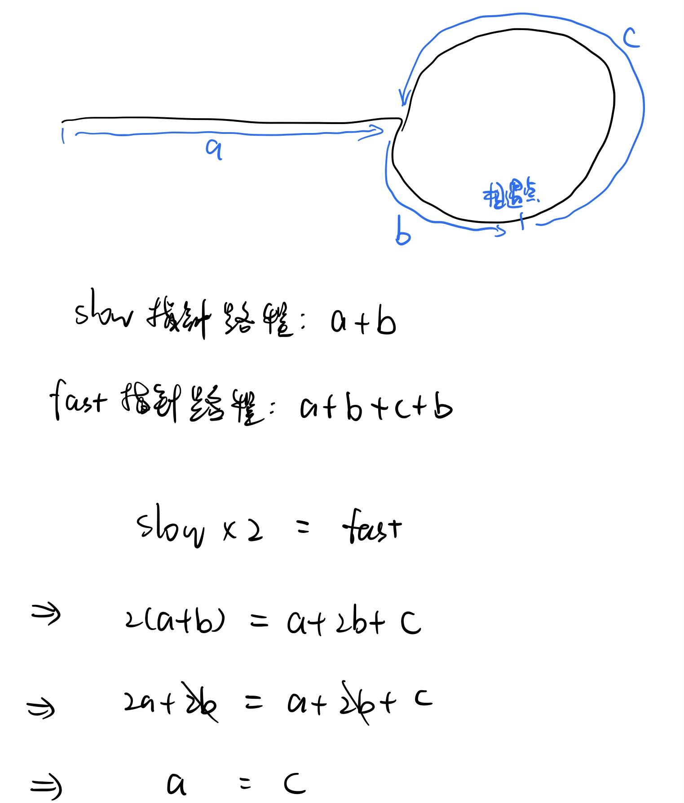
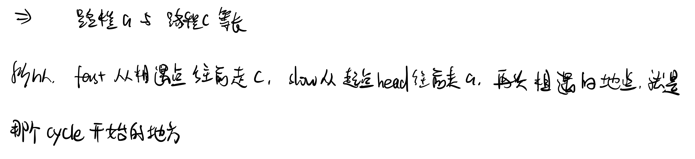

# \[Leetcode\]142. Linked List Cycle II

原题地址：[https://leetcode.com/problems/linked-list-cycle-ii/](https://leetcode.com/problems/linked-list-cycle-ii/) 关键词：Linked List, Two pointer

题意：判断LinkedList是否有环，如果有，找到环的入口位置。


方法一：如果不考虑空间复杂度，可以使用一个HashSet记录走过的节点，当遇到第一个在HashSet中存在的节点时，就说明回到了出发点，即链表有环，同时也找到了环的入口。

```java
public class Solution {
    public ListNode detectCycle(ListNode head) {
        
        HashSet<ListNode> visited = new HashSet<>();
        
        while (head != null) {     
            if (visited.contains(head)) {
                return head;  
            }             
                        
            visited.add(head); //注意这里要先add
            head = head.next;  //再next 
        }
        
        return null;
    }
}
```

\*\*\*\*

★方法二：**Two pointer，**空间复杂度是O\(1\)；一个slow，一个fast，slow每次移动一步而fast每次移动两步。那么如果有cycle的话，slow和fast一定会在circle里某处相遇，且相遇时fast pointer所走过的路程一定是slow pointer的两倍。  
此时把slow放回head，然后和fast再同时向前走\(此时fast一次移动一步\)，再次相遇时就是cycle开始的地方，返回这个node即可。  
如果没有cycle，那么fast一定会遇到null，此时就返回null。

证明如下：






根据初步思路得出的代码（有错）：

```java
//错误代码
public class Solution {
    public ListNode detectCycle(ListNode head) {
        if (head == null) {
            return null;
        }
        
        ListNode slow = head;
        ListNode fast = head;
        
        while (fast != null && fast.next != null) {
            slow = slow.next;
            fast = fast.next.next;
            
            if (slow == fast) { //在circle里相遇
                break;
            }
        }
        
        slow = head;
        
        while (slow.val != fast.val) {
            slow = slow.next;
            fast = fast.next;
        }
        
        return fast;
}
```

上面的代码，在有cycle的情况下是可以通过的，但是如果input只有一个node\[1\]，第一个while loop就不会进入，下面就会返回1，是错误的，应该返回null。在test case的时候应该要考虑到。

为了解决上面的问题，下面是改进的正确代码：

```java
class ListNode {
    int val;
    ListNode next;
    ListNode(int x) {
        val = x;
        next = null;
    }
}

public class Solution {
    public ListNode detectCycle(ListNode head) {
        if (head == null) {
            return null;
        }
        
        ListNode slow = head;
        ListNode fast = head;
        
        while (fast != null && fast.next != null) {
            slow = slow.next;
            fast = fast.next.next;
            
            if (slow == fast) { //在circle里相遇
                slow = head;
                while (slow.val != fast.val) { //区别
                    slow = slow.next;
                    fast = fast.next;
                }             
                return fast;
            }
            
        }    
        
        return null;
    }
}
```

Time complexity: O\(n\)  
Space complexity: O\(1\); Allocates only pointers, so it runs with constant memory usage.


类似的题：287. Find the Duplicate Number


