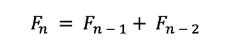
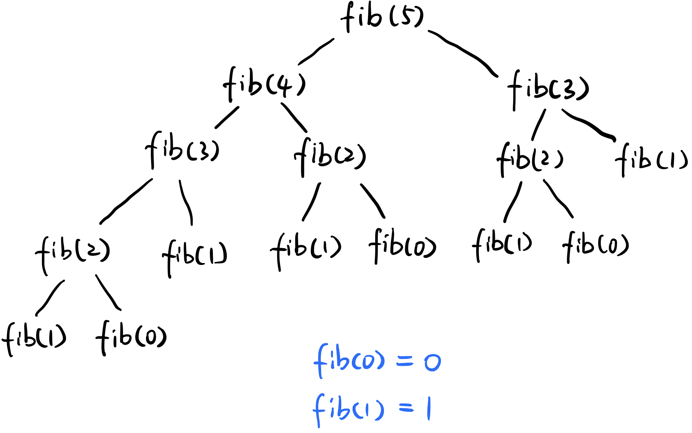

# 斐波那契数列 Fibonacci number

斐波那契数列指的这样一个数列：0, 1, 1, 2, 3, 5, 8, 13, 21, 34, 55, 89, 144, 233, 377 ,610, 987……

**从第3项开始，每一项都等于前两项之和。**特別指出：0不是第一項，而是第零項。

用数学表示就是：



怎样用程序求第n个Fibonacci数字呢？


### 方法一：Recursion（不推荐）

优点：好理解；缺点：时间复杂度太高；

```text
	public static int Fibonacci(int n) {
		if (n <= 1) {
			return n;
		}
		
		return Fibonacci(n - 1) + Fibonacci(n - 2);
	}
```

Time: `O(2 ^ n)`; 解释：T\(n\) = T\(n - 1\) + T\(n - 2\); 比如下图，当n=5时，调用了16次fib\(\)方法，所以是指数复杂度（**exponential**）；



Space: `O(n)`; 解释：按深度算，每return一次创建一个空间。


### 方法二：Dynamic Programming

初始化`dp[]`数组来记录每一个位置的和，长度为n + 1，因为要处理n = 0的情况；

```text
	public int Fibonacci(int n) {
		int dp[] = new int[n + 1]; // 需要1个额外的空间来处理n = 0的情况

		dp[0] = 0; // 初始前两位数
		dp[1] = 1;

		for (int i = 2; i <= n; i++) { // i初始值是2，因为0、1已经排除
			dp[i] = dp[i - 1] + dp[i - 2];
		}

		return dp[n];
	}
```

Time: `O(n)`;   
Space: `O(n)`;

### 方法三：Dynamic Programming 优化 （optimal）

不需要记录所有位置的和，只需要记录最后一个位置的和即可，节省空间。

```text

	public static int Fibonacci(int n) {
		int num1 = 0, num2 = 1; // 初始前两位数
		int sum = 0;

		if (n == 0) {
			return num1;
		}

		for (int i = 2; i <= n; i++) {
			sum = num1 + num2;
			num1 = num2;
			num2 = sum;
		}

		return num2; //最末尾的数字就是num2
	}
```

Time: `O(n)`;   
Space: `O(1)`;


