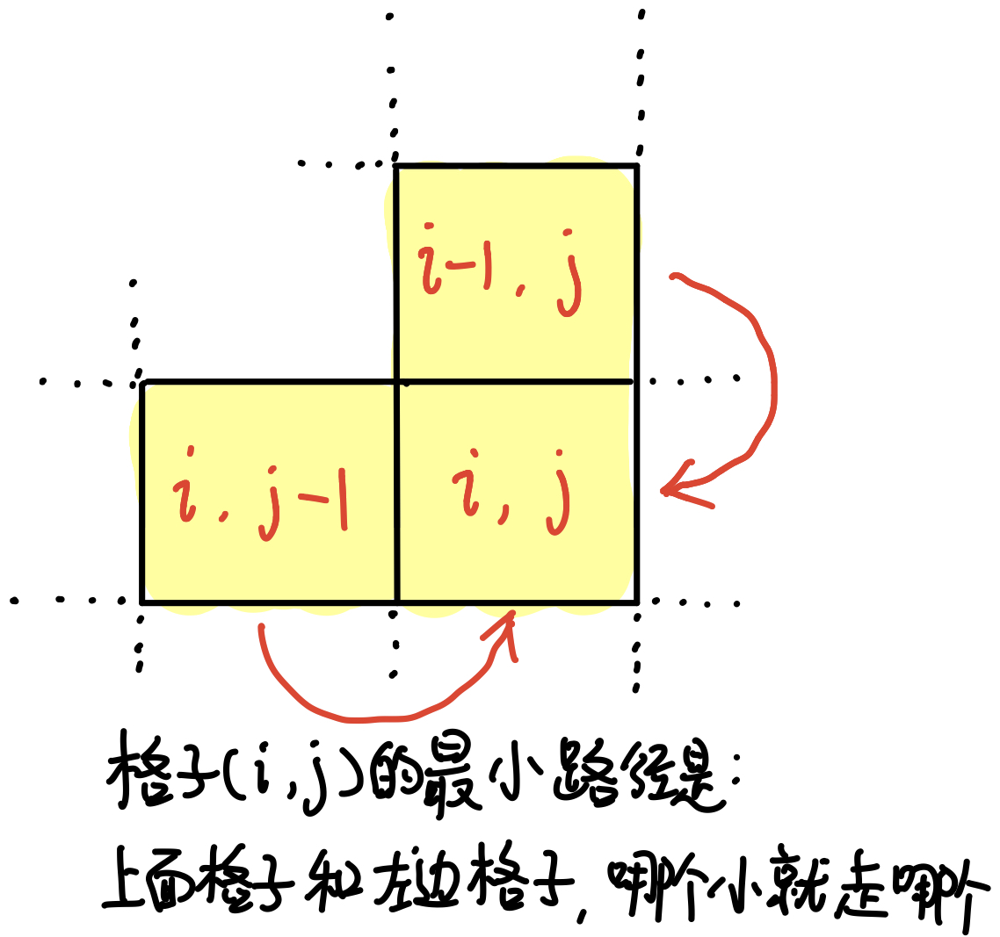
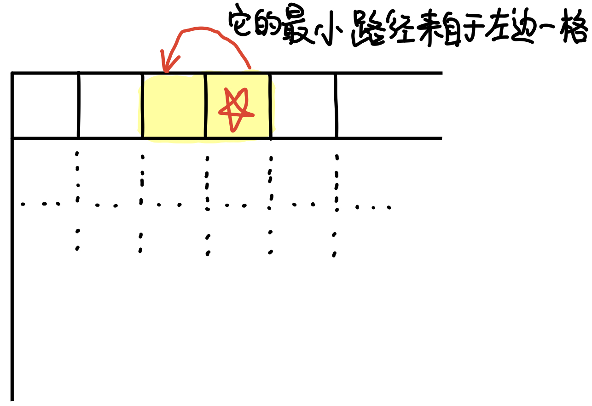
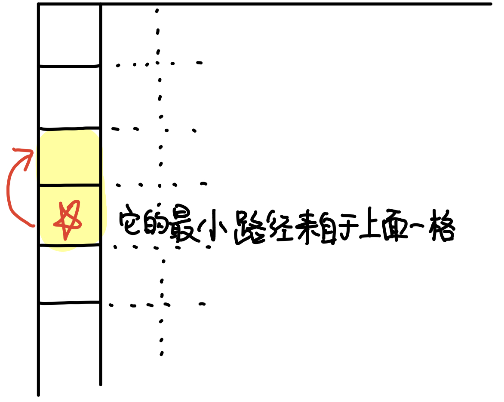

# \[Leetcode\]64. Minimum Path Sum

原题地址：[https://leetcode.com/problems/minimum-path-sum/](https://leetcode.com/problems/minimum-path-sum/)关键词：Dynamic Programming，DP

题意：最小路径和。  
给一个只含非负整数的`m x n`网格`grid[][]`，左上角出发，到右下角结束，找出一条路径，使得路径上的数字总和为最小。  
注意：每次只能**向下**或者**向右**移动一步。

例：


Input: `grid = [[1,3,1],[1,5,1],[4,2,1]]`  
Output: 7  
解释: 标黄色的路径`1 → 3 → 1 → 1 → 1`之和最小


#### 方法1：Brute Force

找出到右下角的所有路径，返回最小的；


### 方法2：Dynamic Programming

**核心思想：**由于路径的方向只能是向下或向右！所以，若想要到达格子`(i, j)`，只能从`(i, j)`的正上方格子，或者`(i, j)`左边的格子，才能到达。

所以可以使用DP，记录**到每一个格子为止**的最小路径和。那么，到格子`(i, j)`为止的最小路径，就是比较它正上方格子的最小路径，与左边格子的最小路径，二者中取最小的，然后加上`(i, j)`本身的值，即为最终结果。  
由此得出状态转移方程（Governing equation）：`dp[i][j] = min(dp[i − 1][j], dp[i][j − 1]) + grid[i][j]`




然而还要考虑到特殊情况：

**● 特殊情况1：**  
最上面第一行，每个元素只能从左边一格移动到达，此时的路径是唯一的！它的最小路径和为当前格子 + 左边格子。  
当`i > 0`且`j = 0`时，状态转移方程为`dp[i]j] = dp[i − 1][j] + grid[i][j]`



**● 特殊情况2：**  
最左边第一列，每个元素只能从上面一格移动到达，此时的路径是唯一的！它的最小路径和为当前格子 + 上面格子。  
当`i = 0`且`j > 0`时，状态转移方程为`dp[i][j] = dp[i][j − 1] + grid[i][j]`




完整代码：

```text
class Solution {
    public int minPathSum(int[][] grid) {
                                                 //无需使用额外的数据结构             
        for (int i = 0; i < grid.length; i++) {
            for (int j = 0; j < grid[0].length; j++) {
                if (i == 0 && j == 0) {  // 起点
                    grid[i][j] = grid[i][j];
                } else if (i == 0 && j >= 1) { // 第一行
                    grid[i][j] = grid[i][j - 1] + grid[i][j];
                } else if (i >= 1 && j == 0) { // 第一列
                    grid[i][j] = grid[i - 1][j] + grid[i][j];
                } else {
                    grid[i][j] = Math.min(grid[i - 1][j] + grid[i][j], grid[i][j - 1] + grid[i][j]);
                }
            }
        }
        
        return grid[grid.length - 1][grid[0].length  -1]; // 返回右下角的元素
    }
}
```

Time: `O(m * n)`；每个扫了一遍，时间是grid的格子总数  
Space: `O(1)`；就在原来grid上操作，没有创建额外的dp数组；若创建额外的dp数组，空间就是O\(m \* n\)；


### 要记住的重点：

i和j都为0的情况要单独拎出来，否则会indexOutOfBoundException


