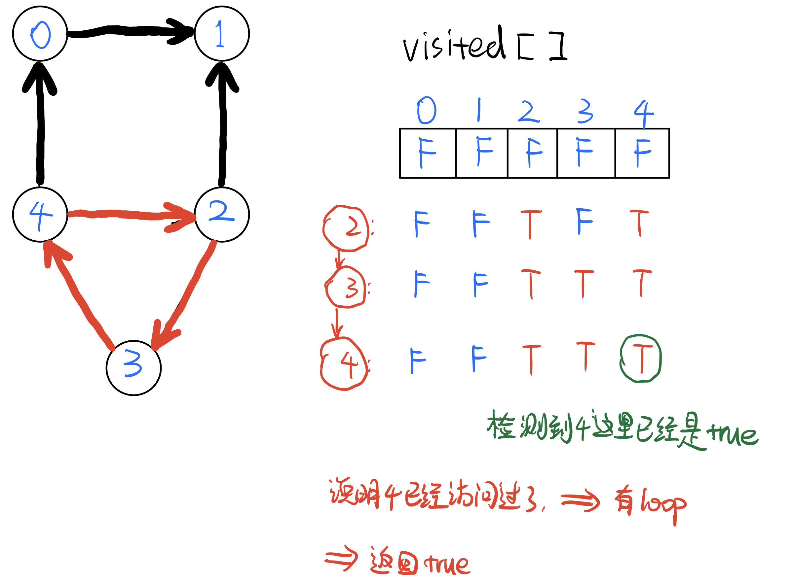

# 有向图中检查环 Detect cycle in a directed graph

### 怎样检测一个有向图directed graph里是否有环？？

给出下面一个directed graph，肉眼可以观察到有一个`4 -> 2 -> 3 -> 4`组成的cycle，但是怎样用程序来鉴别呢？（注意上面的正方形不算cycle，因为从箭头出发没有可以组成的闭环loop）


#### 第一个问题：怎样记录和表示一个有向图？

我们可以用一个HashMap和ArrayList来记录：`HashMap<Integer, List<Integer>()> map = new HashMap<>();`

其中，map的key记录当前节点；  
            map的value记录**由当前点出发，指向的别的点的值；**

那么上面的有向图就可以用HashMap表示为：  
`{0 = [1],   
1 = [null],   
2 = [1, 3],   
3 = [4],   
4 = [0, 2]}`


#### 第二个问题，怎样Detect loop/cycle？

我们初始化一个boolean的数组，长度为node的总数：`boolean[] visited = new boolean[length];`（boolean的初始值默认都是false）

这个`visited[]`boolean数组用来记录我们遍历已经访问过的node；

**算法：**使用backtracking

1. 首先构建这个graph存到map；
2. 然后遍历map；
3. 把走过的节点都在`visited[]`里标记true，backtrack回去时变回false；
4. 在遍历时如果遇到true，说明已经访问过，说明有loop/cycle；

详细图解：  
假设从节点4开始遍历，第一次的路径为`4 -> 0 -> 1`：


回到4后重新出发，路径为`4 -> 2 -> 1`：


回到2后重新出发，路径为`2 -> 3 -> 4`：




所以在backtrack时，用下面两个if放在前面判断：  
`if (visited[cur] == true) return true; //若已访问过，说明有loop   
if (map.get(cur) == null) return false; //为null说明当前点没有子节点，为终点`

backtrack完成时，要把visited变回false：  
`visited[cur] = false;`  


```text
public boolean detectLoop(int[][] graph) {

		HashMap<Integer, ArrayList<Integer>> map = new HashMap<>();

		for (int i = 0; i < graph.length; i++) {  //构建graph
			if (map.get(graph[i][0]) == null) {
				map.put(graph[i][0], new ArrayList<Integer>());
				map.get(graph[i][0]).add(graph[i][1]);
			} else {
				map.get(graph[i][0]).add(graph[i][1]);
			}
		}

		boolean[] visited = new boolean[graph.length];

		for (int i = 0; i < map.size(); i++) { //遍历graph
			if (isCycle(i, map, visited)) {
				return true;
			}
		}

		return false;
	}

	private boolean isCycle(int cur, HashMap<Integer, ArrayList<Integer>> map, boolean[] visited) {
		if (visited[cur] == true) return true; //若已访问过，说明有loop
		if (map.get(cur) == null) return false; //这为null说明该点为终点

		List<Integer> temp = new ArrayList<>(map.get(cur)); //获取该点所有指向的点
		visited[cur] = true;

		for (int j = 0; j < temp.size(); j++) {
			if (isCycle(temp.get(j), map, visited)) {
				return true;
			}
		}

		visited[cur] = false; //因为是backtrack所以遍历下一个点之前要把当前点重新变为false

		return false;
	}
```

Time:??  
Space:?


视频讲解：[https://www.youtube.com/watch?v=0dJmTuMrUZM](https://www.youtube.com/watch?v=0dJmTuMrUZM)


