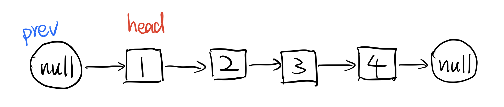
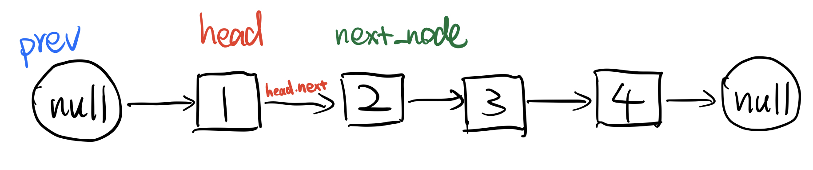
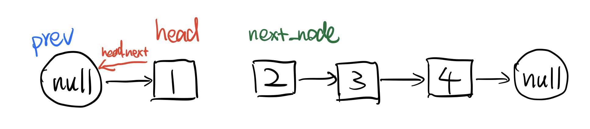
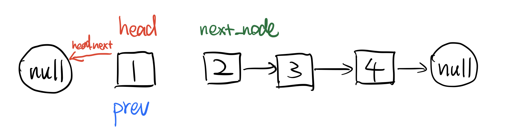
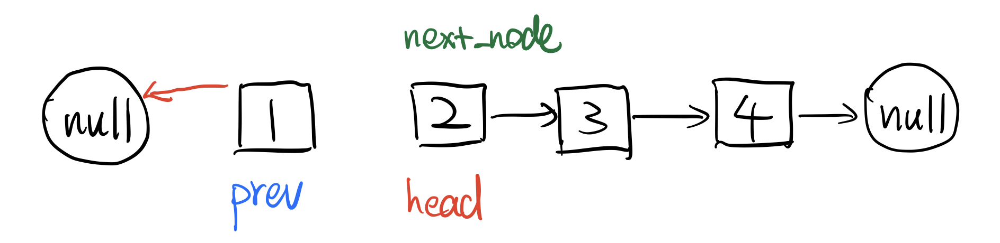
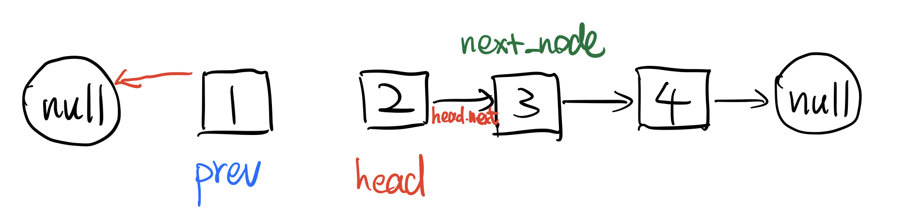
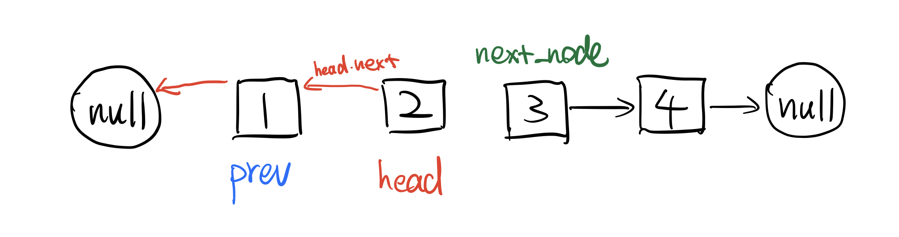
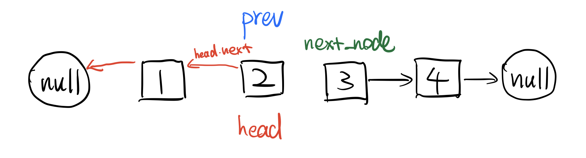
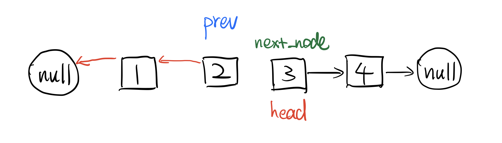
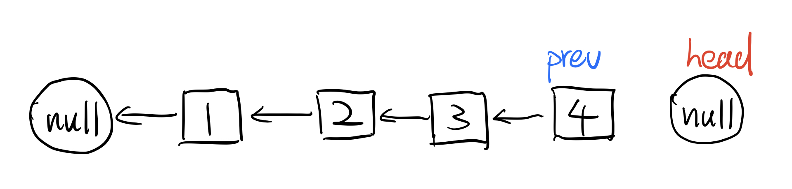

# \[Leetcode\]206. Reverse Linked List

原题地址：[https://leetcode.com/problems/reverse-linked-list/](https://leetcode.com/problems/reverse-linked-list/) 

题意：reverse整个linkedlist

```text
class ListNode { //构造
    int val;
    ListNode next;
    ListNode(int x) {
        val = x;
        next = null;
    }
}

class Solution {
    public ListNode reverseList(ListNode head) {
        ListNode prev = null;
        
        while (head != null) {
            ListNode next_Node = head.next;
            head.next = prev;
            prev = head;
            head = next_Node;
        }
        
        return prev; //注意返回的是prev，不是head
    }
}
```

Time: O\(n\)； n is the list's length  
Space: O\(1\)

### 算法：

完成reverse，需要三个关键的节点，current节点\(head\)，prev节点，next节点；  
while循环里有关键的四步：1.把head右边节点作为next\_node；2.head.next指向前边的prev；3.prev右移到head；4.head右移到next\_node；  
详细步骤如下：

  
首先初始化一个prev为null：




**第一轮while循环：**  
1. 把head下一个节点作为next\_node：`next_Node = head.next;`




2. 把head下一个节点reference指向前一个节点prev：`head.next = prev;`




3. 把prev右移一位，指向head节点处：`prev = head;`




4. 把head右移一位，指向next\_node节点处：`head = next_Node;`  
    第一轮while循环结束；




**第二轮while循环：**  
1. 把head下一个节点作为next\_node：`next_Node = head.next;`




2. 把head下一个节点reference指向前一个节点prev：`head.next = prev;`




3. 把prev右移一位，指向head节点处：`prev = head;`




4. 把head右移一位，指向next\_node节点处：`head = next_Node;`  
    第二轮while循环结束；




最终当检测到head为null时，完成reverse：



此时新链表的**头节点就变成了prev**，所以返回prev，得到最终的结果。


## Follow up: 

**-What are the cases you would test?**   
Ans:   
1. Empty list;  
2. List that has cycle/loop;  
3. List that spreads to two or multiple branches;  
4. List is huge, too long;  


**-If this was an internal API what could break?**  
Ans: has cycle/loop;


### 一般来说，有关linked list的题都可以用以下的test case：

1. Empty list;
2. List that has cycle/loop;
3. List that spreads to two or multiple branches;
4. List is huge, too long;

