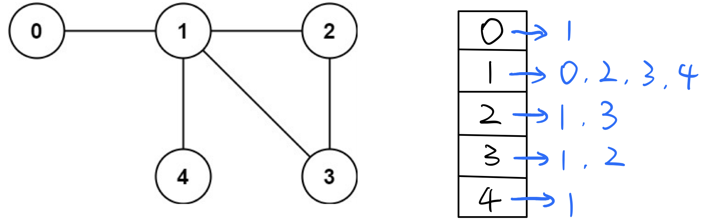

# 无向图中检查环 Detect cycle in a undirected graph

### 怎样检测一个无向图undirected graph里是否有环？？

假设一个图有n=5个节点，给出一个`edges = [[0,1],[1,2],[2,3],[1,3],[1,4]]`，做出下图。肉眼可以观察到有一个`1 -> 2 -> 3 -> 1`组成的cycle，但是怎样用程序来鉴别呢？


#### 

### 第一个问题：怎样记录和表示一个无向图？

要注意的是，无向图中所有的边都是双向的\(**All edges are bidirectional！**\)，所以我们需要一个数据结构能记录每个点，以及和每个点所有相连接的点。

我们可以用一个**Adjacency List**来记录（也就是一个二维的ArrayList）：  
★`List<List<Integer>> adjList = new ArrayList<>();`

其中，Adjacency List的指数index为图的n个节点；  
            Adjacency List的子List记录**与当前节点所有所有相连接的点；**

那么上面的无向图就可以表示为：  
`0 : [1],   
1 : [0, 2, 3, 4],   
2 : [1, 3],   
3 : [1, 2],   
4 : [1]`



```text
       // 1. initialize adjacency list
       
        List<List<Integer>> adjList = new ArrayList<>();
        
        for (int i = 0; i < n; i++) { //注意这里是n
            adjList.add(i, new ArrayList<Integer>());
        }


        // 2. Add edges
        
        for (int i = 0; i < edges.length; i++) {
            adjList.get(edges[i][0]).add(edges[i][1]);
            adjList.get(edges[i][1]).add(edges[i][0]);
        }
```

**要记住的东西：**

1. 构建Adjacency List的时候，要事先给每个节点new一个ArrayList，不然会报错；
2. 在Add edges的时候，因为是无向图是**bidirectional**的，所以两头都要加；比如`edge[1,2]`，1与2相连的同时意味着2也与1相连，所以把2加入1的Adjacency List的同时也要把1加入2的Adjacency List；

#### 

### 第二个问题，怎样Detect loop/cycle？

我们初始化一个boolean的数组，长度为node的总数n：`boolean[] visited = new boolean[n];`（boolean的初始值默认都是false）

这个`visited[]`boolean数组用来记录我们遍历已经访问过的node；

**算法：**使用DFS

1. 首先构建Adjacency List；
2. 从Adjacency List里第一个点开始DFS，把走过的节点都在`visited[]`里标记true；
3. 在DFS时如果遇到true，说明已经访问过，说明有loop/cycle；

详细图解

