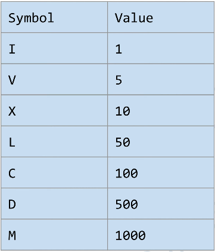

# \[Leetcode\]12. Integer to Roman

原题地址：[https://leetcode.com/problems/integer-to-roman/](https://leetcode.com/problems/integer-to-roman/)

题意：将阿拉伯数字转化为罗马数字；

`Input: num = 3   
Output: "III"` 

`Input: num = 4   
Output: "IV"`


古罗马数字基本符号：



**记数方法：**  
1. 相同的字母连写，表示的数是：这些字母连续相加得到的数，如：`III = 3；`  
2. 字母左大右小，表示的数是：这些字母直接相加得到的数， 如：`VIII = 8，XII = 12；`   
3. 字母左小右大，表示的数是：右边大的数减去左边小的数，如：`IV = 4，IX = 9；`


由上面记数方法可知，阿拉伯数字转化为罗马数字会遇见两种情况：

**第一种情况**：记数方法1、2，这种情况很好处理；  
Symbol： `I  V  X   L   C    D    M`   
Value ：   `1  5  10  50  100  500 1000`

**第二种情况**：记数方法3，这种情况较为特殊；  
****Symbol：  `IV  IX  XL   XC   CD   CM`  
Value：     `4   9   40   90   400  900` 


算法：

为了处理第二种情况，我们初始化两个等长数组来表示对应关系；注意要从大到小排列，把一、二两种情况都融入进去：

`int[] values = new int[]{1000, 900, 500, 400, 100, 90, 50, 40, 10, 9, 5, 4, 1};   
String[] romans = new String[]{"M", "CM", "D", "CD", "C", "XC", "L", "XL", "X", "IX", "V", "IV", "I"};`

初始化一个StringBuilder，遍历上面values这个数组，找到第一个比input num小的value；  
然后用while loop，用num一遍一遍地减去这个value直到value大于了这个num，每减一次就把下面数组romans对应的字符加入到sb；

```text
class Solution {
    public String intToRoman(int num) {
        int[] values = new int[]{1000, 900, 500, 400, 100, 90, 50, 40, 10, 9, 5, 4, 1};
        String[] romans = new String[]{"M", "CM", "D", "CD", "C", "XC", "L", "XL", "X", "IX", "V", "IV", "I"};
        
        StringBuilder sb = new StringBuilder(); 
        
        for (int i = 0; i < values.length; i++) {
            while (num >= values[i]) {
                num -= values[i];
                sb.append(romans[i]);
            }
        }
                
        return sb.toString();  
    }
}
```

Time: O\(1\);  
Space: O\(1\);


### 本题要记住的地方：

1. 初始化两个数组是从大到大
2. 把特殊情况单独拎出来


