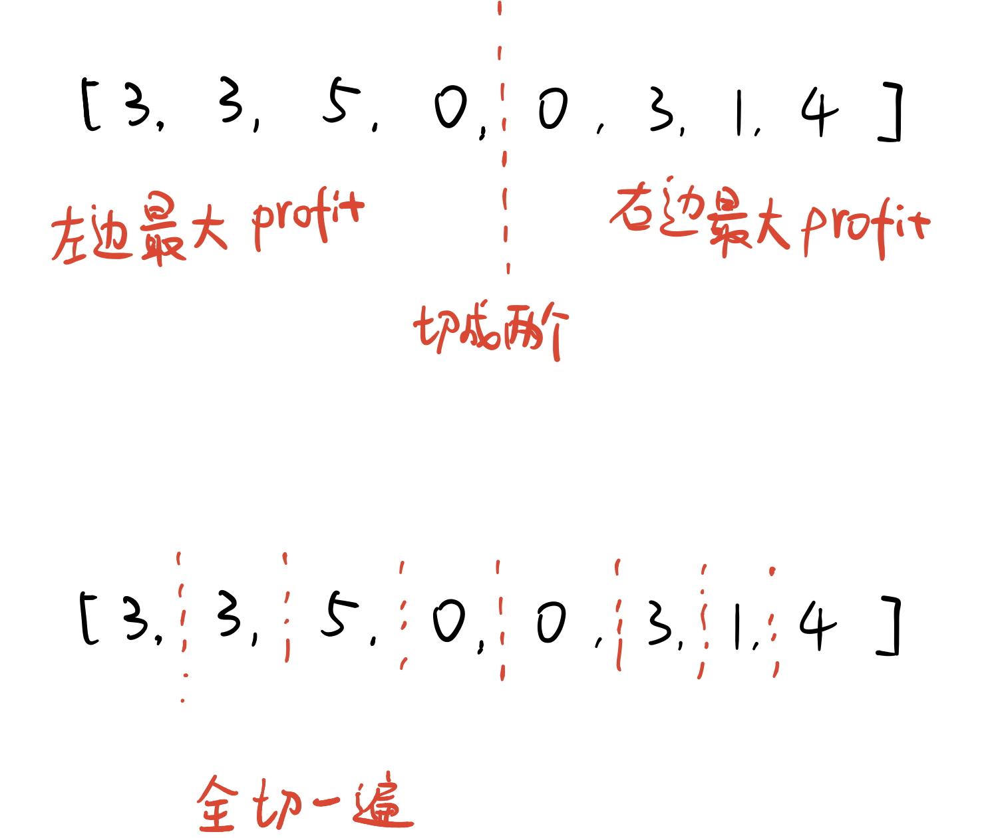
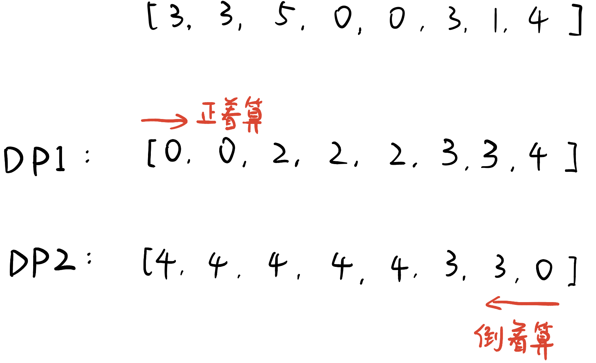

# \[Leetcode\]123. Best Time to Buy and Sell Stock III

原题地址：[https://leetcode.com/problems/best-time-to-buy-and-sell-stock-iii/](https://leetcode.com/problems/best-time-to-buy-and-sell-stock-iii/) 关键词：Dynamic programing，DP

题意：在给出的时间段内，**只能交易2次**，求能获得的最大股票收益。


### 方法1：Brute force

假设股票价格是`prices = [3, 3, 5, 0, 0, 3, 1, 4]`；

随机砍一刀把数组分成两半，左右两半的新数组都只交易一次，左边可以得出一个最大的profit，右边也可以得出一个最大的profit，两个相加得出一个总的profit；

那怎么知道这个总的收益是最大的呢？？

那么我们可以在原数组**每个位置上都砍一刀**，每砍一次，都算出左右两边的最大profit然后加起来，最后比较总的profit哪一个最大即可。  
理解：因为全砍一遍，相当于是把所有能够交易2次的情况全部算出来。



此方法优点是好理解，缺点是太费时间，需要O\(n ^2\)。


### 方法2：Dynamic programing

有什么方法能够减少方法1的时间呢？其实只要能够确定从哪个点切获得的收益最大，就可以了。我们可以新建两个数组，一个记录从左边买入的最大收益，一个记录从右边买入的最大收益，最后遍历一遍求最大值即可。

数组`DP1[]`记录：**到每个点为止**，能获得的最大收益。（从指数0到指数i这段区间内只交易一次）

数组`DP2[]`记录：**从每个点开始**，能获得的最大收益。（从指数`i`开始到指数`prices.length - 1`这段区间内只交易一次）

**注意：**  
`DP1[]`是从`prices[]`左边开始遍历，从指数0开始找到最低点minPrice，然后`i`右边每一个点都减去minPrice一遍，减的时候和`DP1[i - 1]`比较，把最大值放入`DP1[i]`；

`DP2[]`是从`prices[]`右边开始遍历，从指数`prices.length - 1`开始找到最高点maxPrice，然后`i`左边边每一个点都**被**maxPrice减一遍，减的时候和`DP1[i + 1]`比较，把最大值放入`DP1[i]`；



```text
class Solution {
    public int maxProfit(int[] prices) {
        if (prices == null || prices.length < 2) return 0;
        int[] profit1 = new int[prices.length];
        int[] profit2 = new int[prices.length];
        int res = 0;

        // 从第一位数开始，到指数i为止，指数i位置能赚到的最大收益
        int minPrice = prices[0];
        for (int i = 1; i < prices.length; i++) {
            if (prices[i] < minPrice) {
                minPrice = prices[i];
            }
            profit1[i] = Math.max(profit1[i - 1], prices[i] - minPrice);
        }
        
        // 从指数i开始，到最后一位数为止，指数i位置能赚到的最大收益
        int maxPrice = prices[prices.length - 1];
        for (int i = prices.length - 2; i > 0; i--) { //注意要倒着来
            if (prices[i] > maxPrice) {
                maxPrice = prices[i];
            }
            profit2[i] = Math.max(profit2[i + 1], maxPrice - prices[i]);
        }
        
        
        // 计算两次交易最大收益
        for (int i = 0; i < prices.length; i++) {
            res = Math.max(res, profit1[i] + profit2[i]);
        }
        
        
        return res;
    }
}
```

Time: O\(n\);

Space: O\(n\);


#### 要记住的重点：

`DP2[]`一定要倒着算；

