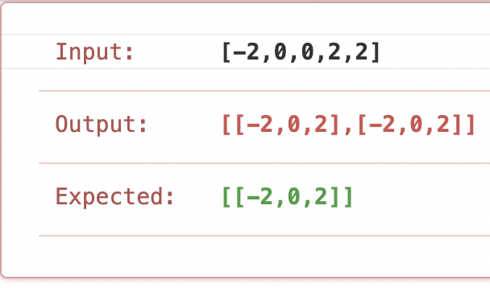

# \[Leetcode\]15. 3Sum

原题地址：[https://leetcode.com/problems/3sum/](https://leetcode.com/problems/3sum/) 关键词：Array, Two pointer

题意：在数组nums中找出三个数a, b, c，使之和为零（a + b + c = 0），返回**所有**符合条件的这三个数，如果没有则返回空list。要求：**结果中不含有duplicate**

算法：Two pointer；a + b + c = 0可变化为b + c = -a，这样就转化成了一个two sum的问题，target是\(-a\)；  
如果要用two pointer来解决2sum问题，那么数组必须是sorted；  
所以我们**先把数组sort**，然后用一个for loop，遍历数组里每一个数nums\[i\]，然后把\( - nums\[i\]\)作为target，在i右边的数里用two pointer方法找，如果nums\[left\] + nums\[right\] == target，就把nums\[left\]，nums\[right\]，nums\[i\]记录进结果。

```text
//错误代码
class Solution {
    public List<List<Integer>> threeSum(int[] nums) {
        List<List<Integer>> res = new ArrayList<>();        
        if (nums.length < 3) return res;
        
        //sort
        Arrays.sort(nums);
        
        //use two pointer for 2 sum
        for (int i = 0; i < nums.length; i++) {
            if (i > 0 && nums[i] == nums[i - 1]) continue; //skip duplicate
            
            int target = -nums[i];
            int left = i + 1;
            int right = nums.length - 1;
            
            while (left < right) {
                if (nums[left] + nums[right] > target) {
                    right--;
                } else if (nums[left] + nums[right] < target) {
                    left++;
                } else {
                    res.add(Arrays.asList(nums[i], nums[left], nums[right]));
                    left++;
                    right--;
                }
            }
        }
        
        return res;
    }
}
```

以上代码在nums没有duplicate的时候是成立的，但是如果有duplicate就会出现以下的错误：



为了解决以上错误，需要在left和right指针移动的时候加上检查是否是duplicate，如果是就要跳过，以下是正确代码：

```text
class Solution {
    public List<List<Integer>> threeSum(int[] nums) {
        //记录结果
        List<List<Integer>> res = new ArrayList<>();   
        
        //corner case
        if (nums.length < 3) return res;
        
        //sort
        Arrays.sort(nums);
        
        //use two pointer for 2 sum
        for (int i = 0; i < nums.length; i++) {
            if (i > 0 && nums[i] == nums[i - 1]) continue; //skip duplicate
            
            int target = -nums[i];
            int left = i + 1;
            int right = nums.length - 1;
            
            while (left < right) {
                if (nums[left] + nums[right] > target) {
                    right--;
                    while (left < right && nums[right] == nums[right + 1]) right--; //skip duplicate
                } else if (nums[left] + nums[right] < target) {
                    left++;
                    while (left < right && nums[left] == nums[left - 1]) left++; //skip duplicate
                } else {
                    res.add(Arrays.asList(nums[i], nums[left], nums[right]));
                    left++;
                    right--;
                    while (left < right && nums[left] == nums[left - 1]) left++; //skip duplicate
                    while (left < right && nums[right] == nums[right + 1]) right--; //skip duplicate
                }
            }
        }
        
        return res;
    }
}
```

Time complexity: O\(n^2\)；前面有sort，所以计算是O\(nlogn + n^2\)，结果就是O\(n^2\)  
Space complexity: from O\(logn\) to O\(n\)，取决于用哪种sorting algorithm.


注意要点：

* 第一个skip duplicate的时候要注意i &gt; 0；后面skip duplicate时候要注意left &lt; right。
* 对于用三个if来判断大于、等于、小于时，只要先写了其中任意两个条件，第三个可以直接else不用再写if。
* 可以直接用Arrays.asList\( "A", "B", "C" \)把ABC直接转换成一个list；对于**二维list**，就可以直接用res.add\(Arrays.asList\(...\)\)加进结果集，不用再新建一维list，就很方便。


复习two sum：

方法一：Brute force；两个for loop，Time: O\(n^2\)，Space: O\(1\)

方法二：Two pointer；核心是先sort，此方法可消除duplicate；Time: O\(nlogn\)，Space: O\(1\)

方法三：Hash map；数字nums\[i\]作为key，指数i作为value；Time: O\(n\)，Space: O\(n\)

```text
public int[] twoSum(int[] numbers, int target) {

    int[] res = new int[2];
    Map<Integer, Integer> map = new HashMap<Integer, Integer>();
    
    for (int i = 0; i < numbers.length; i++) {
        if (map.containsKey(target - numbers[i])) {
            result[1] = i;
            result[0] = map.get(target - numbers[i]);
            return res;
        }
        map.put(numbers[i], i);
    }
    return res;
}
```

像上面这种，如果在过程中，先判断if\(不存在\)再判断if\(存在\)行不通时，可以尝试反过来顺序，先判断if\(存在\)，再判断if\(不存在\)。


