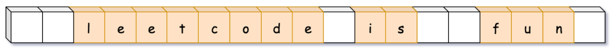
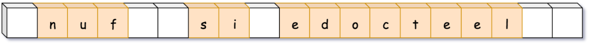
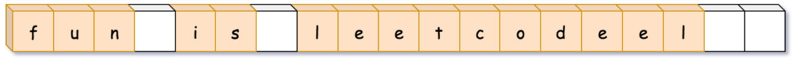
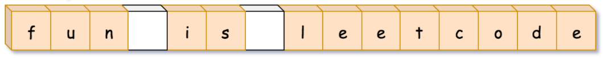

# \[Leetcode\]151. Reverse Words in a String

原题地址：[https://leetcode.com/problems/reverse-words-in-a-string/](https://leetcode.com/problems/reverse-words-in-a-string/)

题意：把一句话里所有的单词顺序reverse；给的input首尾&单词之间可能会含有多余空格；  
例如：Input: `str = " the sky is    blue   "`   
         Output: `str = "blue is sky the"`


#### 方法一：使用build-in class（一般不用此方法）

```text
public class Solution {
    public String reverseWords(String str) {
        String[] words = str.trim().split(" +"); //这里" +"的加号指的是一个以上的空格（多个空格）
        Collections.reverse(Arrays.asList(words));
    
        return String.join(" ", words);
    }
}
```

Time：O\(N\)；where N is a number of characters in the input string.  
Space：O\(N\)； to store the result of split by spaces.


#### 方法二：不使用trim\( \)、split\( \)、StringBuilder：

**算法：先reverse整个string；再分别reverse每个单词；最后去掉空格；**

如图，假如input string为：




1.第一步先reverse整个string；reverse整句话后，单词顺序就翻转了，但是每个单词的字母顺序也翻转了




2. 第二步需要把每个单词的字母顺序翻转回正常顺序：




3. 最后把收尾的空格、单词间多余空格去掉即可：




此方法的难点在于：如何去掉单词之间多余的空格；


首先：理清思路，确定代码结构：  
1. Reverse whole string;  
2. Reverse each word;  
3. Trim white spaces;

```text
public String reverseWords(String str) {
        if (str == null || str == "") return str; //为空直接返回
        
        int length = str.length();
        char charArray[] = str.toCharArray();
            
        //1. Reverse whole string
        reverseString(charArray, 0, length - 1); //reverse需要确定首尾index
        
        //2. Reverse each word
        reverseEachWord(charArray, length);   //注意2和3的input都是一样的
        
        //3. Trim white spaces
        return trimSpaces(charArray, length);
    }
```


下一步：确定reverse string的方法，既然是char array，可以使用two pointer，交换首尾字符：

```text
 public void reverseString(char[] charArray, int left, int right) {
        while (left < right) {              
            char temp = charArray[left];
            charArray[left] = charArray[right];
            charArray[right] = temp;
            left++;
            right--;
        }
    }
```


下一步：需要在句子顺序已确定的情况下，分别reverse里面每一个单词；  
方法：既然是char array，用while遍历整个string，遇到空格则跳过，遇到单词，则**确定每个单词起始点和终点的index**，然后调用上面的reverse string的方法翻转这个单词。

```text
public void reverseEachWord(char[] charArray, int length) {
        int start = 0, end = 0;
        
        while (start < length && end < length) {
            while (start < length && charArray[start] == ' ') {
                start++;
            }
            
            end = start;
            
            while (end < length && charArray[end] != ' ') {
                end++;
            }
            
            reverseString(charArray, start, end - 1);
            
            start = end;
        }
    }
```


下一步：也是最难的一步，删去首尾和单词间的多余空格；

思想类似于move zeros：[https://app.gitbook.com/@bhnigw/s/leetcode/~/drafts/-MaapjwV4XVSaZQrmAPA/leetcode-283.-move-zeroes](https://app.gitbook.com/@bhnigw/s/leetcode/~/drafts/-MaapjwV4XVSaZQrmAPA/leetcode-283.-move-zeroes)

算法：核心就是在原来char array的基础上，把**所需要的字符**，重新依次放进array（从index零开始），最后保留前面需要的，去掉后面不要的：

1. 初始化两个数来当作index，usefulCharIndex和temp，都为0，然后用while遍历整个char array；
2. 首先用temp先跳过开头的空格：`while (charArray[temp] == ' ') temp++;`
3. 跳过空格后，遇到单词，挨个把字符放进array：`charArray[usefulCharIndex] = charArray[temp];`然后temp++，usefulCharIndex++；
4. 一个单词走完后，照理说此时应该给它后面加上一个空格，但是如果这是input string里最后一个单词，且末尾无多余空格，那么这里加上的空格就多余了；所以此时我们要先考虑把结尾的空格也去掉；
5. 此时再次使用temp跳去空格`while (charArray[temp] == ' ') temp++;`这一步有两个意义：
   1. 跳过了单词间多余的空格；
   2. 跳过了结尾的所有空格；
6. 如果第五步是跳过了单词间多余的空格，那么下一步就要在usefulCharIndex上面加上一个空格`charArray[usefulCharIndex] = ' ';`然后usefulCharIndex++；然后继续后续的while找下一个单词；
7. 如果第五步是跳过了结尾的空格，那么此时的temp的值正好等于length，刚好超过array的index范围；此时也不需要在usefulCharIndex后面加上一个空格，因为我们已经完成加入所有的需要的字符；所以，只需要在第六步的基础上加上一个if来判断temp是否超过数组index范围：
   1. 如果temp超过数组index范围：说明已经到达数组结尾，不需要再加空格；
   2. 如果temp没有超过index范围：说明没有到达结尾，还在遍历中间的单词，所以要加空格； 用代码表示就是： `if (temp < length) {     charArray[usefulCharIndex] = ' ';      usefulCharIndex++; }`
8. 最后把新得到的char array转化为string，然后用截取substring，就是最后所要的结果。所需要的substring的index就是0到usefulCharIndex；注意substring方法是第一个index包括，第二个index不包括，而前面usefulCharIndex在每个操作结束后都++了，所以此时usefulCharIndex正好是我们所需要的string的index的后面一位，所以无需改动。  用代码表示就是：`new String(charArray).substring(0, usefulCharIndex);`

```text
public String trimSpaces(char[] charArray, int length) {
        int usefulCharIndex = 0;
        int temp = 0;
        
        while (usefulCharIndex < length && temp < length) {
            while (temp < length && charArray[temp] == ' ') {
                temp++;
            }
            
            while (temp < length && charArray[temp] != ' ') {
                charArray[usefulCharIndex] = charArray[temp];
                temp++;
                usefulCharIndex++;
            }
            
            while (temp < length && charArray[temp] == ' ') { //这里跳过了单词间，和尾部的空格
                temp++;
            }
            
            if (temp < length) {                  //到这里为止，如果temp小于length那么说明已经跳过单词间的空格
                charArray[usefulCharIndex] = ' '; //那么在进入下一个单词前，在最后要保留的string里，加上一个空格
                usefulCharIndex++;              //如果temp大于了length，那说明是输入的str结尾有多余空格
            }
        }
        
        return new String(charArray).substring(0, usefulCharIndex);
    }
```


完整代码：

```text
class Solution {
    public String reverseWords(String str) {
        if (str == null || str == "") return str;
        
        int length = str.length();
        char charArray[] = str.toCharArray();
            
        //1. Reverse whole string
        reverseString(charArray, 0, length - 1);
        
        //2. Reverse each word
        reverseEachWord(charArray, length);
        
        //3. Trim white spaces
        return trimSpaces(charArray, length);
    }
    
    public void reverseString(char[] charArray, int left, int right) {
        while (left < right) {              
            char temp = charArray[left];
            charArray[left] = charArray[right];
            charArray[right] = temp;
            left++;
            right--;
        }
    }
    
    public void reverseEachWord(char[] charArray, int length) {
        int start = 0, end = 0;
        
        while (start < length && end < length) {
            while (start < length && charArray[start] == ' ') {
                start++;
            }
            
            end = start;
            
            while (end < length && charArray[end] != ' ') {
                end++;
            }
            
            reverseString(charArray, start, end - 1);
            
            start = end;
        }
    }
    
    public String trimSpaces(char[] charArray, int length) {
        int usefulCharIndex = 0;
        int temp = 0;
        
        while (usefulCharIndex < length && temp < length) {
            while (temp < length && charArray[temp] == ' ') {
                temp++;
            }
            
            while (temp < length && charArray[temp] != ' ') {
                charArray[usefulCharIndex] = charArray[temp];
                temp++;
                usefulCharIndex++;
            }
            
            while (temp < length && charArray[temp] == ' ') { //这里跳过了单词间，和尾部的空格
                temp++;
            }
            
            if (temp < length) {                  //到这里为止，如果temp小于length那么说明已经跳过单词间的空格
                charArray[usefulCharIndex] = ' '; //那么在进入下一个单词前，在最后要保留的string里，加上一个空格
                usefulCharIndex++;              //如果temp大于了length，那说明是输入的str结尾有多余空格
            }
        }
        
        return new String(charArray).substring(0, usefulCharIndex);
    }
        
    
}
```

Time：O\(N\)；where N is a number of characters in the input string.  
**Space：O\(N\)； str转化过来的char array长度为n，需要n个空间；**


注意的要点：

1. char array可以直接用转化为String：`new String(charArray)；`
2. `str.substring(index1, index2)`里面index1包括，index2不包括；


### 关于Test case：

因为input是string，所以可以从以下角度考虑：

1. Empty or null 
2. Special character 
3. With or without punctuation in the end （标点符号）
4. Multiple while spaces in between  
5. Very long string

最后一点，关于怎样算是very long string：  
取决于Java Virtual Machine\(JVM\)的memeory；Java里String可允许的最大length大约是2 billion（无需回答具体数字）


算法思想与之相同：[186. Reverse Words in a String II](https://app.gitbook.com/@bhnigw/s/leetcode/~/drafts/-Mageog48nBYM2p3FGfN/leetcode-151.-reverse-words-in-a-string/leetcode-186.-reverse-words-in-a-string-ii)


