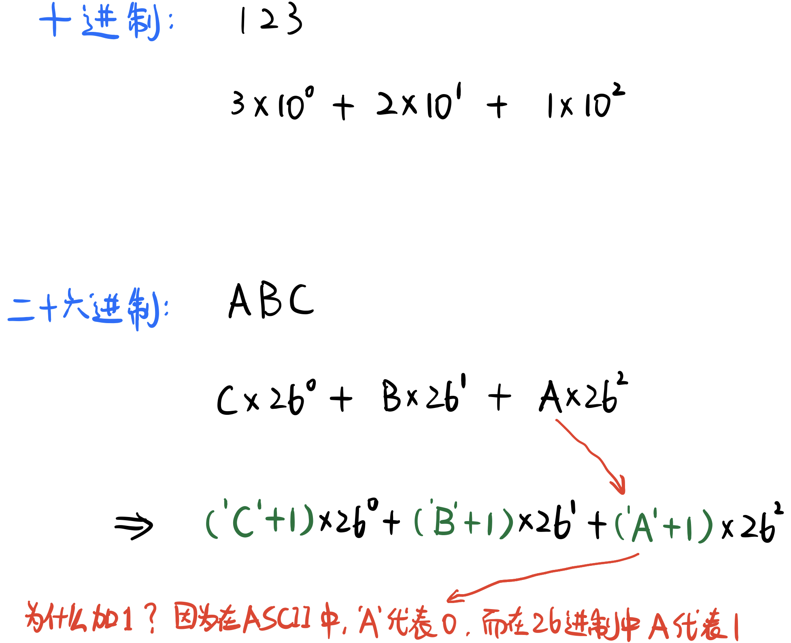

# \[Leetcode\]171. Excel Sheet Column Number

原题地址：[https://leetcode.com/problems/excel-sheet-column-number/](https://leetcode.com/problems/excel-sheet-column-number/)  

题意：字母转化为数字；规则如下：  
A -&gt; 1   
B -&gt; 2   
C -&gt; 3   
...   
Z -&gt; 26   
AA -&gt; 27   
AB -&gt; 28   
...

例1：  
`Input: columnTitle = "AB"； Output: 28`  
例2：  
`Input: columnTitle = "ZY"； Output: 701`


### 算法：

可以理解为把一个二十六进制（base of 26）的数转化为十进制（decimal）的数；



所以，从右向左，遍历input string，每一位的基数乘以26的次方，幂数从0开始依次加一，最后加起来即可

我们要做的就是确定每一位的基数即可。怎么确定每一位字母代表的数字呢？  
可以使用ASCII码里指数的位置差：`ch - 'A' + 1` （[详情点击查看ASCII讲解](https://bhnigw.gitbook.io/-1/shu-ju-jie-gou-string/ascii-ma)）

怎样运算次方呢？  
用`Math.pow(x, y)`，x代表底数，y代表次幂，也就是相当于`x ^ y`

```text
class Solution {
    public int titleToNumber(String columnTitle) {
        if (columnTitle == null || columnTitle.isEmpty()) return 0;
        
        int res = 0;
        int pow = 0; //记录次幂
        
        for (int i = columnTitle.length() - 1; i >= 0; i--) { // 注意是i>=0
            char ch = columnTitle.charAt(i);
            res += (ch - 'A' + 1) * Math.pow(26, pow);
            pow++;
        }        
        
        return res;
    }
}
```

Time: O\(N\)；N is the number of characters in the input string.  
Space: O\(1\)

**注意**：  
1. 代码第10行必须要加1，因为`ch - 'A'`代表的只是该字母的index，而我们需要的是该字母在字母表中是第几个。比如输入letter是'A'，减去后是0，后面乘起来依然是0就不对了；所以要加上1才能代表该字母的位置数。  
2. 怎样计算次幂；  
3. 如果for循环是从后往前，那么`for (int i = nums.length - 1; i >= 0; i--)` 一定是`i >= 0`


英语词汇：

`exponential` adj. 指数的； exponential function 指数函数

`exponent` n. 指数，幂


