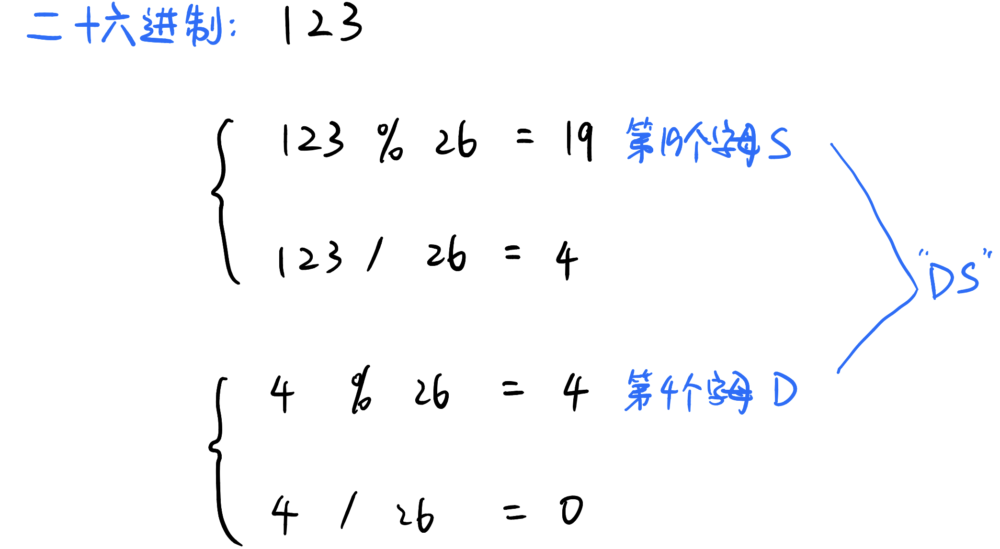

# \[Leetcode\]168. Excel Sheet Column Title

原题地址：[https://leetcode.com/problems/excel-sheet-column-title/](https://leetcode.com/problems/excel-sheet-column-title/)

题意：数字转化为字母；规则如下：  
A -&gt; 1   
B -&gt; 2   
C -&gt; 3   
...   
Z -&gt; 26   
AA -&gt; 27   
AB -&gt; 28   
...

例1：  
`Input: columnNumber = 28； Output: "AB"`  
例2：  
`Input: columnNumber = 701； Output: "ZY"`


### 算法：

对十进制\(decimal\)的数来说，number用%10取余数，得到的余数就是最右边的**个位数**。  
number用/10除以十，看能被整除几次





number用%26取余数，得到的余数就是最右边

```text
class Solution {
    public String convertToTitle(int columnNumber) {
        StringBuilder sb = new StringBuilder();
        
        while (columnNumber > 0) {
            columnNumber--;    //注意这里
            sb.append((char)(columnNumber % 26 + 'A'));
            columnNumber /= 26;
        }

        return sb.reverse().toString();
    }
}
```


### 需要记住的重点：

1. 数字一定要先减1❗️
2. 最后转化为string前要reverse


