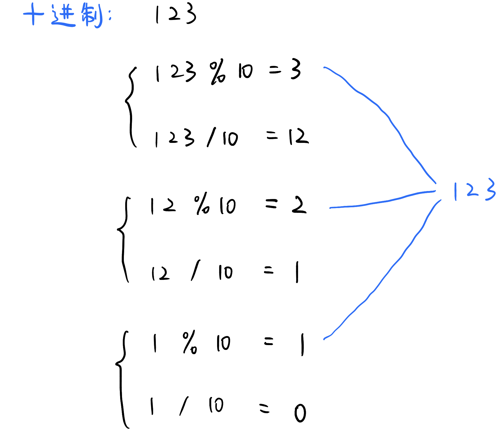

# \[Leetcode\]168. Excel Sheet Column Title

原题地址：[https://leetcode.com/problems/excel-sheet-column-title/](https://leetcode.com/problems/excel-sheet-column-title/)

题意：数字转化为字母；规则如下：  
A -&gt; 1   
B -&gt; 2   
C -&gt; 3   
...   
Z -&gt; 26   
AA -&gt; 27   
AB -&gt; 28   
...

例1：  
`Input: columnNumber = 28； Output: "AB"`  
例2：  
`Input: columnNumber = 701； Output: "ZY"`


### 算法：




```text
class Solution {
    public String convertToTitle(int columnNumber) {
        StringBuilder sb = new StringBuilder();
        
        while (columnNumber > 0) {
            columnNumber--;
            sb.append((char)(columnNumber % 26 + 'A'));
            columnNumber /= 26;
        }

        return sb.reverse().toString();
    }
}
```


