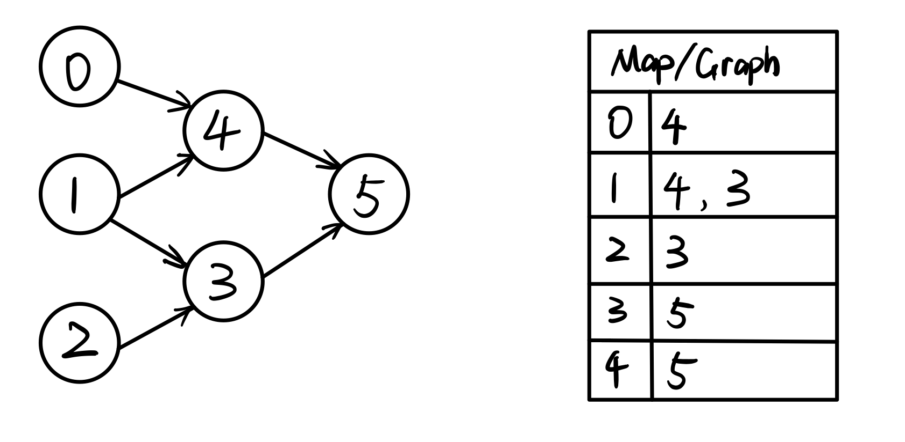
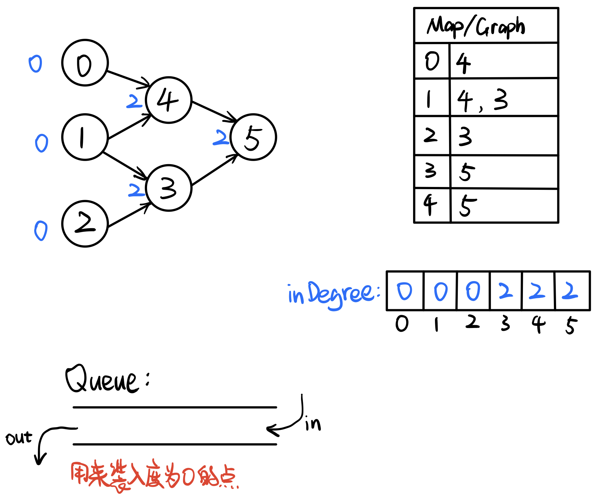
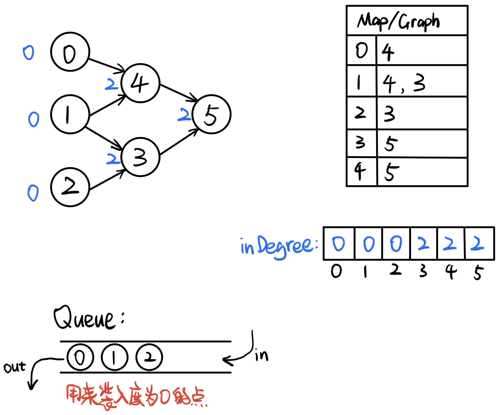
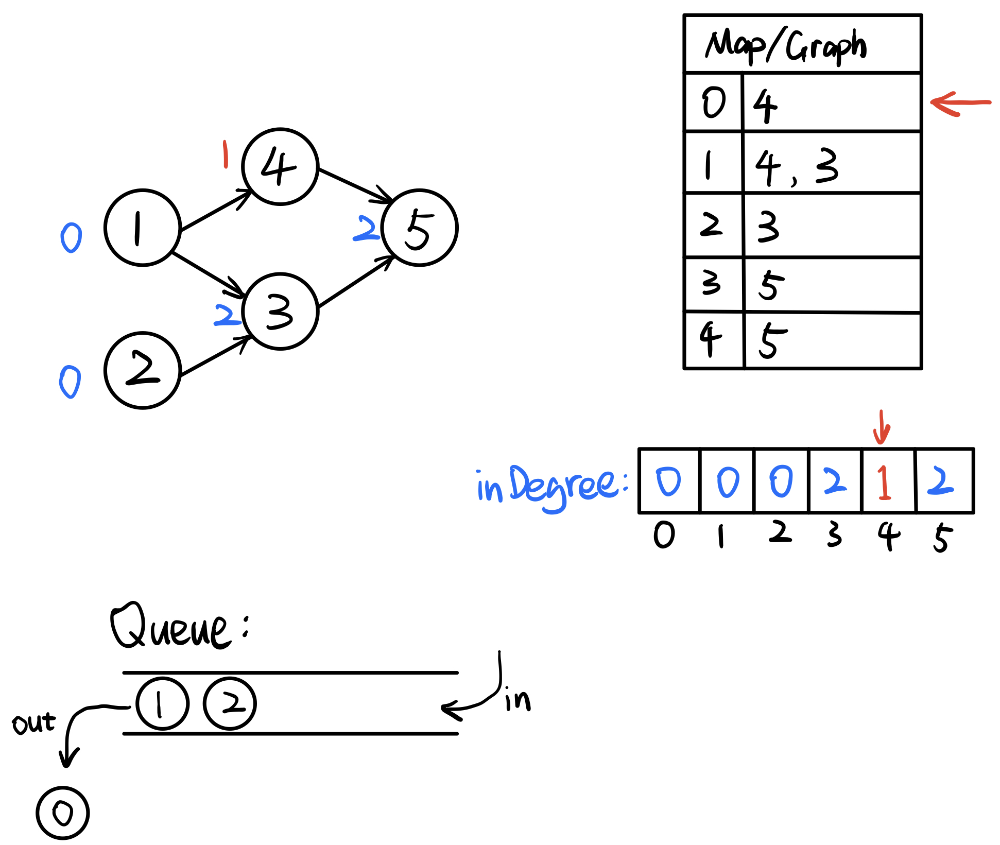
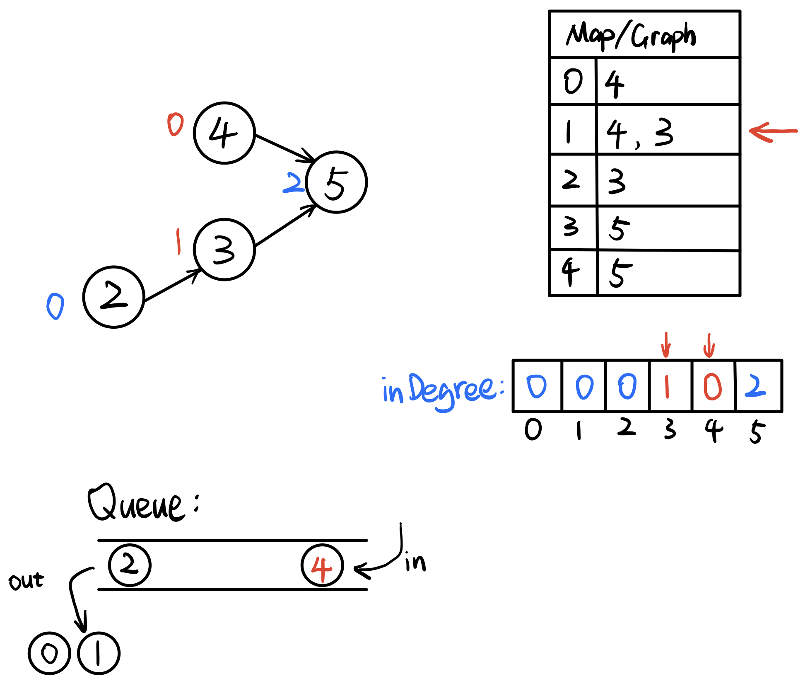
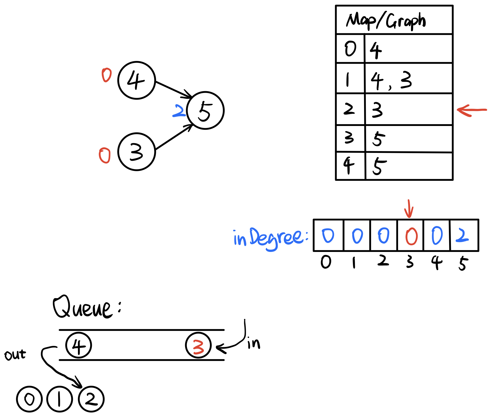
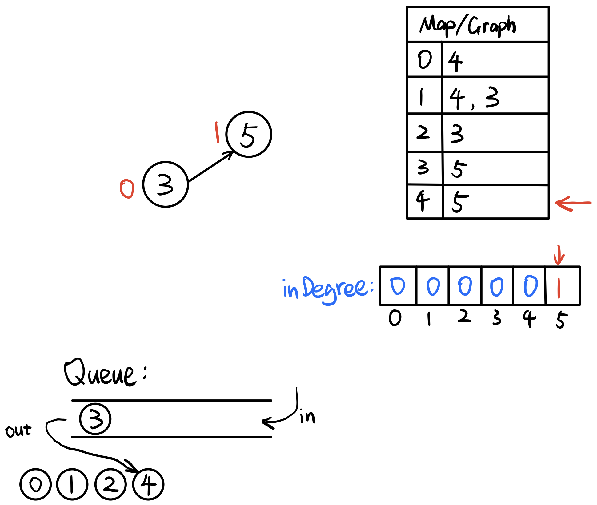
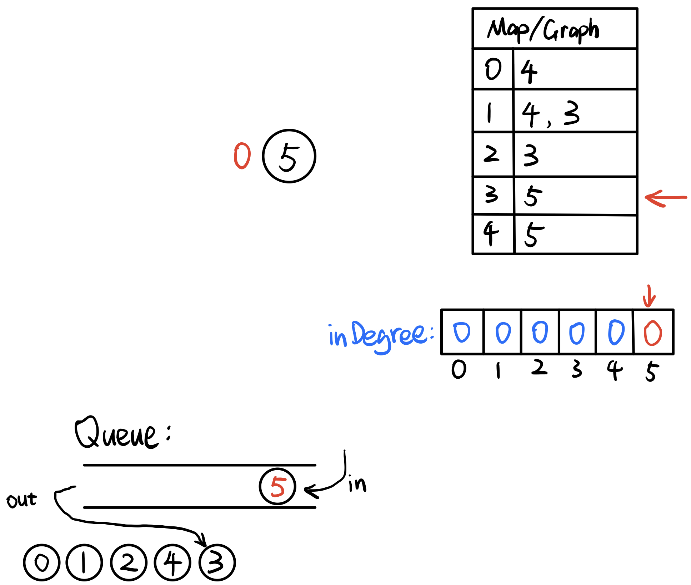
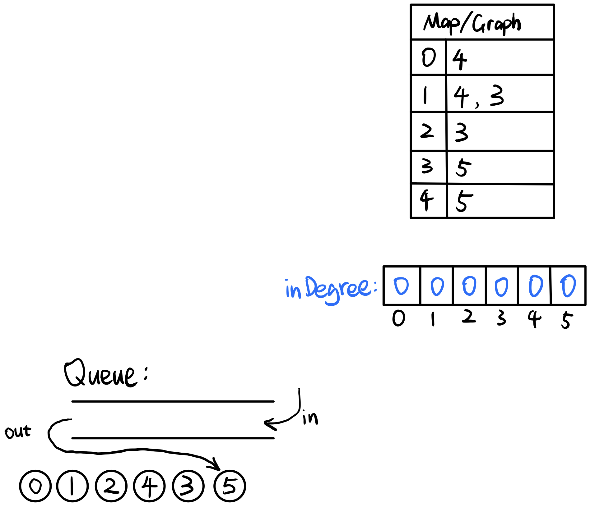

# \[Leetcode\]207. Course Schedule

原题地址：[https://leetcode.com/problems/course-schedule/](https://leetcode.com/problems/course-schedule/) 关键词：Topological, Directed graph，BFS

题意：某学期必须选修 n 门课程，记为 0 到 n - 1 ;（比如必须选5门课，那么课程号就为0,1,2,3,4）  
在选修某些课程之前需要一些先修课程。 先修课程按数组`prerequisites[][]`给出，其中`prerequisites[i] = [ai, bi]` ，表示如果要学习课程 ai 则必须先学习课程 bi 。  
例如，先修课程对 \[0, 1\] 表示：想要学习课程 0 ，你需要先完成课程 1 。   
判断是否可能完成所有课程的学习？如果可以，返回 true ；否则返回 false 。

Example 1:  
Input: `numCourses = 2`, `prerequisites = [[1,0]]`;   
Output: `true` 

Example 2:  
Input: `numCourses = 2`, `prerequisites = [[1,0],[0,1]]`;  
 Output: `false`


### 方法一：构建有向图，检查环

假设需要选5门课，先修课的要求为：`prerequisites = [[1, 0], [0, 2], [3, 4], [4, 0], [2, 1]]`;那么可以用课程号指向先修课，就构成了一个有向图：


因为0 -&gt; 1-&gt; 2出现了死循环，所以不可能修完所有课程。  
**因此我们只需要查这个graph有没有死循环即可**，只要出现loop/cycle，那么就不可能修完所有课程；

所以这道题就演变成了[Detect whether a directed graph has a loop or cycle](https://bhnigw.gitbook.io/leetcode/ji-chu-bi-hui/detect-cycle-in-a-directed-graph). （点击查看详细图解）

#### 算法：

第一步：  
我们可以用一个HashMap和ArrayList来记录这个有向图：`HashMap<Integer, ArrayList<Integer>()> map = new HashMap<>();`

其中，map的key记录当前节点；  
            map的value记录**由当前点出发，指向的别的点的值；**

那么上面的有向图就可以用HashMap表示为：  
`{0 = [2],   
1 = [0],   
2 = [1],   
3 = [4],   
4 = [0]}`


第二步：  
我们初始化一个boolean的数组，长度为课程总数numCourses：`boolean[] visited = new boolean[numCourses];`（boolean的初始值默认都是false）

这个`visited[]`boolean数组用来记录我们遍历已经访问过的node；

第三步：  
使用backtracking

1. 首先构建这个graph存到map；
2. 然后遍历map；
3. 把走过的节点都在`visited[]`里标记true，backtrack回去时变回false；
4. 在遍历时如果遇到true，说明已经访问过，说明有loop/cycle；

在backtrack时，用下面两个if放在前面判断：  
`if (visited[cur] == true) return true; //若已访问过，说明有loop   
if (map.get(cur) == null) return false; //为null说明当前点没有子节点，为终点`

backtrack完成时，要把visited变回false：  
`visited[cur] = false;`

```text
class Solution {
  public boolean canFinish(int numCourses, int[][] prerequisites) {

    HashMap<Integer, List<Integer>> map = new HashMap<>();

    // build the graph
    for (int i = 0; i < prerequisites.length; i++) {
        if (map.get(prerequisites[i][0]) == null) {
            map.put(prerequisites[i][0], new ArrayList<Integer>());
            map.get(prerequisites[i][0]).add(prerequisites[i][1]);
        } else {
            map.get(prerequisites[i][0]).add(prerequisites[i][1]);
        }
    }

    boolean[] visited = new boolean[numCourses];

    for (int i = 0; i < numCourses; i++) {
      if (isCycle(i, map, visited)) {
        return false;
      }
    }

    return true;
  }


  private boolean isCycle(int cur, HashMap<Integer, List<Integer>> map, boolean[] visited) {
      if (visited[cur] == true) return true;
      if (map.get(cur) == null) return false;
      
      List<Integer> temp = new ArrayList<>(map.get(cur));    
      visited[cur] = true;
      
      for (int j = 0; j < temp.size(); j++) {
          if (isCycle(temp.get(j), map, visited)) {
              return true;
          }
      }
      
      visited[cur] = false; //注意要变回false
      
      return false;
  }
}
```

Time：`O(M + N^2)`  
M是build graph所需时间，也就是`prerequisites[][]`的size；  
N是number of courses，在worst case下，Backtrack的时间为N^2，所以时间复杂度为`O(M + N^2)`

Space：`O(M + N)`  
M是build graph所需要使用的HashMap的空间，也就是`prerequisites[][]`的size；  
N是number of courses，我们需要用一个`visited[]`的数组来记录已经访问过的node，这个数组的长度是N，所以空间复杂度为`O(M + N)`

时间复杂度相关知识：[https://bhnigw.gitbook.io/-1/shi-jian-fu-za-du-time-complexity](https://bhnigw.gitbook.io/-1/shi-jian-fu-za-du-time-complexity)  
空间复杂度相关知识：[https://bhnigw.gitbook.io/-1/kong-jian-fu-za-du-space-complexity](https://bhnigw.gitbook.io/-1/kong-jian-fu-za-du-space-complexity)


### 方法二（重要）：拓扑排序 Topological Sort

有向图中的一些概念：  
入度\(`In-Degree`\)：对于图中某个node，指向它的所有箭头的总数，为入度in-degree；  
出度\(`Out-Degree`\)：对于图中某个node，从它出发，指向别的点的所有箭头的总数，为出度out-degree；

例如：  
需要修的课程数是`numCourses = 6；`  
先修课的条件是`prerequisite[][] = [[4,0],[4,1],[3,1],[3,2],[5,4],[5,3]]`；  
根据以上条件，作出下图：



**注意**这里和方法一相反，这里用先修课指向必修课，表示先修课修完了才能修下一门课，所以用`prerequisite[i][1]`当作HashMap的key，用`prerequisite[i][0]`当作value；


#### 接下来进行拓扑排序 Topological Sort：★用BFS

在画图前，初始化一个`inDegree[]`数组，在build graph的时候，把每个顶点的入度记录进数组。这里入度可以理解为：每个顶点有多少入度，就必须上多少门先修课；\(图中用蓝色表示\)  
初始化一个`queue`，用来装入度为0的顶点（用于BFS）；




首先，遍历一遍起始的`inDegree[]`数组，把所有入度为0的顶点加进queue：\(加入0、1、2\)




**接下来，进行BFS：**  
`while (!queue.isEmpty()) {   
    int course = queue.poll();  
    ...  
}`

poll出的点是课程0，在map中get提取出课程0所对应的所有后续课程，然后所有后续课程的入度减1；  
如果后续课程减完1后入度为0，那就加入到queue；  
可以理解为，poll一门课，就上完了一门课，那么后续的课就少一门先修课；



BFS部分的代码为：

```text
// BFS
        while (!queue.isEmpty()) {
            int course = queue.poll();
            List<Integer> toTake = map.get(course);
            for (int i = 0; toTake != null && i < toTake.size(); i++) {
                inDegree[toTake.get(i)]--;
                if (inDegree[toTake.get(i)] == 0) {
                    queue.offer(toTake.get(i));
                }
            }
        } 
//注意要确保toTake不为null否则报错nullPointerException
```


BFS下一步，poll出的点是课程1，课程1所对应的所有后续课程是3、4，所以课程3、4的入度减1；  
课程4减完1后入度为0，加入到queue；




BFS下一步，poll出的点是课程2，课程2所对应的所有后续课程是3，所以课程3的入度减1；  
课程3减完1后入度为0，加入到queue；




BFS下一步，poll出的点是课程4，课程4所对应的所有后续课程是5，所以课程5的入度减1；




BFS下一步，poll出的点是课程3，课程3所对应的所有后续课程是5，所以课程5的入度减1；  
课程5减完1后入度为0，加入到queue；




若queue为空，表示BFS结束：



最后一步，只需检查`inDegree[]`数组，若全部为0，表示可以修完所有课程，返回true；  
若出现不为0的数，表示不可能修完所有课程，返回false；

详细代码：

```text
class Solution {
    public boolean canFinish(int numCourses, int[][] prerequisites) {
        HashMap<Integer, List<Integer>> map = new HashMap<>();
        int[] inDegree = new int[numCourses];
        
        // build the graph
        for (int i = 0; i < prerequisites.length; i++) {
            inDegree[prerequisites[i][0]]++;
            if (map.get(prerequisites[i][1]) == null) {
                List<Integer> list = new ArrayList<>();
                list.add(prerequisites[i][0]);
                map.put(prerequisites[i][1], list);
            } else {
                map.get(prerequisites[i][1]).add(prerequisites[i][0]);
            }
        }
        
        
        // initialize the queue
        Queue<Integer> queue = new LinkedList<>();
        
        for (int i = 0; i < inDegree.length; i++) {
            if (inDegree[i] == 0) {
                queue.offer(i);
            }
        }
        
        
        // BFS
        while (!queue.isEmpty()) {
            int course = queue.poll();
            List<Integer> toTake = map.get(course); //这里不用new Arraylist否则报错
            for (int i = 0; toTake != null && i < toTake.size(); i++) {
                inDegree[toTake.get(i)]--;
                if (inDegree[toTake.get(i)] == 0) {
                    queue.offer(toTake.get(i));
                }
            }
        } 
        
        
        //check inDegree
        for (int i = 0; i < inDegree.length; i++) {
            if(inDegree[i] != 0) return false;
        }
        
        return true;
    }
}
```

总结代码结构：  
1. Build graph;  
2. Build the queue;  
3. BFS  
4. Check inDegree

Time：`O(M + N)`  
M是build graph所需时间，也就是`prerequisites[][]`的size；  
N是number of courses，BFS在worst case下需要访问所有的vertex和edge；所以时间就是`O(M + N)`；

Space：`O(M + N)`  
M是build graph所需要使用的HashMap的空间，也就是`prerequisites[][]`的size；  
N是number of courses，我们需要用一个`inDegree[]`的数组来记录入度，这个数组的长度是N，所以空间复杂度为`O(M + N)`

时间复杂度相关知识：[https://bhnigw.gitbook.io/-1/shi-jian-fu-za-du-time-complexity](https://bhnigw.gitbook.io/-1/shi-jian-fu-za-du-time-complexity)  
空间复杂度相关知识：[https://bhnigw.gitbook.io/-1/kong-jian-fu-za-du-space-complexity](https://bhnigw.gitbook.io/-1/kong-jian-fu-za-du-space-complexity)


