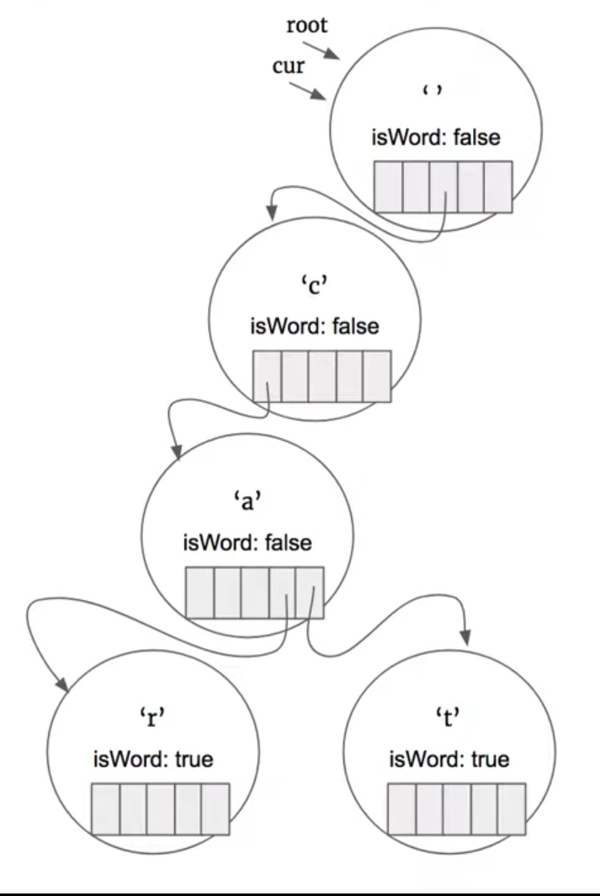

# \[Leetcode\]208. Implement Trie \(Prefix Tree\)

原题地址：[https://leetcode.com/problems/implement-trie-prefix-tree/](https://leetcode.com/problems/implement-trie-prefix-tree/)关键词：Trie, Prefix Tree

题意：构造Trie，然后：  
实现insert\(String word\)方法插入关键词；  
实现boolean search\(String word\)方法，查找关键词；  
实现boolean startsWith\(String prefix\)方法， 查找单词前缀prefix；

Explanation:  
`Trie trie = new Trie();   
trie.insert("apple");   
trie.search("apple"); // return True   
trie.search("app"); // return False   
trie.startsWith("app"); // return True   
trie.insert("app");   
trie.search("app"); // return True`

关于Trie的基础知识：[https://app.gitbook.com/@bhnigw/s/-1/trie-prefix-tree](https://app.gitbook.com/@bhnigw/s/-1/trie-prefix-tree)


#### 首先构建Trie：

```text
class TrieNode {
    char val;
    boolean isWord; 
    TrieNode[] children = new TrieNode[26];
    
    public TrieNode() { }
    
    TrieNode(char c){
        TrieNode node = new TrieNode();
        node.val = c;
    }
}
```

#### 构造insert方法：

首先创建一个current node指向root；然后把input string转化为char array；  
遍历这个char array；  
因为child的范围是26个英文字母，所以接下来找char array第一个字符ch，是不是current node的child；  
方法是判断`cur.children[ch - 'a']`（注意这个children\[ \]数组的元素的类型是TrieNode）  
    1. 如果它不为空，说明cur node含有字母为ch的child node；  
    2. 如果为空，则说明cur不含有该字母的child node，那么我们就在字符ch所对应的children\[ \]的位置new一个val为ch的TrieNode，方法：`cur.children[ch - 'a'] = new TrieNode(ch);`

便利结束后，给最后一个node的内部值isWord赋值true，表明这个关键词的insert过程完成。方法：`cur.isWord = true;`



```text
 public void insert(String word) {
        TrieNode cur = root;
        
        char[] arr = word.toCharArray();
        
        for (char ch : arr) {
            if (cur.children[ch - 'a'] == null) {
                cur.children[ch - 'a'] = new TrieNode(ch); //注意后面括号内容
            }
            
            cur = cur.children[ch - 'a'];
        }
        
        cur.isWord = true;
    }
```

Time: O\(L\)；L为输入单词的长度length   
Space: O\(L\)；这里worst case是如果新插入的单词在原来Trie Tree里没有任何的prefix，则需要重新创建L个node，所以空间复杂度是O\(L\)；


#### 构造boolean search\(String word\)方法：

string转化char array然后遍历，遍历结束后如果最后一个node的isWord的值为true则说明该word是关键词；若为false则该word不是关键词；

```text
public boolean search(String word) {
        TrieNode cur = root;
        
        char[] arr = word.toCharArray();
        
        for (char ch : arr) {    
            if (cur.children[ch - 'a'] == null) {
                return false;
            }
            
            cur = cur.children[ch - 'a'];
        }
        
        return cur.isWord;
    }
```

Time: O\(L\)；L为输入单词的长度length   
Space: O\(1\)


#### 构造boolean startsWith\(String prefix\)方法：

```text
 public boolean startsWith(String prefix) {
        TrieNode cur = root;
        
        char[] arr = prefix.toCharArray();
        
        for (char ch : arr) {    
            if (cur.children[ch - 'a'] == null) {
                return false;
            }
            
            cur = cur.children[ch - 'a'];
        }
        
        return true;
    }
```

Time: O\(L\)；L为输入单词的长度length   
Space: O\(1\)


#### 完整代码：

```text
//构造TrieNode

class TrieNode {
    char val;
    boolean isWord; 
    TrieNode[] children = new TrieNode[26];
    
    public TrieNode() { }
    
    TrieNode(char c){
        TrieNode node = new TrieNode();
        node.val = c;
    }
}

class Trie {
    private TrieNode root;
    
    //注意要初始化root
    
    public Trie() {
        root = new TrieNode();
        root.val = ' ';
    }
    
 
    public void insert(String word) {
        TrieNode cur = root;
        
        char[] arr = word.toCharArray();
        
        for (char ch : arr) {
            if (cur.children[ch - 'a'] == null) {
                cur.children[ch - 'a'] = new TrieNode(ch);
            }
            
            cur = cur.children[ch - 'a'];
        }
        
        cur.isWord = true;
    }
    

    public boolean search(String word) {
        TrieNode cur = root;
        
        char[] arr = word.toCharArray();
        
        for (char ch : arr) {    
            if (cur.children[ch - 'a'] == null) {
                return false;
            }
            
            cur = cur.children[ch - 'a'];
        }
        
        return cur.isWord;
    }
    
    
    public boolean startsWith(String prefix) {
        TrieNode cur = root;
        
        char[] arr = prefix.toCharArray();
        
        for (char ch : arr) {    
            if (cur.children[ch - 'a'] == null) {
                return false;
            }
            
            cur = cur.children[ch - 'a'];
        }
        
        return true;
    }
}
```


