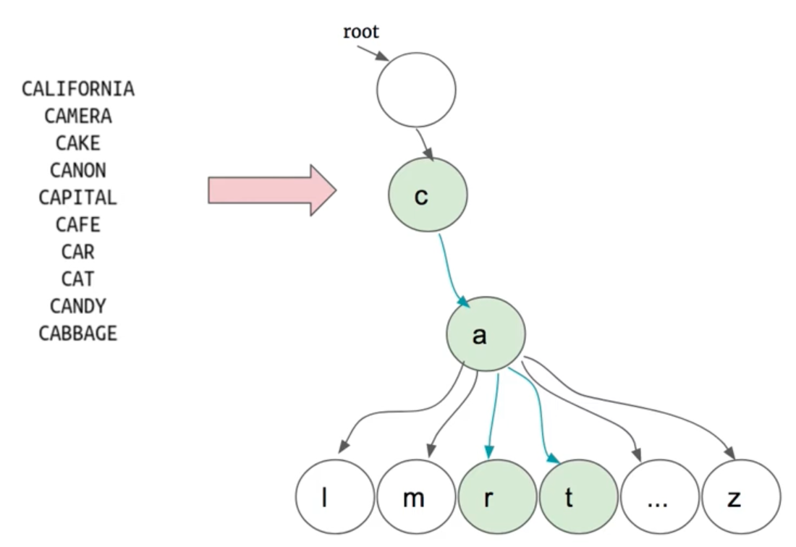

# \[Leetcode\]212. Word Search II

原题地址：[https://leetcode.com/problems/word-search-ii/](https://leetcode.com/problems/word-search-ii/) 关键词：DFS，Trie

题意：给一个充满字符char的二维数组`board[][]`，和一个关键词的stirng数组`words[]`，找出board中所有存在于words\[ \]中的单词。  


![char board\[ \]\[ \]](.gitbook/assets/screen-shot-2021-06-02-at-1.59.29-am.png)

 Input: `board = [['o','a','a','n'],['e','t','a','e'],['i','h','k','r'],['i','f','l','v']]`，`words = ["oath", "pea", "eat", "rain"]`   
Output: `["eat", "oath"]`

#### 

### 算法：

第一个问题：如何找单词？方法是遍历words里的单词，找到第一个单词的第一个字母，然后去board里找这个字母，如果board里存在这个字母，则围绕这个字母开始DFS。

但是！！这就引申出第二个问题，如果input的words单词量十分巨大，每找一个单词就要重新遍历整个board，耗时巨大，怎么办？

这时就要想到，单词数量越多，就越容易出现common prefix；如果能够预先处理这些单词，那么搜索将会大幅提速。

★这时就要引入[Trie tree](https://app.gitbook.com/@bhnigw/s/-1/trie-prefix-tree)：**1.我们可以把words全部转换到Trie tree上，2.然后再结合Trie tree对这个二位矩阵进行DFS**，就要方便很多：

**1.把words全部转换到Trie tree上：**



**2. 结合Trie tree对这个二位矩阵board进行DFS：**


所以，代码的结构应该是：  
1. 定义主要的方法，确定input和output：`public List findWords(char[][] board, String[] words) { }`然后  
2. 然后在此方法内，**先把words全部转换到Trie tree上**：`buildTrieTree(root, words);`  
3. 然后需要一个**helper function来DFS**：`helper(board, cur, i, j, res);`


### 具体实现：

**首先要初始化Trie：**  
★这里要注意的是，一般的Trie的node附带的值是一个char和一个boolean值isWord；但是因为这里我们要返回的是复合体对的关键词string，所以这里我们用一个string值来代替这个boolean值；见下图

```text
class TrieNode {
    char val;
    String word; //注意这里是string
    TrieNode[] children = new TrieNode[26]; //注意这里后面要new
    
    public TrieNode() { }
    
    public TrieNode(char ch) {
        val = ch;
        word = null;
        children = new TrieNode[26];
    }
}
```


**build一个TrieTree的方法：**  
★遍历完一个关键词所有字符后，就把cur的trie node里的string标记为这个关键词的string

```text
private TrieNode buildTrieTree(TrieNode root, String[] words) {
        TrieNode cur = root;

        for (String str : words) {
            cur = root;
            for (char ch : str.toCharArray()) {
                if (cur.children[ch - 'a'] == null) {
                    cur.children[ch - 'a'] = new TrieNode(ch); //注意后面括号内容
                }
                cur = cur.children[ch - 'a'];
            }
            
            cur.word = str; 
        }
        
        return root;
    }
```


主方法：

遍历board，如果任何一个字符char出现在了root的child里，那么说明这个字符是某个关键词word的第一个字母，那么我们就在board里围绕这个字符进行DFS；

围绕这个字符dfs的时候，对于已经访问过的字符，要在board上把它标记为星号`'*'`，不然会陷入死循环；然后对这个字符的这一轮dfs结束后，要把星号重新变回原来的字符，不然会影响下面的关键词的形成。

DFS时：

1. 如果指数i, j超出范围，直接return；
2. 如果遇到星号`'*'`，表示已经访问过，此路不通直接return；
3. 注意此时的current node是来自上一轮的node，也就是上面一层的node，所以我们需要判断cur的children集合里是否含有当前`board[i][j]`的这个字符，如果为null，意思是周围找不到关键词后续的字母，所以此路不通直接return；`if (cur.children[board[i][j] - 'a'] == null) return;`
4. 如果以上三个条件都满足，说明该字符`board[i][j]`出现在了上面cur node的child node里，那么我们就把cur移动到这个child node上作为current node；`cur = cur.children[board[i][j] - 'a'];`
5. 如果cur node里面含有的string不为空，说明到这个字符为止可以组成关键词，所以就把这个string加入res；`res.add(cur.word);`
6. ★重点来了！！下面代码第31行，当我们找到一个关键词时，就要把它的string变为null，为什么要这样做？因为，如果关键词有同样的prefix，比如"car"和"card"这两个单词，遍历完"car"后如果不变为null，那么在遍历"card"经过'r'这个字母时，就会把"car"再一次加入到结果集res，出现重复，就不对了；所以一定要记得加入res后把string变为null；具体图解见下面。

```text
public List<String> findWords(char[][] board, String[] words) {
        List<String> res = new ArrayList<>();
        
        TrieNode root = new TrieNode();
        root = buildTrieTree(root, words);
        
        for (int i = 0; i < board.length; i++) {
            for (int j = 0; j < board[0].length; j++) {
                TrieNode cur = root;
                if (cur.children[board[i][j] - 'a'] != null) { //如果words里面任何开头的字母出现在board，就进行dfs
                    helper(board, cur, i, j, res);
                }
            }
        }
           
        return res;
    }
    
    private void helper(char[][] board, TrieNode cur, int i, int j, List<String> res) {
        if (i < 0 || i >= board.length || j < 0 || j >= board[0].length) return;
        
        char ch = board[i][j];
        if (ch == '*') return; //如果已经访问过，则return
        
        if (cur.children[ch - 'a'] == null) return; 
                
        cur = cur.children[ch - 'a']; 
        
        if (cur.word != null) {
            res.add(cur.word);
            cur.word = null; //注意这里，见下图
        } 
        
        board[i][j] = '*'; //把当前遍历过的标记为‘*’，以防止下面dfs出不来
        helper(board, cur, i + 1, j, res);
        helper(board, cur, i - 1, j, res);
        helper(board, cur, i, j + 1, res);
        helper(board, cur, i, j - 1, res);
        
        board[i][j] = ch; //dfs后要把‘*’还原为原来的char，不然后面的找不到
    }
```

这里把"car"加入res后，要把string变为null：`cur.word = null;`


#### 复杂度：

Time: `O(M(4*3^(L-1))`；M是board里cell的个数；L是words里最长的单词的长度，也就是Trie tree最高的高度；  
Space: `O(N)`；N是words中所有字母的数量，也就是Trie tree中所有node的总数


#### 要注意的：

1. Trie的构建中，node附带值要从普通的boolean变成string类型的word
2. 复杂度的计算


#### 相关知识：

[Trie](https://app.gitbook.com/@bhnigw/s/-1/trie-prefix-tree)，[DFS](https://app.gitbook.com/@bhnigw/s/-1/dfs-mo-ban)


附完整代码：

```text
class TrieNode {
    char val;
    String word;
    TrieNode[] children = new TrieNode[26]; //注意这里后面要new
    
    public TrieNode() { }
    
    public TrieNode(char ch) {
        val = ch;
        word = null;
        children = new TrieNode[26];
    }
}

class Solution {
    public List<String> findWords(char[][] board, String[] words) {
        List<String> res = new ArrayList<>();
        
        TrieNode root = new TrieNode();
        root = buildTrieTree(root, words);
        
        for (int i = 0; i < board.length; i++) {
            for (int j = 0; j < board[0].length; j++) {
                TrieNode cur = root;
                if (cur.children[board[i][j] - 'a'] != null) { //如果words里面任何开头的字母出现在board，就进行dfs
                    helper(board, cur, i, j, res);
                }
            }
        }
           
        return res;
    }
    
    private void helper(char[][] board, TrieNode cur, int i, int j, List<String> res) {
        if (i < 0 || i >= board.length || j < 0 || j >= board[0].length) return;
        
        char ch = board[i][j];
        if (ch == '*') return; //如果已经访问过，则return
        
        if (cur.children[ch - 'a'] == null) return; //
                
        cur = cur.children[ch - 'a']; //注意
        
        if (cur.word != null) {
            res.add(cur.word);
            cur.word = null; //注意这里
        } 
        
        board[i][j] = '*'; //把当前遍历过的标记为‘*’，以防止下面dfs出不来
        helper(board, cur, i + 1, j, res);
        helper(board, cur, i - 1, j, res);
        helper(board, cur, i, j + 1, res);
        helper(board, cur, i, j - 1, res);
        
        board[i][j] = ch; //dfs后要把‘*’还原为原来的char，不然后面的找不到
    }
    
    private TrieNode buildTrieTree(TrieNode root, String[] words) {
        TrieNode cur = root;

        for (String str : words) {
            cur = root;
            for (char ch : str.toCharArray()) {
                if (cur.children[ch - 'a'] == null) {
                    cur.children[ch - 'a'] = new TrieNode(ch); //注意后面括号内容
                }
                cur = cur.children[ch - 'a'];
            }
            
            cur.word = str;
        }
        
        return root;
    }
}
```


