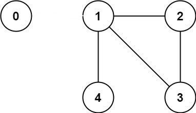

# \[Leetcode\]261. Graph Valid Tree

原题地址：[https://leetcode.com/problems/graph-valid-tree/](https://leetcode.com/problems/graph-valid-tree/)关键词：Union find, Undirected graph, DFS

题意：判断树。给一个数字n，表示有0到n-1个节点；给一个`edges[][]`，根据它做出一个无向图undirected graph；**判断作出的图是不是一个tree**，是就true；

Example 1：


`Input: n = 5, edges = [[0,1],[0,2],[0,3],[1,4]]   
Output: true`

Example 2：



`Input: n = 5, edges = [[1,2],[2,3],[1,3],[1,4]]   
Output: false`


### 注意：

**要使得一个graph能称作是一个tree，那么它必须满足以下条件/具有以下特点：**

1.  任何两个节点之间都有一条连接的路径；也就是说，所有点都必须fully connected，不能有落单的；
2. 图中不能有环cycle/loop；
3. ★**如果一个tree有n个节点，那么它必然有n - 1条edges**；若少于`n - 1`则必然有点没有连接上，若多于`n - 1`则必然有环cycle/loop

⇒ 所以，只要一个graph不满足以上三个条件中任意一个，就不能称作是一个tree，就要return false；

有了思路，接下来看具体的方法：


### 方法一：Graph DFS with adjacency list

基本算法步骤：  
1. 检查图中是否有环；\(详细步骤参考[检测无向图中是否存在环](https://bhnigw.gitbook.io/leetcode/ji-chu-bi-hui/wu-xiang-tu-zhong-jian-cha-huan-detect-cycle-inaundirected-graph)\)  
2. ★检查所有节点是否都连接上；

**根据tree特点，如果edges总数不等于n - 1，直接false；（在代码开头判断）**

**DFS步骤：**

1. 首先构建Adjacency List；
2. 新建boolean数组`visited[n]`记录已经访问过的节点；
3. 从Adjacency List里第一个点开始DFS，把走过的节点都在`visited[]`里标记true；
4. 在DFS时如果遇到true，说明已经访问过，说明有loop/cycle；
5. 在DFS的同时，我们要用一个int来记录parent node，比如在DFS进入到节点1的时候，0是1的parent node，但1的Adjacency List是`[0, 2, 3, 4]`包含了0，所以我们在对1的Adjacency List遍历DFS的时候，要加入一个判断条件，只有当current node不等于parent node的时候我们才进行DFS，如果current node等于parent node那就跳过它；起始点0的parent node我们设置为-1，然后DFS下一个节点的时候把当前current node设置为下一个节点的parent node；（参见代码41行）

```text
class Solution {
    public boolean validTree(int n, int[][] edges) {
        if (edges.length != n - 1) return false;
        
        // initialize adjacency list
        List<List<Integer>> adjList = new ArrayList<>();
        for (int i = 0; i < n; i++) { //注意这里是n
            adjList.add(i, new ArrayList<Integer>());
        }

        // Add edges
        for (int i = 0; i < edges.length; i++) {
            adjList.get(edges[i][0]).add(edges[i][1]);
            adjList.get(edges[i][1]).add(edges[i][0]);
        }
        
        
        // dfs
        boolean[] visited = new boolean[n];
        if (hasCycle(adjList, visited, 0, -1)) { //起始点0没有parentNode，所以是-1
            return false;
        }
        
        // make sure all vertices are connected
        for (boolean i : visited) {
            if (i == false) {
                return false; //居然还有一个节点没有被访问过，说明不是图
            }
        }
        
        return true;
    }
    
    private boolean hasCycle(List<List<Integer>> adjList, boolean[] visited, int curNode, int parentNode) {
        if (visited[curNode] == true) return true; //如果true说明已访问过，说明出现环
        
        visited[curNode] = true;
        List<Integer> childNode = adjList.get(curNode);
        
        for (int i : childNode) {
            if (parentNode != i && hasCycle(adjList, visited, i, curNode)) {
                return true;
            }
        }
        
        return false;
    }
}
```

代码结构总结：  
1. 构建Adjacency List；  
2. Add edges；  
3. DFS；  
4. 检查所有点是否相连（是否构成图）

Time：`O(N + E)`；  
DFS的时间就是node总数加上edges的总数  
N是顶点总数，也是构造Adjacency List所花时间；  
E是edges的总数；

Space：`O(N + E)`  
N是Adjacency List的长度；  
E是Adjacency List的子List的总长度；

**要记住的东西：**

1. 构建Adjacency List的时候，要事先给每个节点new一个ArrayList，不然会报错；
2. 子节点中包含parent node，所以必须剔除掉parent node才能DFS；


### 方法二（重要）：Union find

方法一复杂度还是略高，根据tree的特点我们可以思考一下更简便的方法；

要使graph成为有效树valid tree，它必须正好有`n - 1`条边edge。  
如果edge比`n - 1`少，图就不可能完全连通；  
如果edge比`n - 1`多，则必然有cylcle/loop；  
⇒ 所以，**如果图是完全连通的，且正好包含`n - 1`条边，那么它必然是一棵树**！


按照这个逻辑，我们算法的思路就出来了:

1. 检查graph是否有 `n - 1` 条边edge，如果没有则返回`false`；
2. 检查graph是否fully connected，如果是，返回true，如果不是返回false；


