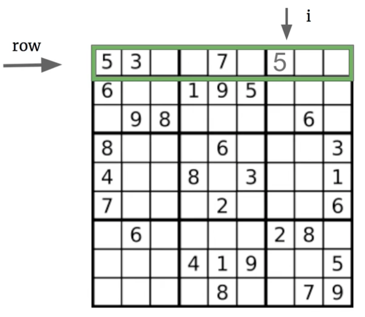
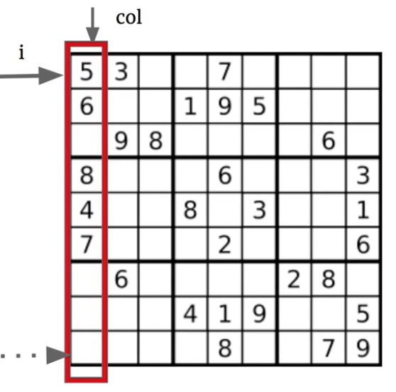
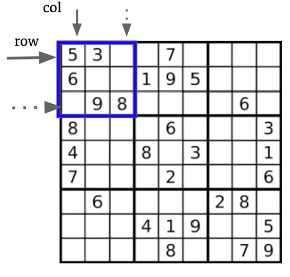

# \[Leetcode\]36. Valid Sudoku

原题地址：[https://leetcode.com/problems/valid-sudoku/](https://leetcode.com/problems/valid-sudoku/) 关键词：ASCII，HashSet

题意：判断给的9×9的matrix是不是一个有效的Sudoku。

输入的`board[][]`是二维char array，题目已经保证长宽均为9，且里面字符只包含`'.'`和1～9（空白的格子用字符`'.'`代替）；

按规则，下图应该返回true；


**有效的Sudoku：**  
1. 每一行含有数字1～9，不能重复；  
2. 每一列含有数字含有数字1～9，不能重复；  
3. 每一个3×3的小正方形含有数字1～9，不能重复；（共9个小正方形）

### 算法：

既然有效的sudoku有三个条件，那么可以将此问题拆解为三个小问题：  
1. 检查每一行内数字是否有重复；  
2. 检查每一列内的数字是否有重复；  
3. 检查九个3×3的小正方形内数字是否重复；

### 问题1：检查每一行内数字1～9是否有重复



一看到“重复“这两个字，就应该立马联想到HashSet，次题可以用HashSet来存储数字检测是否重复，也可以新建数组来count每个数字出现的次数；

#### 方法1：使用HashSet：

需要注意的是：\(1\) 初始化HashSet一定要在外层for循环，不能写在第二个for里面。若写在第二个for里面意思就是每添加一个数就全部清零，那就无法记录任何重复；若写在第一个for里，意思就是有九个row，遍历一个新row的时候才清零set，因此可以记录每个row里面数字的情况；  
\(2\) HashSet里的`add()`方法本身就可以判断set里是否已经含有该元素且会返回一个boolean值，如果`add()`返回false说明有重复；

```text
        // Check row
        for (int row = 0; row < 9; row++) {
            Set<Character> set = new HashSet<>(); //九个row，每个row要重新new一个set
            for (int col = 0; col < 9; col++) {
                if (board[row][col] != '.') {
                    if (!set.add(board[row][col])) return false; //注意
                } 
            }
        }
```

#### 方法2：使用长度为9的`nums[]`数组，数字出现一次就在对应的index加一，若任何`nums[i]`数值大于1立即返回false

需要注意的是：\(1\) 和上面一样，注意初始化`nums[]`的位置是在第一层for；  
\(2\) ★注意下面代码第6行是减1而不是减0；

因为`nums[]`的长度为9，对应数字1～9，数字字符`'1'`对应的index是0，所以是`nums[ch - '1']`；

如果`nums[]`的长度为10，对应数字0～9的话，数字字符`'0'`对应的index是0，数字字符`'1'`对应的index是1，就可以`nums[ch - '0']`；

延伸拓展：如果题目的input数字只在3～8范围，那么`nums[]`长度应设为6，操作应为`nums[ch - '3']`；  
因为数字字符`'3'`对应的index是0；

```text
        // Check row
        for (int row = 0; row < 9; row++) {
            int[] nums = new int[9];
            for (int col = 0; col < 9; col++) {
                if (board[row][col] != '.') {
                    nums[board[row][col] - '1']++;  // 注意
                    
                    if (nums[board[row][col] - '1'] > 1) return false;
                }                
            }
        }
```

#### 方法3：与方法2类似，只是使用的是长度128的`ascii[]`数组来记录

需要注意的是：\(1\) 和上面一样，注意初始化`ascii[]`的位置是在第一层for；  
\(2\) 标准ascii长为128；  
\(3\) 对于Character来说，可以作为index直接放进数组（[点击查看详情](https://bhnigw.gitbook.io/-1/shu-ju-jie-gou-string/ascii-ma)）；

```text
        // Check row
        for (int row = 0; row < 9; row++) {
            int[] ascii = new int[128];
            for (int col = 0; col < 9; col++) {
                if (board[row][col] != '.') {
                    ascii[board[row][col]]++;
                }
                
                if (ascii[board[row][col]] > 1) return false;
            }
        }
```


### 问题2：检查每一列内数字1～9是否有重复



如法炮制，只需注意调换两层for循环row和col的位置即可：

```text
        // Check column
        for (int col = 0; col < 9; col++) { //注意for的初始值
            Set<Character> set = new HashSet<>(); //九个col，每个col要重新new一个set
            for (int row = 0; row < 9; row++) {  //注意for的初始值
               if (board[row][col] != '.') {    //board指数不用调换
                    if (!set.add(board[row][col])) return false;
                }
            }
        }
```


### 问题3：检查九个3×3的小正方形内数字是否重复




### 要记住的重点：

1. 新建`set`或者`ascii[]`的时候一定是在最外层的for循环


