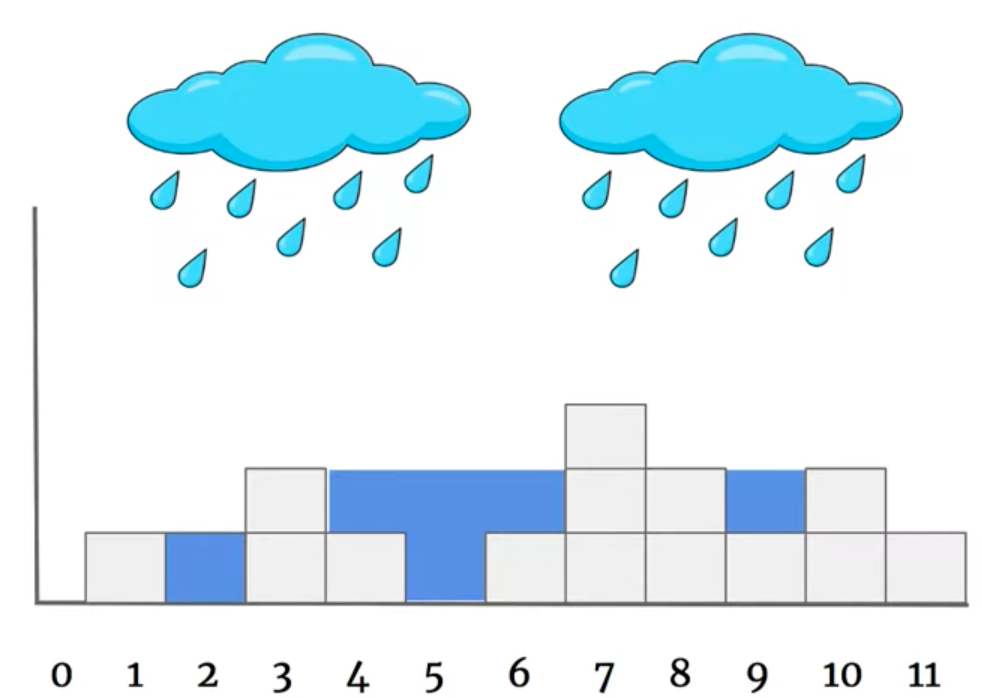
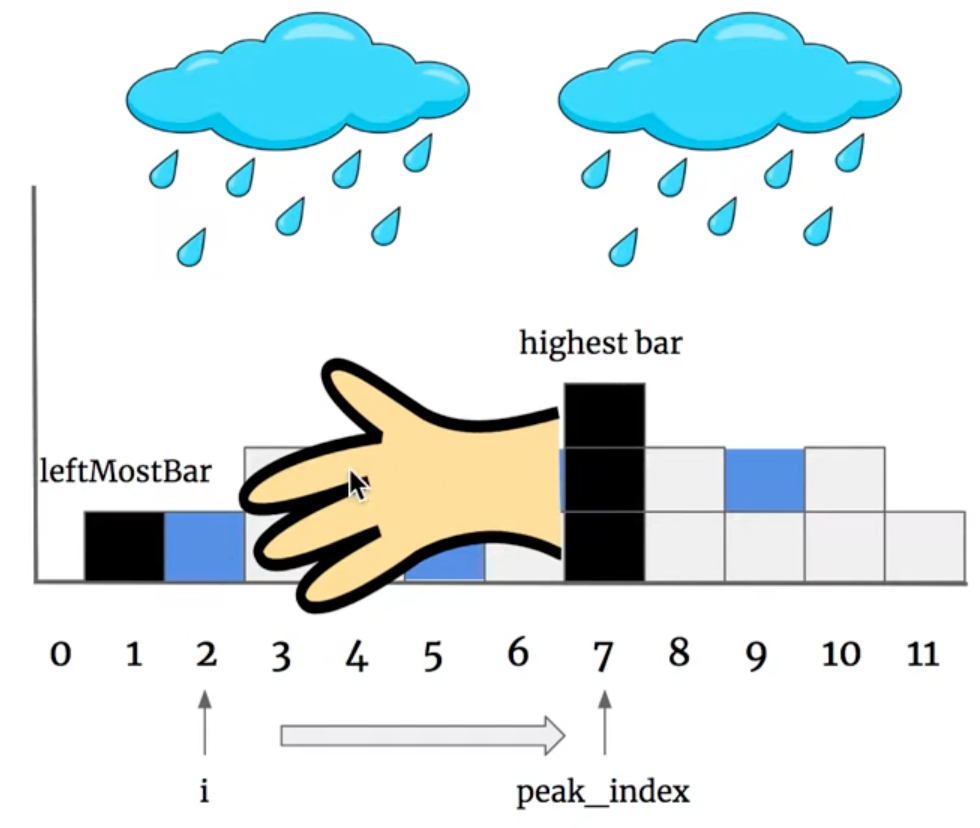
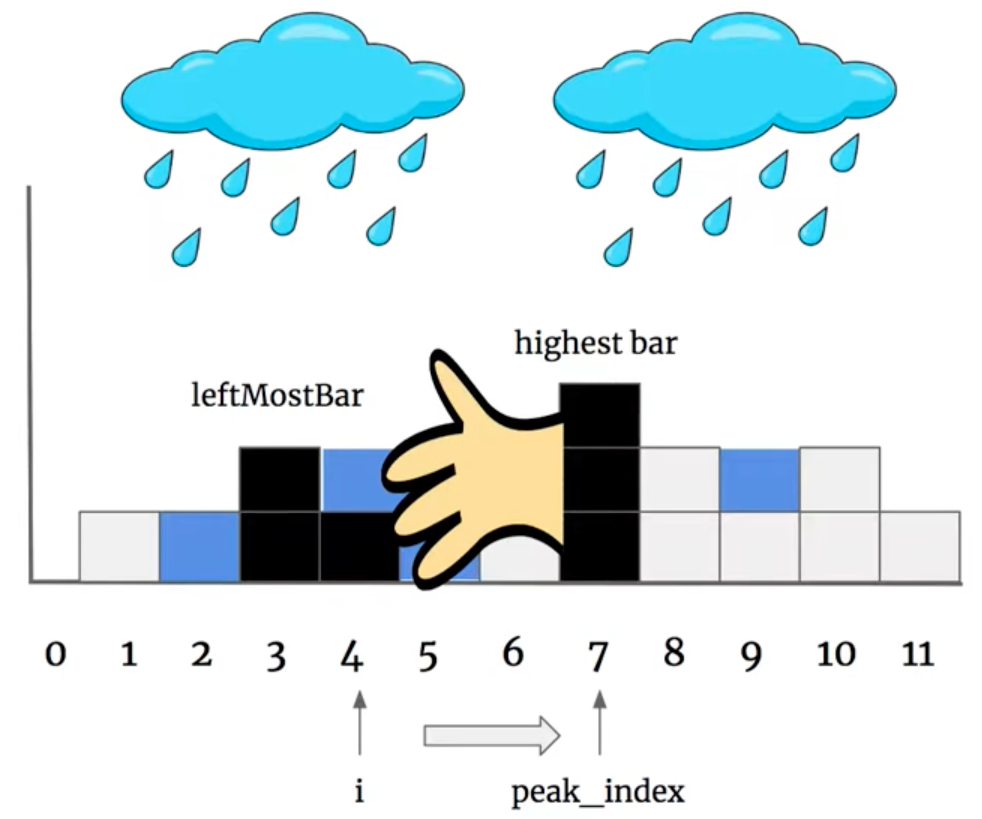

# \[Leetcode\]42. Trapping Rain Water

原题地址：[https://leetcode.com/problems/trapping-rain-water/](https://leetcode.com/problems/trapping-rain-water/) 关键词：two pointer

题意：给个数组`height[]`，求能装水的总量。




### 算法：Two pointer

**核心思想：不考虑整个水坑的面积，而是看每一个竖条，单独算出每个竖条的蓄水量，最后加起来；**

  
先遍历一次数组，找到最高的那个peak bar，记录它的指数`peak_index`；

然后从最左边i = 0开始，往中间的`peak_index`开始遍历。我们初始化一个leftMostBar = 0；  
根据木桶原理，最短板决定了液面高度；目前右边最高的peak bar已经确定，所以决定蓄水量的是左边的leftMostBar挡板。我们要做的，就是不断更新左边的leftMostBar：

当扫到当前挡板比leftMostBar低的时候，说明该处是一个洼地，可以蓄水。

#### 那么该竖条的蓄水量由什么决定呢？

我们假装指针`i`没有扫到的地方都看不见。此时只能看到左边的leftMostBar和右边最高的peak bar，两块挡板。因为左边的挡板一定比peak矮，根据木桶原理可以确定，leftMostBar的高度决定了当前指针`i`位置的蓄水量。如果遍历遇到的挡板比之前leftMostBar更高，则更新leftMostBar。

如下图，`i = 2`时，leftMostBar在i = 1处，竖条`i = 2`处的蓄水量是1：




如下图，`i = 4`时，leftMostBar在i = 3处，竖条`i = 4`处的蓄水量是1：



**所以，遍历过程中的核心就是：  
●遇到比之前leftMostBar更高的挡板，则更新leftMostBar；  
●遇到比之前leftMostBar更低的挡板，说明该竖条是一个洼地，可以蓄水，用leftMostBar的高度减去当前bar高度就是该竖条的储水量；**


左边的遍历结束后，再从最右端`i = height.length - 1`开始，往中间的`peak_index`开始遍历，过程如法炮制即可。

```text
class Solution {
    public int trap(int[] height) {
        int res = 0;
        
        // 1. 确定最高bar的指数
        int peakIndex = 0;
        for (int i = 0; i < height.length; i++) {
            if (height[i] > height[peakIndex]) {
                peakIndex = i;
            }
        }
        
        // 2. 从最左边到最高
        int leftMostBar = 0;
        for (int i = 0; i < peakIndex; i++) {
            if (height[i] > leftMostBar) {
                leftMostBar = height[i];
            } else {
                res += leftMostBar - height[i];
            }
        }
        
        // 3. 从最右边到最高
        int rightMostBar = 0;
        for (int i = height.length - 1; i > peakIndex; i--) {
            if (height[i] > rightMostBar) {
              rightMostBar = height[i];
            } else {
                res += rightMostBar - height[i];
            }
        }
        
        return res;
    }
}
```

代码结构：  
1. 确定最高bar的指数peak index；  
2. 从最左边到最高；  
3. 从最右边到最高；

Time：O\(n\)  
Space：O\(1\)；没有创建额外数组；


### ❗️Follow up：在所有小水坑中，如何得出其中最大的水坑的储水量？

可以新建一个数组`nums[]`，长度等于`height[]`，初始化所有数为0。  
在之前遍历的过程中，把指针`i`扫到有水的地方的蓄水量放到`nums[i]`里。  
最后遍历`nums[]`，把所有连续不为0的数加起来比较哪个最大即可。

```text
        int maxVolume = 0;
        int curVolume = 0;
        int i = 0;
         
        while (i < nums.length) {
            while (nums[i] != 0 && i < nums.length) {
                curVolume += nums[i];
                maxVolume = Math.max(curVolume, maxVolume);
                i++;
            }
            
            curVolume = 0;
            i++;
        }
```


视频讲解：[https://www.youtube.com/watch?v=bu1quf2rOp8](https://www.youtube.com/watch?v=bu1quf2rOp8)


