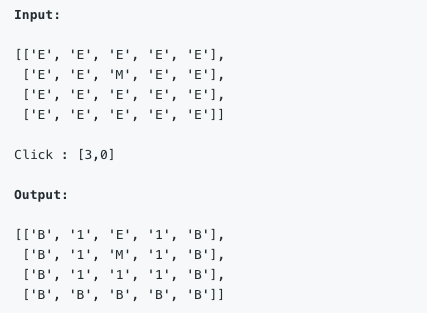
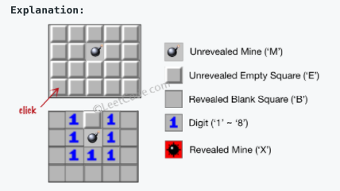

# \[Leetcode\]529. Minesweeper

原题地址：[https://leetcode.com/problems/minesweeper/](https://leetcode.com/problems/minesweeper/) 关键词：DFS

题意：扫雷。给一个matrix和一个初始点击的点click\[ \]；点击之前雷是M，空白是E；  
点击之后：如果点到雷M，游戏结束，把M变为X然后直接return；  
如果点到空白E，那么：  
如果E周围的8个点都没有雷M，则把E变为B；  
如果E周围的8个点中有雷M，则统计周围8个点中雷的总数，然后把E变为此数，然后return；





解释：为什么上图雷M的正上方E没有变成B，因为无论是dfs还是bfs，把空白格变成数字后就会立即return，不会遍历到雷上方的点。


算法：DFS；算法简单直接，就是从click\[ \]的点开始dfs；  
1.点击click\[ \]之后，如果点到雷M，把M变为X然后直接return board；  
2.如果点到空白E，那么就开始检测这个空白点周围有没有雷，方法：统计这个空白点周围的8个点雷的个数，把数放进count，如果count为0则说明周围没有雷；  
3.如果count==0，说明周围都没有雷，则把E变为B，然后对该点周围的8个点进行dfs \(recursive\)；  
4.如果count !=0，说明周围有雷，那么就把E变为数字count，然后return board；

因为后期要对click里的数进行操作，而且会频繁用到matrix的长宽，所以要注意把matrix的长宽定义成m和n，然后click的数定义成row和col，这样方便看。同时要注意函数头的输入和输出是什么：  
input: `char[][] board, int[] click`  
output: `board[][]`

```text
class Solution {
    public char[][] updateBoard(char[][] board, int[] click) {
        int m = board.length, n = board[0].length;
		    int row = click[0], col = click[1];
        
        //如果点到雷M，把M变为X然后直接return board；
        if (board[row][col] == 'M') {
            board[row][col] = 'X';
            return board;
        }

        if (board[row][col] == 'E') { //点到空白
        
            //检测这个空白点周围有没有雷，方法：统计这个空白点周围的8个点雷的个数，把数放进count，如果count为0则说明周围没有雷
            int count = 0;
            for (int i = -1; i < 2; i++) {
                for (int j = -1; j < 2; j++) {
                    if (i == 0 && j == 0) continue;
                    if (row + i < 0 || row + i >= m || col + j < 0 || col + j >= n) continue;
                    if (board[row + i][col + j] == 'M') count++;
                }
            }  
            
            //周围都没有雷，则把E变为B，然后对该点周围的8个点进行dfs
            if (count == 0) { 
                board[row][col] = 'B';
                for (int i = -1; i < 2; i++) {
                    for (int j = -1; j < 2; j++) {
                        if (i ==0 && j == 0) continue;
                        if (row + i < 0 || row + i >= m || col + j < 0 || col + j >= n) continue;
                        click[0] = row + i;
                        click[1] = col + j;
                        updateBoard(board, click); // DFS
                    }
                }     
                
            } else { //周围有雷，那么就把E变为数字count，然后return board
                board[row][col] = (char)(count + '0');
                return board;
            }
        }
              
        return board;
    }
}
```

Time: O\(m\*n\) 遍历了所有格子  
Space: O\(m\*n\) 由dfs的深度/层数决定


重点总结：

1.对于二维矩阵/数组，在dfs/bfs的时候对**index是否超出范围**的检查：

* 要注意提前定义边的长度：`int m = board.length, n = board[0].length;`
* 然后在dfs时，检查`row < 0 || row  >= m || col < 0 || col >= n` 如果不满足就continue或return。注意这里的m和n不用减去1，因为上面定义的长度是本身的length，当index等于该length时就直接判定算越界

2.对于二维矩阵/数组，如何处理当前node旁所有的相邻node，除了上下左右外，还包括左上左下右上右下：

```text
            for (int i = -1; i < 2; i++) {
                for (int j = -1; j < 2; j++) {
                    if (i == 0 && j == 0) continue; //等于0说明是当前点本身，应跳过
                    
                    //然后进行需要的操作
                }
            } 
```

解释：i小于2表明i最多是1，那么i的-1，0，1和j的-1，0，1所形成的8种排列组合，就代表了8个方向。

3.注意复习string to integer，integer to string，char to integer，integer to char，string to char，char to string [https://app.gitbook.com/@bhnigw/s/-1/](https://app.gitbook.com/@bhnigw/s/-1/)  
这里把整数count转化成为字符char的方法是`(char)(count + '0');` 注意是加0不是减0

