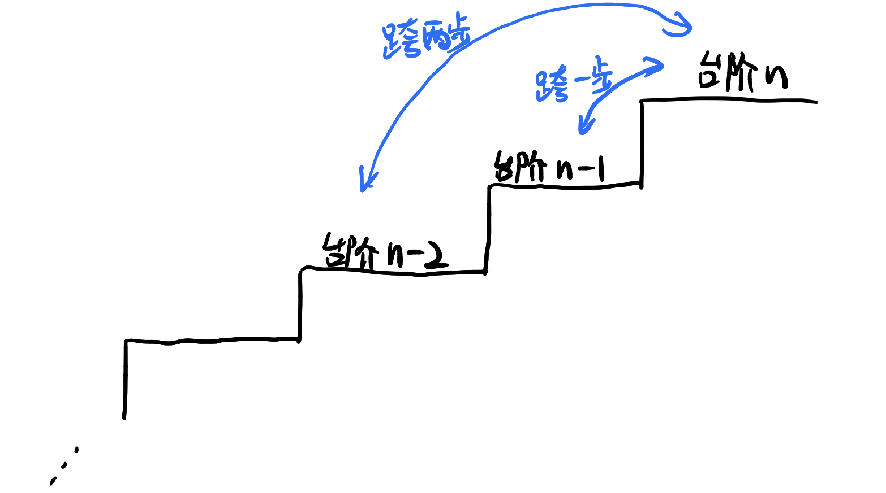

# \[Leetcode\]70. Climbing Stairs

原题地址：[https://leetcode.com/problems/climbing-stairs/](https://leetcode.com/problems/climbing-stairs/) 关键词：Dynamic Programming，Fibonacci

题意：爬楼梯；  
共有n个阶梯，每次可以爬1或2个台阶。问有多少种不同的方法可以爬到阶梯n。


### 方法1：Brute force / Recursion（不推荐）

此方法时间是`O(2 ^ n)`，是指数复杂度（**exponential**）

```text
public class Solution {
    public int climbStairs(int n) {
        return climb_Stairs(0, n);
    }
    
    public int climb_Stairs(int i, int n) {
        if (i > n) {
            return 0;
        }
        if (i == n) {
            return 1;
        }
        
        return climb_Stairs(i + 1, n) + climb_Stairs(i + 2, n); 
    }
}
```


### 方法2：Dynamic Programming（重要）

倒过来想，如果已经爬到了台阶n上，往回退，只有两种退法：要么往回退1步站到台阶`n - 1`上，要么往回退2步站到台阶`n - 2`上；  
那么，能够爬到台阶n上的方法总数就是下面两部分之和：

1. 爬上`n − 1`阶楼梯的方法总数，因为再爬 1 阶就能到第`n`阶 
2. 爬上`n − 2`阶楼梯的方法总数，因为再爬 2 阶就能到第`n`阶

**所以我们得到公式`dp[n] = dp[n − 1] + dp[n − 2]`；**

同时需要初始化`dp[1] = 1`和`dp[2] = 2`；（input是正整数）



```text
class Solution {
    public int climbStairs(int n) {
        int dp[] = new int[n + 1]; //为什么加1，是为了处理n=0的情况
        
        dp[1] = 1;  // 注意input是正整数，所以从1开始
        dp[2] = 2;
        
        for (int i = 3; i <= n; i++) { // 注意i从3开始
            dp[i] = dp[i - 1] + dp[i - 2];
        }
        
        return dp[n];
    }
}
```

Time: `O(n)`；  
Space: `O(n)`；空间就是数组`dp[]`的长度


### 方法3：Fibonacci

观察方法2的公式，正好符合Fibonacci的公式：


所以可以得到一个更加节省空间的方法：

```text
public class Solution {
    public int climbStairs(int n) {
        if (n == 1) {
            return 1;
        }
        int first = 1;
        int second = 2;
        
        for (int i = 3; i <= n; i++) {
            int third = first + second;
            first = second;
            second = third;
        }
        
        return second;
    }
}
```

Time: `O(n)`;   
Space: `O(1)`;


