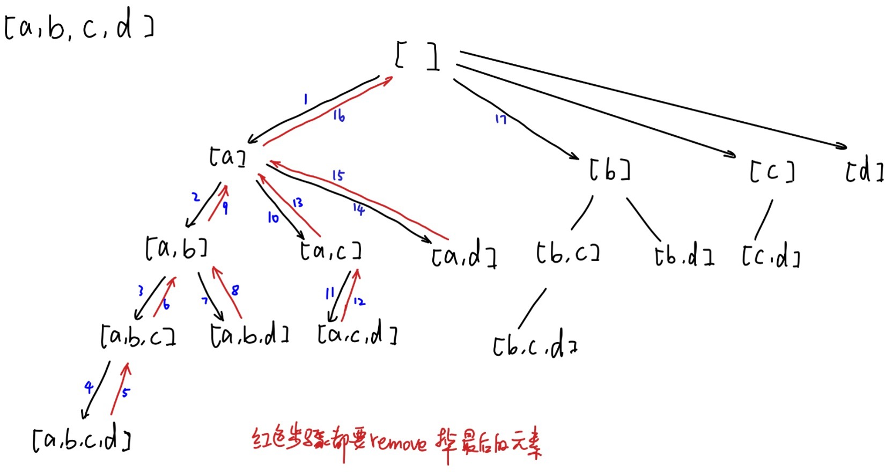

# \[Leetcode\]78. Subsets

原题地址：[https://leetcode.com/problems/subsets/](https://leetcode.com/problems/subsets/) 关键词：Backtracking, ArrayList, DFS, Recursive

题意：给一个没有duplicate的数组，输出所有的子集（包括空集和它本身）

算法：使用**DFS/backtrack/recursive**；如下图所示：




```text
class Solution {
    public List<List<Integer>> subsets(int[] nums) {
        List<List<Integer>> res = new ArrayList<>();
        List<Integer> tempSubset = new ArrayList<>();
        
        int startIndex = 0;
        
        helper(nums, startIndex, tempSubset, res);
        
        return res;
    }
    
    private void helper(int[] nums, int startIndex, List<Integer> tempSubset, List<List<Integer>> res) {
        res.add(new ArrayList<>(tempSubset)); //注意一定要new ArrayList
        
        for (int i = startIndex; i < nums.length; i++) {
            tempSubset.add(nums[i]);
            helper(nums, i + 1, tempSubset, res); //注意是i + 1，而不是startIndex + 1
            tempSubset.remove(tempSubset.size() - 1); //注意每backtrack一次就要remove掉list最末端那个
        }
    }
}
```

Time: O\(n2^n\)   
Space: O\(2^n\) ，取决于有多少个ArrayList？？？


**注意事先确认**：  
1. 给的input数组是否有duplicates，如果有，那么需要sort，然后在for循环里skip掉相同元素 `if(i > startIndex && input[i] == input[i-1]) continue`;  
2. 给的input数组里装的是char还是String还是integer


重点总结：  
1. 想要去除变化长度的ArrayList中**最后面**的元素可以用`list.remove(list.size() - 1)`;因为长度变化index不好确定的情况下，用list的size能够准确的确定最后一个元素的index；  
2. 注意第18行，是i + 1，而不是startIndex + 1，因为后面需要遍历的是从此刻i开始的后面；  
3. 注意复杂度的计算；  
4. 注意复习ArrayList的相关知识[https://bhnigw.gitbook.io/-1/shu-ju-jie-gou-arraylist](https://bhnigw.gitbook.io/-1/shu-ju-jie-gou-arraylist)


  


