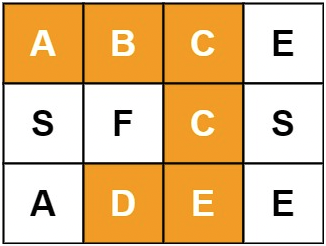

# \[Leetcode\]79. Word Search

原题地址：[https://leetcode.com/problems/word-search/](https://leetcode.com/problems/word-search/)关键词：DFS

题意：给一个充满字符char的二维数组`board[][]`，和一个关键词`word`，判断这个单词word是否在board出现，若出现返回true，若没有返回false。



Input: `board = [['A','B','C','E'],['S','F','C','S'],['A','D','E','E']], word = "ABCCED"`   
Output: `true`


算法：

遍历board，如果遇到了word的第一个字母，那就围绕这个字符进行DFS；

围绕这个字符dfs的时候，对于已经访问过的字符，要在board上把它标记为星号`'*'`，不然会陷入死循环；然后对这个字符的这一轮dfs结束后，要把星号重新变回原来的字符，不然会影响下面的关键词的形成。


DFS时：

1. 如果指数i, j超出范围，直接return；
2. 如果board当前字符和单词word当前字符不同`ch != word.charAt(index)`，说明遇到了遇到星号`'*'`，或者字母不相同没有此单词，此路不通直接return；
3. 由于dfs是boolean方法，那么怎样才算是找到了单词word呢？那就是dfs找到了单词word里所有的字母，也就是说，如果此时的index等于word的长度，就说明找到了，返回true；

```text
class Solution {
    public boolean exist(char[][] board, String word) {        
        if (word == null || word.length() == 0) return false;
        
        for (int i = 0; i < board.length; i++) {
            for (int j = 0; j < board[0].length; j++) {
                if (dfs(board, word, i, j, 0)) {        //注意
                    return true;
                }
            }
        }
        
        return false;
    }
    
    private boolean dfs(char[][] board, String word, int i, int j, int index) {
        if (index == word.length()) return true; //注意

        if (i < 0 || i >= board.length || j < 0 || j >= board[0].length) return false;
        
        char ch = board[i][j];
        if (ch != word.charAt(index)) return false; //字母不同，或者是星号'*'，返回false
        
        board[i][j] = '*';
        
        boolean found = false;
        
        if (dfs(board, word, i + 1, j, index + 1) || dfs(board, word, i - 1, j, index + 1) || 
           dfs(board, word, i, j + 1, index + 1) || dfs(board, word, i, j - 1, index + 1)) {
            found = true;
        }
        
        board[i][j] = ch;
        
        return found;
    }
}
```

注意：

主方法和dfs的方法类型都为boolean；  
注意28行的方法；


The complexity will be O\(m\*n\*4^L\)where m is the no. of rows and n is the no. of columns in the 2D matrix and s is the length of the input string.

$$
O(m*n*4^L)
$$

When we start searching from a character we have 4 choices of neighbors for the first character and subsequent characters have only 3 or less than 3 choices but we can take it as 4 \(permissible slopiness in upper bound\). This slopiness would be fine in large matrices. So for each character we have 4 choices. Total no. of characters are 𝑠 where s is the length of the input string. So one invocation of search function of your implementation would take 𝑂\(4𝑠\) time.

Also in worst case the search is invoked for 𝑚∗𝑛 times. So an upper bound would be 𝑂\(𝑚∗𝑛∗4𝑠\).

