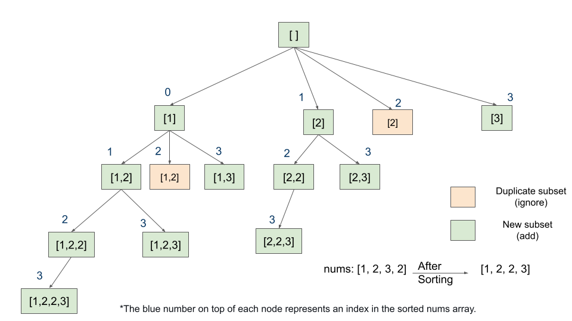

# \[Leetcode\]90. Subsets II

原题地址：[https://leetcode.com/problems/subsets-ii/](https://leetcode.com/problems/subsets-ii/) 关键词：Backtrack

题意：给一个含有duplicate的数组，输出所有的子集（包括空集和它本身）；要求输出结果中不含重复子集；

例：  
Input: `nums = [1, 2, 3, 2]`   
Output: `[[],[1],[1,2],[1,2,2],[1,2,2,3],[1,2,3],[1,3],[2],[2,2],[2,2,3],[2,3],[3]]`


#### 详细图解：




#### 算法/代码结构：

1. 无需null check；初始化二维List作为res，初始化一维List作为backtrack时候的current Subset；
2. 给数组排序sort，为后面去重复做准备；
3. 无需for循环遍历数组，直接用0作为初始index进入helper方法；
4. 在helper方法内：
   1. 首先把当前此刻最新的currentSubset加入结果集（第一轮加入的是空集）
   2. 从当前输入的index开始for循环，每一轮的for 循环都有四个操作：
      1. 去重复，因为前面sort了数组所以用？？
      2. 把当前数字`nums[i]`加入curren subset；
      3. 继续下一轮
      4. ★每一轮for循环结束前，都要去掉curren subset里最后一个元素（因为要backtrack到上一轮给末尾加入新的元素，详细看上图和[backtrack讲解](https://bhnigw.gitbook.io/-1/backtrack-mo-ban)）

```text
class Solution {
    public List<List<Integer>> subsetsWithDup(int[] nums) {
        List<List<Integer>> res = new ArrayList<>();
        List<Integer> currentSubset = new ArrayList<>();
        Arrays.sort(nums);
        
        helper(nums, 0, currentSubset, res);

        return res;
    }
    
    private void helper(int[] nums, int index, List<Integer> currentSubset, List<List<Integer>> res) {
        res.add(new ArrayList<>(currentSubset)); //注意一定要new ArrayList
        
        for (int i = index; i < nums.length; i++) {
            if(i > index && nums[i] == nums[i - 1]) continue; //1

            currentSubset.add(nums[i]);                     //2
            helper(nums, i + 1, currentSubset, res);        //3
            currentSubset.remove(currentSubset.size() - 1); //4
        }
    }
}
```

Time：O\(n × 2 ^ n\) 

Space：O\(n\)


