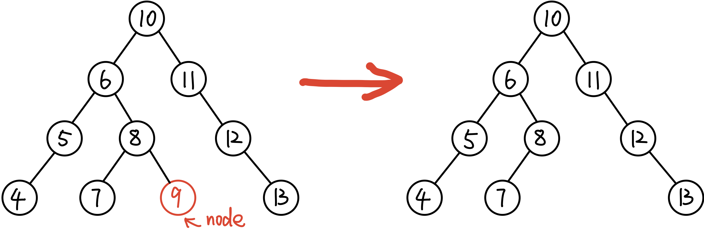
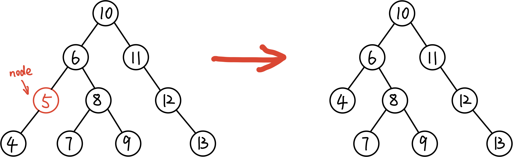
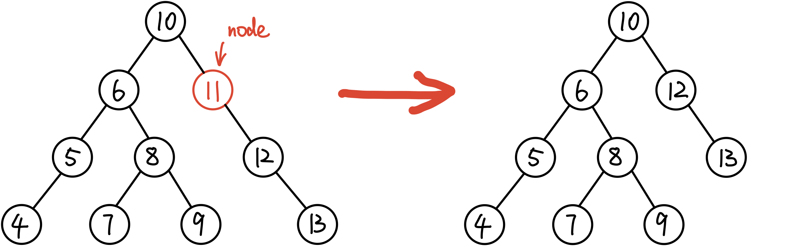

# ★删除 Delete

原题地址：[https://leetcode.com/problems/delete-node-in-a-bst/](https://leetcode.com/problems/delete-node-in-a-bst/) 关键词：Binary Search Tree

题意：删除BST上值为`key`的node，返回整个tree；

### 算法：Recursion

如果没找到删除的节点，遍历到空节点null直接返回；

当找到要删除的节点时，有以下4种情况：

● **节点情况1：**没有左child，也没有右child，也就是**Leaf节点**，则直接删除它：`return null`

  
****● **节点情况2：**只有左child（只有left subtree）：直接`return left subtree` 

  
****● **节点情况3：**只有右child（只有right subtree）：直接`return right subtree` 

  
****● **节点情况4：**既有左child，又有右child。设当前要删除的节点为`cur_node`，找到它的**right** subtree中**值最小的节点**`min_node`，把`min_node`赋值给`cur_node`；  
然后进行recursion，继续找`min_node`的right subtree中值最小的节点`min_min_node`，继续替换继续找...

所以，具体算法为：

* 如果`key > root.val`，说明要删除的节点在右子树，root.right = deleteNode\(root.right, key\)；
* 如果`key < root.val`，说明要删除的节点在左子树，root.left = deleteNode\(root.left, key\)；
* 如果`key == root.val`，则该节点就是我们要删除的节点，则： 
  * 如果该节点是Leaf节点，则直接删除它：`root = null`；
  * 如果该节点只有左child，。 
  * 如果该节点只有右child，。 
  * 如果该节点左右都有child，找到它right subtree中值最小的节点，替换；然后以这个最小节点为当前要删除的节点，继续recursion找到它right subtree中值最小的节点，替换...
* 返回 root。

