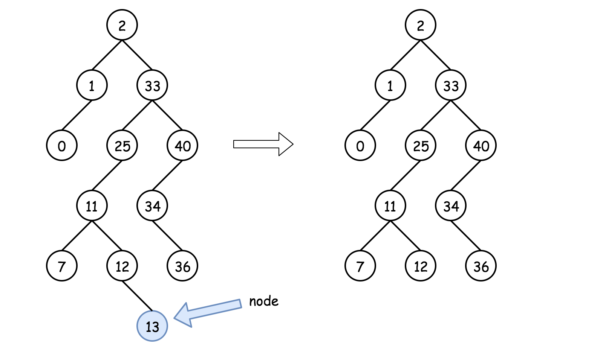
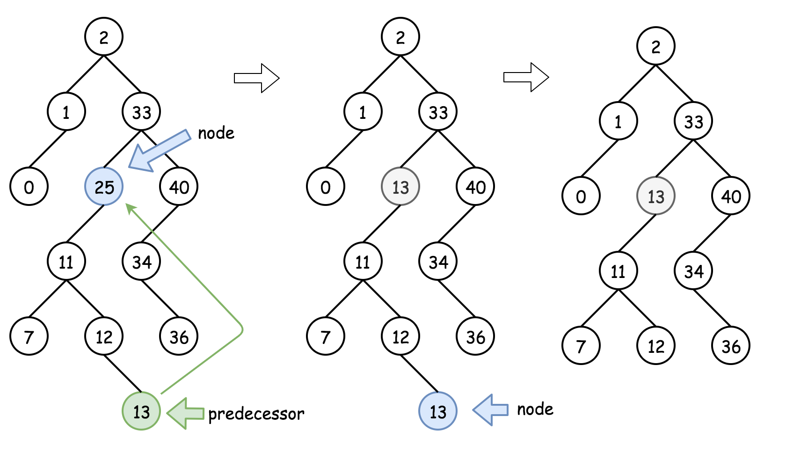

# ★删除 Delete

原题地址：[https://leetcode.com/problems/delete-node-in-a-bst/](https://leetcode.com/problems/delete-node-in-a-bst/) 关键词：Binary Search Tree

题意：删除BST上值为val的node，返回整个tree；

### 算法：Recursion

这里有三种情况：

**情况1：**要删除的节点为Leaf节点，可以直接删除：

  
**情况2：**要删除的不是Leaf节点，且拥有右child。则该节点可以由它的后继节点successor进行替代，后继节点位于它的right subtree里某个低处的位置。然后可以从后继节点successor的位置递归向下操作以删除后继节点successor。

  
**情况3：**要删除的不是Leaf节点，且没有右child，但是有左child。这意味着它的后继节点在它的上面，但是我们并不想返回。我们可以使用它的前驱节点predecessor进行替代，然后再递归的向下删除前驱节点predecessor。

所以，具体算法为：

* 如果`key > root.val`，说明要删除的节点在右子树，root.right = deleteNode\(root.right, key\)；
* 如果`key < root.val`，说明要删除的节点在左子树，root.left = deleteNode\(root.left, key\)；
* 如果`key == root.val`，则该节点就是我们要删除的节点，则： 
  * 如果该节点是Leaf节点，则直接删除它：`root = null`；
  * 如果该节点不是Leaf节点，且有右child，则用它的后继节点的值替代：`root.val = successor.val`，然后删除后继节点successor。 
  * 如果该节点不是Leaf节点，且**只**有左child，则用它的前驱节点的值替代：`root.val = predecessor.val`，然后删除前驱节点predecessor。 
* 返回 root。

