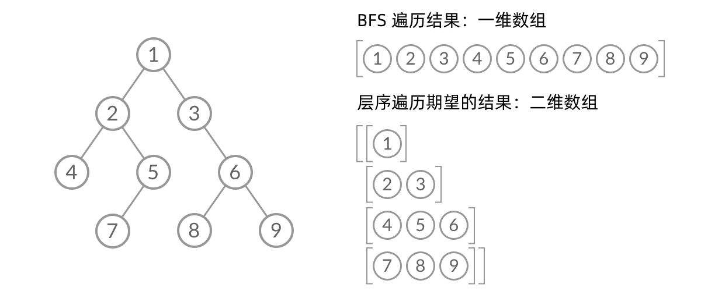

# \[Leetcode\]102. Binary Tree Level Order Traversal

原题地址：[https://leetcode.com/problems/binary-tree-level-order-traversal/](https://leetcode.com/problems/binary-tree-level-order-traversal/) 关键词：Tree，Level Order Traversal

题意：二叉树的**层序遍历（**Level Order Traversal）  
题目给一个tree，把tree每一层的值分别放入二维list里并返回；

例：


Input: root = `[3,9,20,null,null,15,7]`   
Output: `[[3],[9,20],[15,7]]`


### 方法1：BFS

层序遍历就是把二叉树分层，然后每一层从左到右遍历；


乍一看，我们可以直接用一个Queue然后 BFS 得出层序遍历结果。然而，BFS 的遍历结果是个一维数组，我们**无法区分Queue中的结点来自哪一层**。而题目的层序遍历要求我们区分每一层，也就是返回一个二维数组：



那问题就来了！怎样区分每一层的node，然后分层放进二维数组呢？？？这也是这道题的重点！

我们只需要稍微修改一下代码，在每一层while循环开始时，记录当前queue的长度n，也就是每一层的size，然后在while里用for循环`(int i = 0; i < size; i++)`把这一层的node都poll光


最终代码：

```text
class Solution {
    public List<List<Integer>> levelOrder(TreeNode root) {
        List<List<Integer>> res = new ArrayList<>();
        if (root == null) return res;
        
        Queue<TreeNode> queue = new LinkedList<>();
        queue.offer(root);
        
        while (!queue.isEmpty()) {
            int size = queue.size(); //记录当前queue的大小，也就是每一层的size
            List<Integer> curLevel = new ArrayList<>();
            
            for (int i = 0; i < size; i++) {
                TreeNode curNode = queue.poll(); //这for循环会把这一层的node都poll光！
                curLevel.add(curNode.val);       //每poll一个把值加入当前的小list
                
                if (curNode.left != null) {
                    queue.offer(curNode.left);
                }
                if (curNode.right != null) {
                    queue.offer(curNode.right); //把下一层的node全部加进来！
                }
            }            
            
            res.add(curLevel); //把每一层的list加入res
        }
        
        return res;
    }
}
```

Time: `O(N)`，每个node走了一遍  
Space: `O(N)`，queue的size 


### 方法2：DFS（不推荐）


### 本题要记住的重点：

怎样区分Queue中的结点来自哪一层。

