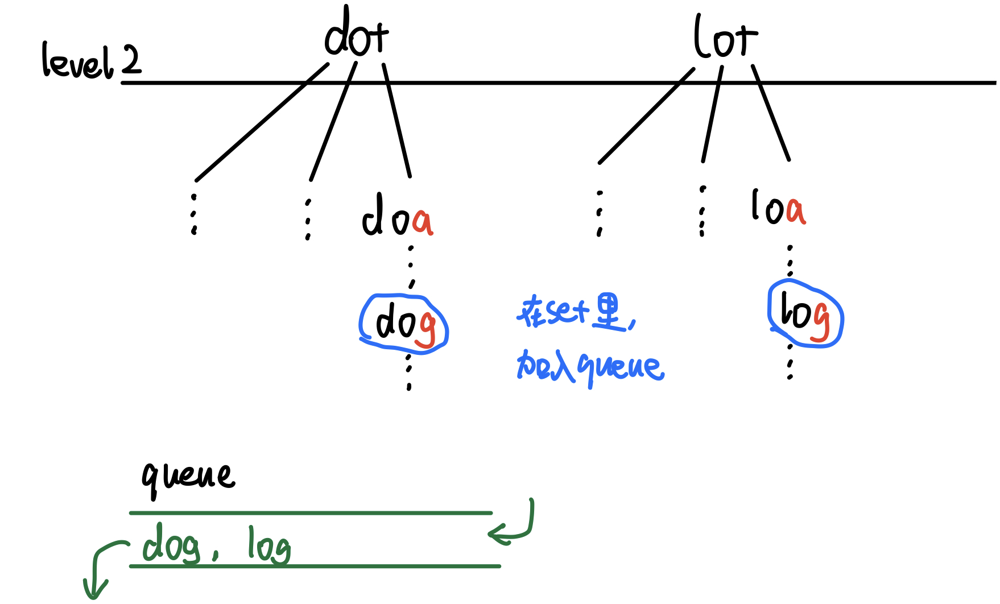

# \[Leetcode\]127. Word Ladder

原题地址：[https://leetcode.com/problems/word-ladder/](https://leetcode.com/problems/word-ladder/) 关键词：BFS，Queue

题意：把beginWord转化为endWord，每次只能变换一个字母，且每次变换后的新单词必须存在于给定的词典wordList中。求转换最少步骤数；如果不存在这样的转换序列，返回 0。

例：  
Input:`beginWord = "hit"`, `endWord = "cog"`, `wordList = ["hot","dot","dog","lot","log","cog"]`   
Output: 5   
解释：一个最短转换序列是 `"hit" -> "hot" -> "dot" -> "dog" -> "cog"`, 返回它的长度 5。


### 算法：BFS

以下面为例子：  
beginWord = `"hit"`, endWord = `"cog"`, wordList = `["hot","dot","dog","lot","log","cog"]`

BFS第一轮，每一轮把queue里poll光！level 0：


BFS第二轮，每一轮把queue里poll光！level 1：


BFS第三轮，每一轮把queue里poll光！level 3：




后面的步骤都一样，直到queue里poll出的单词等于endWord的时候，就返回level + 1；

```text
class Solution {
    public int ladderLength(String beginWord, String endWord, List<String> wordList) {
        int level = 0;
        Set<String> set = new HashSet<>(wordList);
        
        Queue<String> queue = new LinkedList<>();
        queue.offer(beginWord);
        
        while(!queue.isEmpty()) {
            int size = queue.size();
            for (int i = 0; i < size; i++) {  // 把这一层的poll光
                String s = queue.poll();
                
                if (s.equals(endWord)) return level + 1; //达到endWord返回层数
                
                char[] curWord = s.toCharArray();
                for (int j = 0; j < s.length(); j++) { //把当前单词的每一个字母，
                    char original = curWord[j];
                    for (char c = 'a'; c <= 'z'; c++) { //每个字母都用26个英文字母替换一次
                        curWord[j] = c;
                        String newWord = new String(curWord);//替换后形成新的单词
                        if (set.contains(newWord)) { //检查这个单词在不在set里
                            queue.offer(newWord);  //如果在，那就可能是有效路径，加入queue
                            set.remove(newWord);   // 只要set里扫过，就要删除，避免死循环
                        }
                    }
                    
                    curWord[j] = original; // 注意！要维持原来单词的字母不变
                }                 //因为之前每个字母都用26个英文字母替换一次，单词已被破坏
            }
            
            level++;
        }
        
        return 0;
    }
}
```

Time: `O(26×M×N)`；  
解释：N是word list里的单词总数，M是每个单词的长度，单词每个位置都用26个英文字母换了一遍；

Space: `O(26×M×N)`；？？？  
解释：N是word list里的单词总数，M是每个单词的长度，单词每个位置都用26个英文字母换了一遍，每换一个就开辟了一个空间存新单词；set的空间是O\(N\)；


### ⚠️  要注意的重点：

1. 怎样遍历26个英文字母（代码第19行）
2. 遍历26个英文字母的时候，要注意维持原来单词的字母不变❗️  因为之前每个字母都用26个英文字母替换了一次，单词已被破坏。（代码20、28行）


