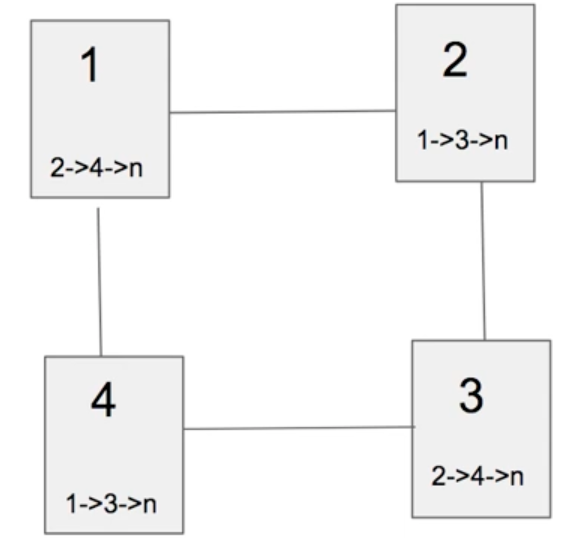
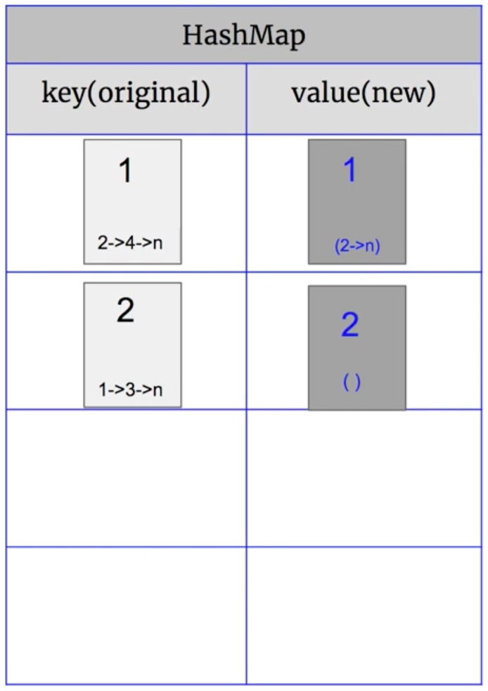
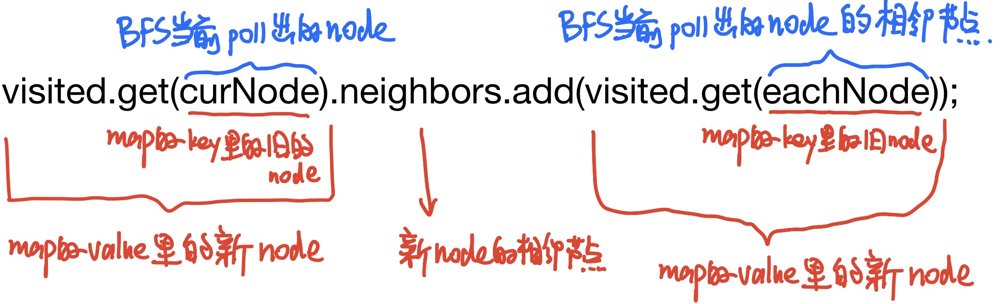

# \[Leetcode\]133. Clone Graph

原题地址：[https://leetcode.com/problems/clone-graph/](https://leetcode.com/problems/clone-graph/) 关键词：HashMap，BFS，graph

题意：Deep copy一个图。   
给一个undirected graph，每一个Node包含一个整数val，和一个List&lt;Node&gt;Neighbors作为它的adjacency list。不能返回它的reference，要返回它的deep copy。

例：  
Input: `adjList = [[2,4],[1,3],[2,4],[1,3]]`  
Output:                   `[[2,4],[1,3],[2,4],[1,3]]`   
解释： 图中有 4 个节点。   
节点 1 的值是 1，它有两个邻居：节点 2 和 4 。   
节点 2 的值是 2，它有两个邻居：节点 1 和 3 。   
节点 3 的值是 3，它有两个邻居：节点 2 和 4 。   
节点 4 的值是 4，它有两个邻居：节点 1 和 3 。


### 算法：BFS + HashMap

首先确定node怎样表示，按照题意，每一个node节点包含自身的val，和与他相临的所有的node作为Neighbors。那么题干中的图可以表示为：



Node的构造方法：

```text
class Node {
		public int val;
		public List<Node> neighbors;

		public Node() {
			this.val = 0;
			this.neighbors = new ArrayList<Node>();
		}

		public Node(int val) {
			this.val = val;
			this.neighbors = new ArrayList<Node>();
		}

		public Node(int val, ArrayList<Node> neighbors) {
			this.val = val;
			this.neighbors = neighbors;
		}
	}
```


初始化一个HashMap为`visited`，原来的node作为key，deep copy的新的node作为value。HashMap的作用是：判断node是否已经访问过。

初始化一个新的node为`res`，作为返回最终结果的reference；它的val为input node的val，它的 neighbor list为空。把`(input node, res)`作为key-value pair放进HashMap。



进行BFS：  
先把input的node放进queue，然后对这个node的neighbor list所有节点进行BFS（注意这里的neighbors都是原图里的），如果neighbors没有在map里出现过（没有在map的key里出现过），就加入进queue；然后初始化一个`newNode`，val设为与neighbor list当前节点相同，把`(neighbor list当前节点, newNode)`作为key-value pair放进HashMap。

怎样加neighbors，对queue里的node的neighbor list进行BFS的时候，就把旧node里所有的neighbor list加到新的node的neighbor list里，方法：



完整代码：

第16行为什么不是containsValue，因为HashMap里的value是新的node，它的内存地址与原来的node是不同的，如果写成containsValue，那么第16行`visited.containsKey(eachNode)`的判断会永远是false，会一直往queue里加东西造成死循环。

```text
class Solution {
    public Node cloneGraph(Node node) {
        if (node == null) return null;
        
        Map<Node, Node> visited = new HashMap<>();
        Node res = new Node(node.val, new ArrayList<>());
        visited.put(node, res);
        
        Queue<Node> queue = new LinkedList<>();
        queue.offer(node);
        
        while (!queue.isEmpty()) {
            Node curNode = queue.poll();
            
            for (Node eachNode : curNode.neighbors) {             
                if (!visited.containsKey(eachNode)) { //为什么不是containsValue
                    queue.offer(eachNode);
                    Node newNode = new Node(eachNode.val, new ArrayList<>());
                    visited.put(eachNode, newNode);
                }
                visited.get(curNode).neighbors.add(visited.get(eachNode)); 
                                                    //前面get的和后面的不一样
            } 
            
        }
        
        return res;
    }
}
```

Time: O\(N\)；node的个数  
Space: O\(N\)；map的size


### 要记住的重点：

1. 原图中的node和新图中的node是不一样的，比如node的val都是1而且neighbor的val也一样，但是这两个node的内存地址是不一样的，可以被同时加入进set。
2. 怎样加neighbors


