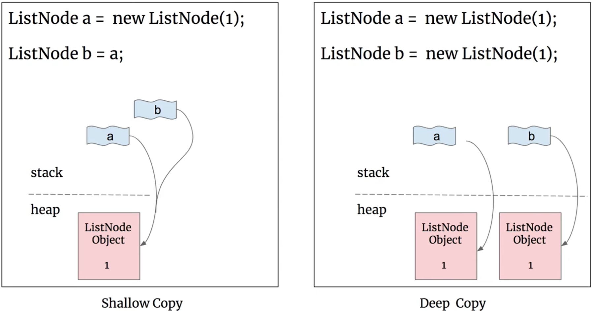
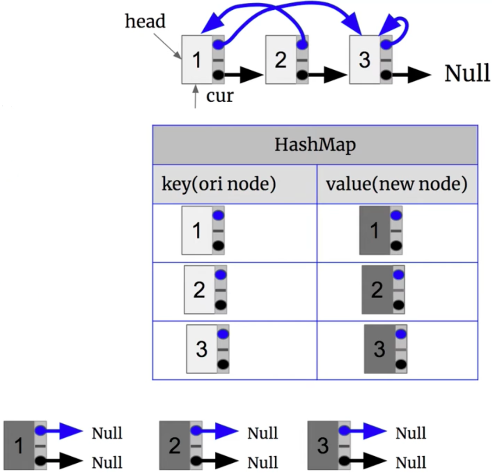

# \[Leetcode\]138. Copy List with Random Pointer

原题地址：[https://leetcode.com/problems/copy-list-with-random-pointer/](https://leetcode.com/problems/copy-list-with-random-pointer/) 关键词：LinkedList

题意：给一个LinkedList，每个node除了包含`next`指针外，还包含一个额外的随机指针`random`，该`random`指针可以指向LinkedList中的任何节点，或空节点null。  
要求返回这个LinkedList的**deep copy**；

概念补充：什么叫**deep copy**？在普通的LinkedList题中，我们返回的是head或dummy.next，它只是一个reference，表示指向原来的LinkedList的头节点，并没有新的LinkedList出现，这个叫shallow copy。  
而**deep copy**指的是，新建一个LinkedList，里面的所有node的对应关系和原LinkedList一摸一样。

举例：给一个普通的ListNode `a`，返回shallow copy就是左图；返回**deep copy**就是右图里返回的`b`。




下面按照本题题意，加上指针`random`，举一个例子：


Input: `head = [[3,null],[3,0],[3,null]]`   
Output:             `[[3,null],[3,0],[3,null]]`


### 算法：

使用两轮loop。

#### 第一轮loop：copy原链表的val

使用HashMap记录对应关系，用cur遍历原LinkedList，每扫一个原LinkedList的node，就new一个跟当前cur node的val值相同的新的node，把这个新的node放进HashMap的value里。  
⚠️  注意：只copy原来LinkedList节点的val，至于next指针和random指针留在后面建立。具体实现：`map.put(cur, new Node(cur.val, null, null));`




#### 第二轮loop：确定next指针和random指针的指向

用cur遍历原LinkedList，用HashMap来get到新的node，这个新的node的next指向哪里，要参考原来的LinkedList。  
原来的LinkedList里，`cur`的指针next指向`cur.next`。我们用HashMap来get到两个新的node：一个新node1是`map.get(cur)`，另一个新node2是`map.get(cur.next)`；新node1的指针next应该指向新node2


所以，具体实现就是：`map.get(cur).next = map.get(cur.next);`   
random指针同理：      `map.get(cur).random = map.get(cur.random);`


#### 要注意的地方：

代码第14行，如果写成`map.get(cur).next = cur.next;`就是错误的❌  ，为什么？因为cur是属于原来的LinkedList，cur.next也属于原来的LinkedList，而题目要求的是deep copy，所以必须指向新的node，不能指向原来的LinkedList。

```text
class Solution {
    public Node copyRandomList(Node head) {
        if (head == null) return null;
        
        Map<Node, Node> map = new HashMap<>();
        Node cur = head;                      // 指向head，进行第一轮loop
        while (cur != null) {
            map.put(cur, new Node(cur.val, null, null));
            cur = cur.next;
        }
        
        cur = head;  // 重新指向head，进行第二轮loop
        while (cur != null) {
            map.get(cur).next = map.get(cur.next); // 注意这里不能指向cur.next，因为是旧的list
            map.get(cur).random = map.get(cur.random); //应该指向map的value里的新的
            cur = cur.next;
        }
        
        return map.get(head);
    }
}
```

Time: `O(N)`；两轮linear loop  
Space: `O(N)`；map的size


### 


