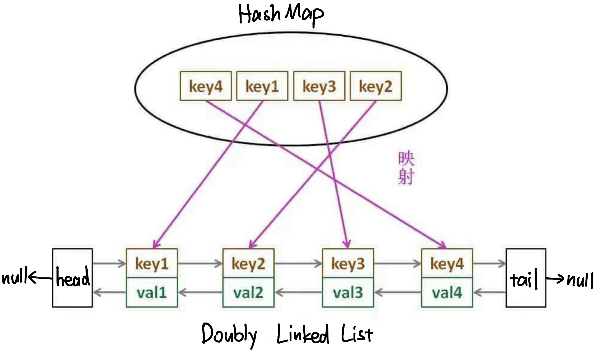

# \[Leetcode\]★146. LRU Cache

原题地址：[https://leetcode.com/problems/lru-cache/](https://leetcode.com/problems/lru-cache/) 关键词：Doubly LinkedList，双向链表

#### 什么是LRU Cache？

计算机的缓存Cache容量是有限的，如果缓存满了就要删除一些内容，给新内容腾位置。但问题是，删除哪些内容呢？LRU Cache淘汰算法就是一种常用策略。LRU 的全称是**Least Recently Used**，也就是说我们认为最近使用过的数据应该是是「有用的」，很久都没用过的数据应该是「无用的」，当Cache容量满了时，就优先删那些很久没用过的数据。

**题意：**设计和实现一个LRU Cache，实现下面三个方法：  
●`LRUCache(int capacity)`：初始化正整数capacity，作为LRU的缓存容量；  
●`int get(int key)`：如果关键字key存在于LRU Cache中，则返回关键字的值；不存在就返回 -1 。   
●`void put(int key, int value)`：如果key已经存在，则变更其value值；如果key不存在，则插入该组「key-value pair」。当LRU Cache容量达到上限时，它应该在写入新数据之前，删除最久未使用的数据值，从而为新的数据值留出空间。

Follow up：是否可以在 O\(1\) 时间复杂度内完成这两种操作？


## 方法1：两个[Stack](https://bhnigw.gitbook.io/-1/shu-ju-jie-gou-stack)（时间`O(n)`，不推荐）

初始化两个栈stack1和stack2。可以理解为stack1就是用来存数据的缓存cache。  
●`get(int key)`方法：把stack1的元素挨个pop到stack2里，若遇到key则把它单个拎出来，然后把stack2里挨个pop到stack1中，最后把key放到stack1的栈顶。  
●`put(int key, int value)`方法：容量未满，且key不在stack1中，则直接放到stack1的栈顶。如果容量满了，且key不在stack1中，删掉stack1栈底的元素，把key放到栈顶。如果key已存在，则删掉stack1里的key对应元素，然后把新的把key放到栈顶。

该方法get和put都需要把stack里元素全部pop出来，所以时间是`O(n)`


## 方法2：[Doubly LinkedList ](https://bhnigw.gitbook.io/-1/doubly-linkedlist)+ [HashMap](https://bhnigw.gitbook.io/-1/shu-ju-jie-gou-map)（时间`O(1)`，最优）

这个LRU cache由`Doubly LinkedList`和`HashMap`一起构成。

**`HashMap`作用**：用于检索key，获取对应的node和它的val。HashMap的key是input里的key，HashMap的value是Doubly LinkedList的ListNode  
**`Doubly LinkedList`作用**：可以实现双向遍历，插入和删除操作简便快捷，耗时仅为`O(1)`；





### ● ****构建Doubly LinkedList：

因为题目要求能够存储key和value两个数据，所以构建时稍作修改，加一个key的值；

```text
class ListNode { // 这里没有括号，且要写在外面class的里面一层
        ListNode prev;
        ListNode next;
        int key;  // 多加一个key
        int val;
        
        ListNode() { }  
        
        ListNode(int key, int val) {
            this.key = key;
            this.val = val;
        }
}
```


### ● 初始化所需要的Global varibales：

共有四个：（后面几乎所有的方法都会用到）  
1. `Map<Integer, ListNode> map = new HashMap<>();`   
2. `int capacity;`  决定cache的容量上限  
3. `ListNode head;`   
4. `ListNode tail;`

要注意HashMap里放的是什么❗️**map的key**是input里的key，**map的value**是Doubly LinkedList的ListNode。


### ●`LRUCache(int capacity)`方法：

**作用：**用于把input给出的capacity放到gloabl变量里，确定cache的容量上限。

```text
public LRUCache(int capacity) {  
        this.capacity = capacity; 
}
```


### ●`get(int key)`方法：

**作用：**读取Cache里key所对应的value。

**算法：**

* 检查input给的key，是否在map里有对应的node
  * 如果map里有对应的node，就从LinkedList里把这个node拎出来，放到链表的表头，作为新的head。然后返回该node的值；
  * 如果map里没有对应的node，就直接返回-1；

“从LinkedList里把某个node拎出来，放到链表的head“，这个操作需要用到两个步骤：  
1. `deleteNode(node)`：把这个node从链表里删去；  
2. `moveToHead(node)`：把这个node放到表头作为新的head；

```text
 public int get(int key) {
        ListNode node = map.get(key);
        if (node == null) return -1; // key不存在就返回-1
        
        deleteNode(node);
        moveToHead(node); // key存在的话，就放到head然后返回val
        
        return node.val;
    }
```


### ●`put(int key, int value)`方法：

**作用：**把一对新的key和value放进Cache里。

**算法：**

* 检查input给的key，是否在map里有对应的node：
* 如果map里没有对应的node，意味着要new一个新的node加入cache：
  * 如果Cache的**capacity没到上限**：直接把新的node放入map，然后放到LinkedList的表头，更新`head`节点；
  * 如果Cache的**capacity已到上限**：需要先把`tail`节点从map和LinkedList里面删去，然后再把新的node放入map，然后放到LinkedList的表头，更新head节点；
* 如果map里已经有对应的node，意味着不用加入新的node，只需更新旧node的val即可，做法是：把这个node从LinkedList里删去，然后更新旧node的val，最后把更新后的node放到表头作为新的head；

```text
public void put(int key, int value) {
        ListNode node = map.get(key);
        
        if (node == null) { // 为空就要new一个新的node
            ListNode newNode = new ListNode(key, value);

            if (map.size() < capacity) {  
                map.put(key, newNode);
                moveToHead(newNode);
            } else {
                map.remove(tail.key); // 从map里删掉tail  要注意先后！！
                deleteNode(tail);     // 从双链表删掉tail               
                map.put(key, newNode);// map里放入新的node
                moveToHead(newNode);  // 双链表里放入新的node
            }
        } 
        
        if (node != null) {
            deleteNode(node);
            map.get(key).val = value;
            moveToHead(node);
        }
}
```

**⚠️  ⚠️  一个易错的重点：**注意第11～12行，如果把顺序反过来，先删掉LinkedList里的tail，再删掉map里的tail，就是错的，为什么❓  
因为，在`deleteNode(tail)`的操作中，假设原来的尾巴节点为tail\_1，它被删掉后，tail\_1的前面一个元素会变成新的尾巴节点，写作tail\_2，此时再删掉map里的tail时，被删掉的是tail\_2，而本来该删掉的是tail\_1，所以就不对了。  
**所以要记住：对map的操作永远放在第一步，对LinkedList的操作永远放在map之后。**


### ●`moveToHead(ListNode node)`方法：

**作用：**把node放到LinkedList的表头，作为新的head。

算法：


```text
private void moveToHead(ListNode node) {
        node.next = head;
        node.prev = null;  // 这一步重要
        if (head != null) head.prev = node;
        head = node;
        
        if (tail == null) tail = head; //此处初始化tail
}
```


### ●`deleteNode(ListNode node)`方法：

**作用：**从LinkedList里删掉指定的的node。

算法：


```text
 private void deleteNode(ListNode node) {
        if (node.prev != null) {
            node.prev.next = node.next;
        } else {
            head = node.next;
        }
        
        if (node.next != null) {
            node.next.prev = node.prev;
        } else {
            tail = node.prev;
        }
}
```


### 完整代码：

```text
class LRUCache {

    // Construct the Doubly LinkedList
    class ListNode {   // 这里没有括号，且要写在外面class的里面一层
        ListNode prev;
        ListNode next;
        int key;
        int val;
        
        ListNode() { }  
        
        ListNode(int key, int val) {
            this.key = key;
            this.val = val;
        }
    }
    
    
    // Global varibales
    private Map<Integer, ListNode> map = new HashMap<>();
    private int capacity;
    private ListNode head;
    private ListNode tail;
    
    
    public LRUCache(int capacity) {
        this.capacity = capacity;
    }
    
    public int get(int key) {
        ListNode node = map.get(key);
        if (node == null) return -1; // 没有就返回-1
        
        deleteNode(node);
        moveToHead(node); // 有的话放到head然后返回val
        
        return node.val;
    }
    
    public void put(int key, int value) {
        ListNode node = map.get(key);
        
        if (node == null) { // 为空就要new一个新的node
            ListNode newNode = new ListNode(key, value);

            if (map.size() < capacity) {  
                map.put(key, newNode);
                moveToHead(newNode);
            } else {
                map.remove(tail.key); // 从map里删掉tail  要注意先后！！
                deleteNode(tail);     // 从双链表删掉tail               
                map.put(key, newNode);// map里放入新的node
                moveToHead(newNode);  // 双链表里放入新的node
            }
        } 
        
        if (node != null) {
            deleteNode(node);
            map.get(key).val = value;
            moveToHead(node);
        }
    }
    
    
    // Method of Doubly LinkedList
    private void moveToHead(ListNode node) {
        node.next = head;
        node.prev = null;  // 这一步重要
        if (head != null) head.prev = node;
        head = node;
        
        if (tail == null) tail = head; //此处初始化tail
    }
    
    private void deleteNode(ListNode node) {
        if (node.prev != null) {
            node.prev.next = node.next;
        } else {
            head = node.next;
        }
        
        if (node.next != null) {
            node.next.prev = node.prev;
        } else {
            tail = node.prev;
        }  
    }
    
}
```

Time: `O(1)`;   
Space: `O(capacity)`; 空间取决于cache的size


### 要记住的重点：

1. 对map的操作永远放在第一步，对LinkedList的操作永远放在map之后。


