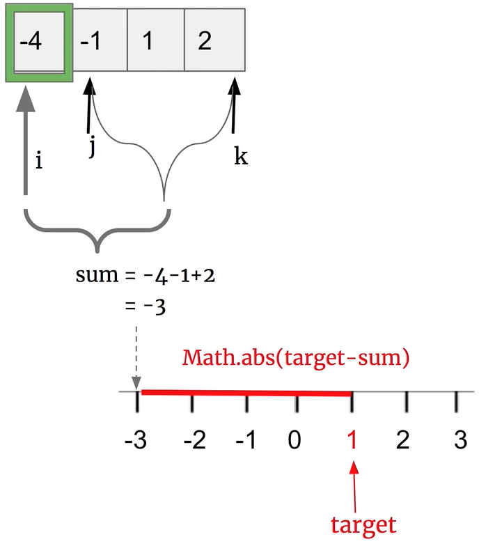

# \[Leetcode\]16. 3Sum Closest

原题地址：[https://leetcode.com/problems/3sum-closest/](https://leetcode.com/problems/3sum-closest/) 关键词：Array, Two pointer

题意：给定一个数组`nums`和 一个目标值`target`。找出`nums`中的三个整数，使得它们的和与`target`**最接近**。返回这三个数的和。只存在唯一答案。


### 算法：Two pointer

核心思想与3Sum完全相同，区别是：

1. 不用检查duplicate；
2. 每个三个数都要加一次得出一个sum

初始化一个`res = 0`记录结果，每个三个数都要加一次得出一个sum后，把`sum - target`得出的结果取绝对值，**当绝对值最小时**，把这三个数之和sum放入res即可。

取绝对值的方法：`Math.abs(res - target)`



```text
class Solution {
    public int threeSumClosest(int[] nums, int target) {
        if (nums == null || nums.length < 3) {
            return 0;
        }
        
        Arrays.sort(nums); 
        
        int res = nums[0] + nums[1] + nums[2]; 
        
        for (int i = 0; i < nums.length; i++) { //遍历每一个数，每到一个数就把它作为two sum问题里面的target
            int left = i + 1;            
            int right = nums.length - 1; 
            
            while (left < right) {
                int sum = nums[i] + nums[left] + nums[right]; //得出一个新的sum值
                if (Math.abs(sum - target) < Math.abs(res - target)) { 
                    res = sum;          //看新的sum和旧的res哪一个更接近target                                      
                }
                
                if (sum < target) { //左pointer对应的值小，所以如果sum小于target，就把左pointer往右边大的移动一位
                    left++;
                } else {
                    right--;
                }
            }
        }
        
        return res;
         
    }
}
```

Time：`O(n^2)`；前面有sort，所以计算是O\(nlogn + n^2\)，结果就是O\(n^2\)  
Space：`O(logn)`；

