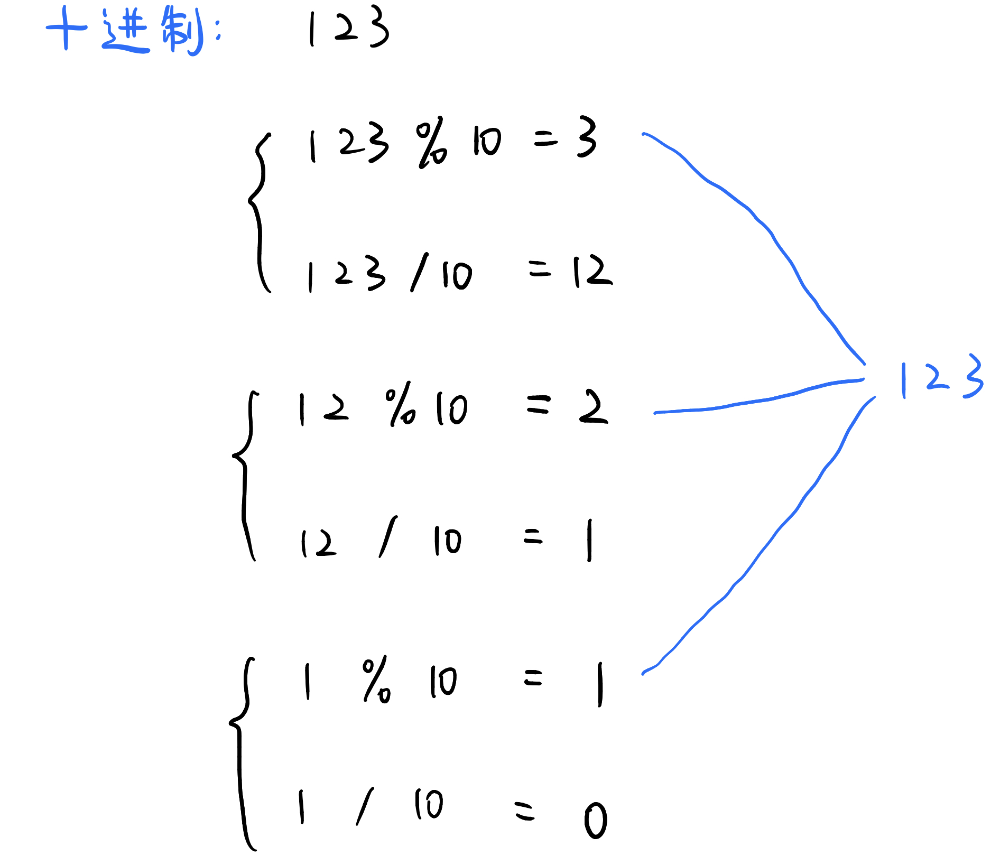
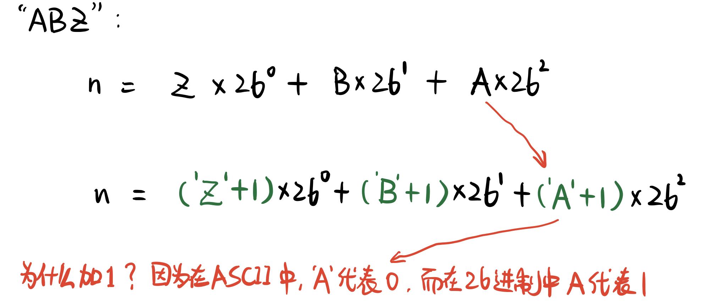
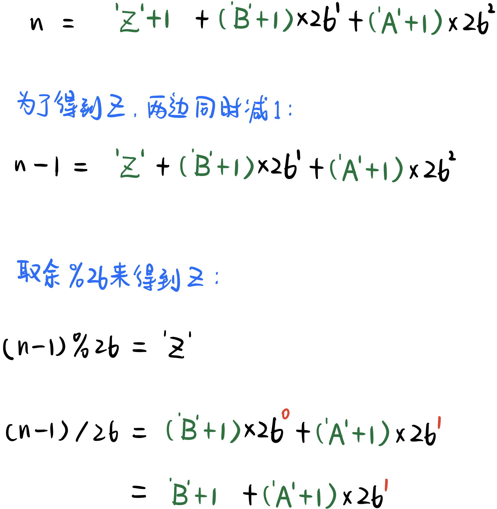
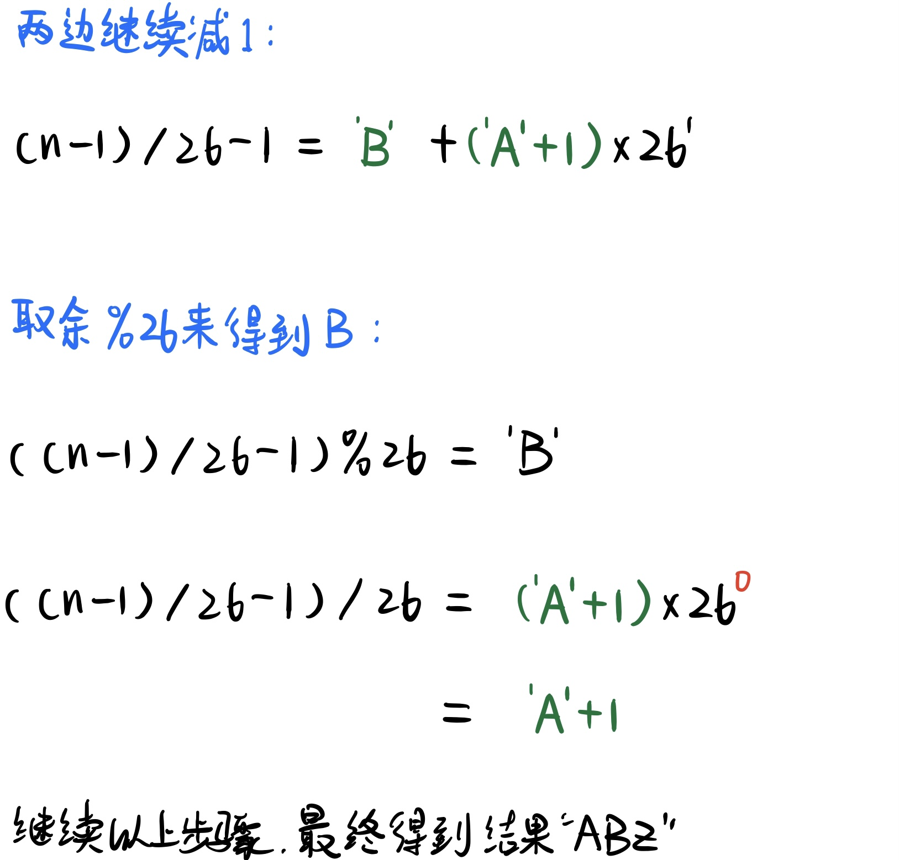

# \[Leetcode\]168. Excel Sheet Column Title

原题地址：[https://leetcode.com/problems/excel-sheet-column-title/](https://leetcode.com/problems/excel-sheet-column-title/)

题意：数字转化为字母；规则如下：  
A -&gt; 1   
B -&gt; 2   
C -&gt; 3   
...   
Z -&gt; 26   
AA -&gt; 27   
AB -&gt; 28   
...

例1：  
`Input: columnNumber = 28； Output: "AB"`  
例2：  
`Input: columnNumber = 701； Output: "ZY"`


### 算法：

核心思想：  
对十进制\(decimal\)的数来说，number用求余符号`"%"`对10求余数，得到的余数就是最右边的**个位数**。然后用取整符号`"/"`除以10更新number，再继续用%10求余数就得到了十位数，然后不断重复此过程...

举例：`number = 123`：  
先把number用`"%"`对10求余：123 % 10 = 3，说明个位数就是3；  
然后number用`"/"`除以10，看能被整除几次：123 / 10 = 12，说明number能被10整除12次；\(number里有12个10\)

十位数应该是12，但因为是10进制，所以对12求余：12 % 10 = 2，所以十位数就是2；  
继续把number用`"/"`除以10得：12 / 10 = 1，意思是number能被100整除1次；  
所以百位数应该是1，但因为是10进制，所以对1求余：1 % 10 = 1，所以百位数就是1；

每求余一次`"%"`，就得出一位数字。




同理：  
对26进制\(base of 26\)的数来说，number用求余符号`"%"`对26求余数，得到的余数就是最右边的"个"位数。然后用取整符号`"/"`除以26更新number，再继续用%26求余数就得到了"十"位数，然后不断重复此过程...

### 要注意的是：

我们在做上一题**字母转化为数字**的时候，我们对字符char加1才能得出正确的数字。那么，在做本道题**数字转化为字母**的时候，相应的，要对数字减1才能得出正确的字母。

假设我们把字符串`"ABZ"`转化为数字`n`：




在本题**数字转化为字母**里，假设input数字就是上面的`n`：



到上面这为止，一轮完整的循环结束。  
我们可以总结出，要得到正确的字母，必须要在每一轮loop的开始把n减去1❗️  
下面进入第二轮loop：



转化为代码就如下：

```text
class Solution {
    public String convertToTitle(int number) {
        StringBuilder sb = new StringBuilder();
        
        while (number > 0) {
            number--;    //注意这里
            sb.append((char)(number % 26 + 'A'));
            number /= 26;
        }

        return sb.reverse().toString();
    }
}
```

Time: O\(k\)；k是number能被26整除的次数  
Space: O\(k\)；k是最后string的长度


### 需要记住的重点：

1. 数字一定要先减1❗️
2. while的条件是大于0
3. 因为是从个位开始append，所以最后转化为string前要先reverse；


