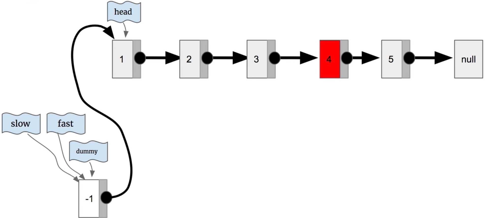
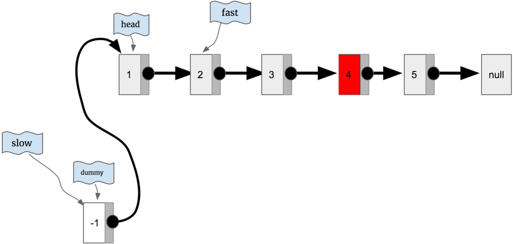
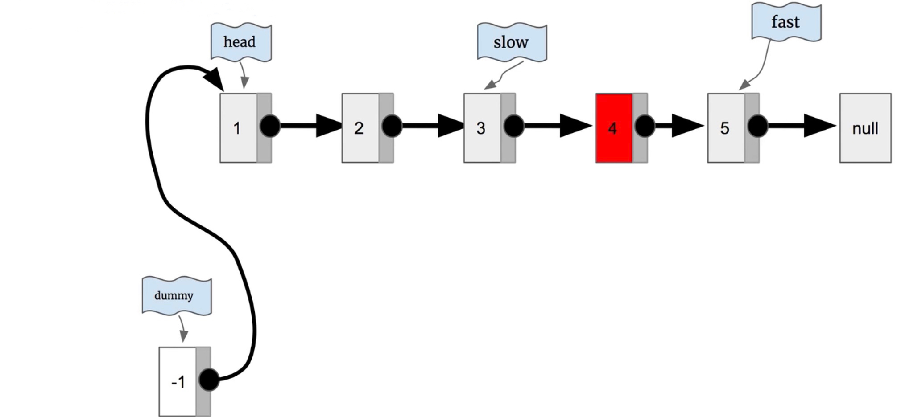
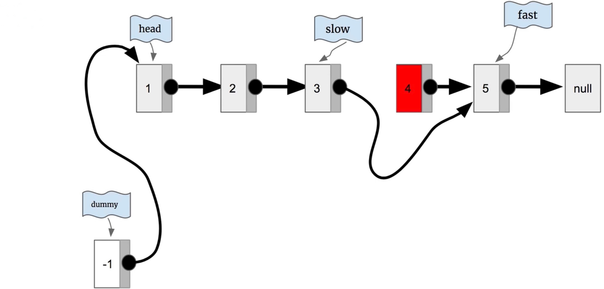

# \[Leetcode\]19. Remove Nth Node From End of List

原题地址：[https://leetcode.com/problems/remove-nth-node-from-end-of-list/](https://leetcode.com/problems/remove-nth-node-from-end-of-list/) 关键词：LinkedList

题意：删去倒数第n个节点；  
给一个LinkedList，删除LinkedList的倒数第 n 个结点，并且返回LinkedList的头结点。

例：  
Input: `head = [1,2,3,4,5]`, `n = 2`  
Output: `[1,2,3,5]`


### 算法：Two Pointer

本题的难点是：LinkedList只有一个方向，只能从head往前走，不能从屁股倒着走，那怎样来倒数呢？

**核心思想：**用快慢指针，slow指针不动，让fast指针先提前走n步；然后fast和slow同时往后走，直到fast抵达最后一个node，此时slow指针后面那一个node就是我们要删去的node。


下面展示详细步骤。以`head = [1,2,3,4,5], n = 2`为例子，目标是要删去倒数第二个node。

第1步：初始化dummy指向head，初始化slow、fast指向dummy；




第2步：把fast往前移动n步，也就是移动2步；




第3步：slow和fast一起向前走，直到fast到达最末尾；




第4步：删去slow后面那一个元素；方法：`slow.next = slow.next.next;`



最后返回`dummy.next`即可。


重点来了❗️  为什么结果不能返回head？

看上面的链表，假如我们删除的是倒数第5个node，那么此时head就从链表里被删掉了，此时再返回head就是错误的！  
所以最后返回的是`dummy.next`！

```text
class Solution {
    public ListNode removeNthFromEnd(ListNode head, int n) {
        ListNode dummy = new ListNode(-1);
        dummy.next = head;
        ListNode slow = dummy;
        ListNode fast = dummy;    
        
        for (int i = 0; i < n; i++) { // 提前走n步
            fast = fast.next;
        }
        
        while (fast.next != null) { // 同时移动
            slow = slow.next;
            fast = fast.next;
        }
        
        slow.next = slow.next.next; // 删除操作
        
        return dummy.next;
    }
}
```

Time: `O(n)`;  
Space: `O(1)`;


### 要记住的重点：

1. 单方向的链表怎样来倒数node；
2. 返回的是dummy.next而不是head；


