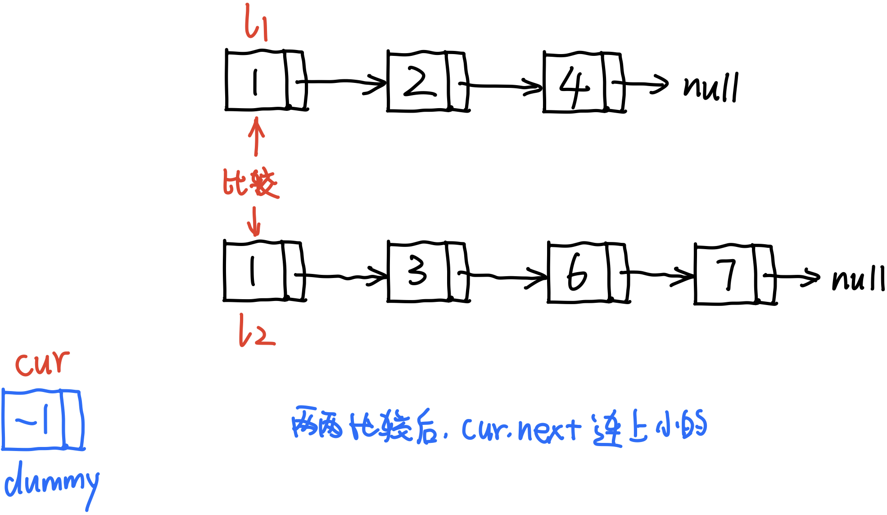
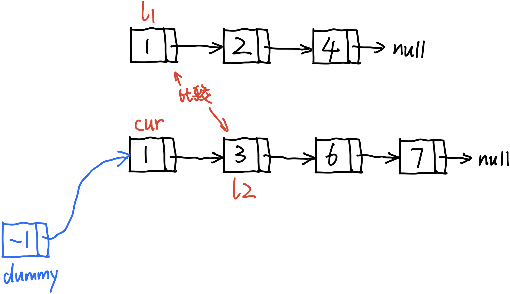
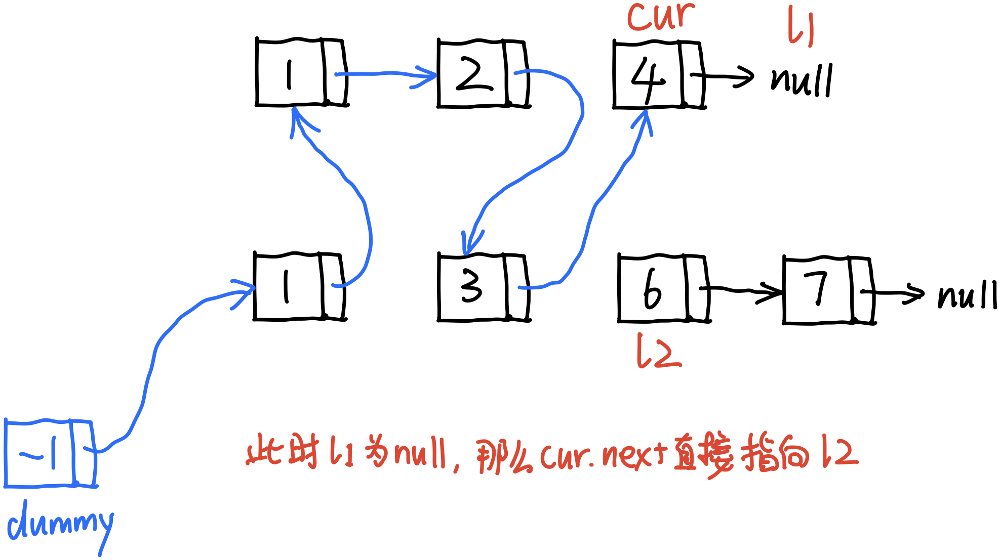
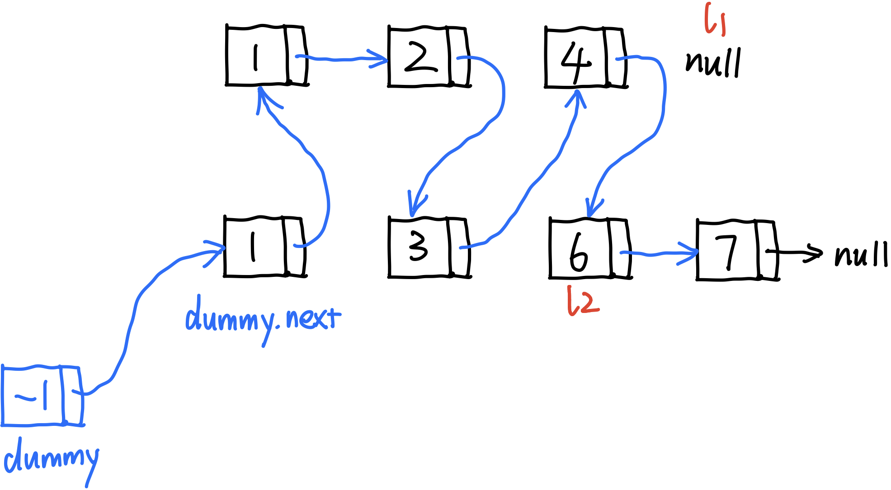

# \[Leetcode\]21. Merge Two Sorted Lists

原题地址：[https://leetcode.com/problems/merge-two-sorted-lists/](https://leetcode.com/problems/merge-two-sorted-lists/) 关键词：Linked List

题意：合并2个升序链表。  
将两个升序的LinkedList，合并为一个新的升序LinkedList并返回。

例：  
Input: `l1 = [1,2,4], l2 = [1,3,4]`   
Output: `[1,1,2,3,4,4]`


### 算法：














```text
class Solution {
    public ListNode mergeTwoLists(ListNode l1, ListNode l2) {
        ListNode dummy = new ListNode(-1);
        ListNode cur = dummy;
        
        while (l1 != null && l2 != null) { // 处理等长的部分
            if (l1.val < l2.val) {
                cur.next = l1;
                l1 = l1.next;  // 这一步可能l1已经到了终点null
                cur = cur.next;               
            } else {
                cur.next = l2;
                l2 = l2.next;
                cur = cur.next;               
            }
        }
        
        
        if (l1 != null) {  // 如果l1和l2不等长，那么下面是处理后面不等长的部分 
            cur.next = l1;
        }
        if (l2 != null) {
            cur.next = l2;
        }
        
        return dummy.next;
    }
}
```

Time: `O(n + m)`；n是l1的节点总数，m是l2的节点总数；  
Space: `O(n + m)`；


#### Follow up:




