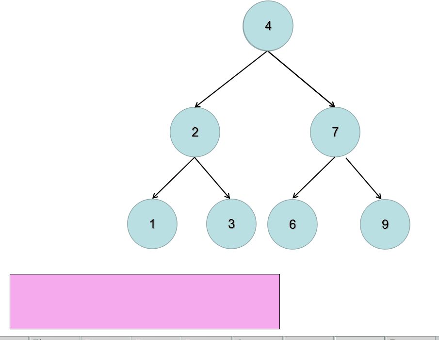
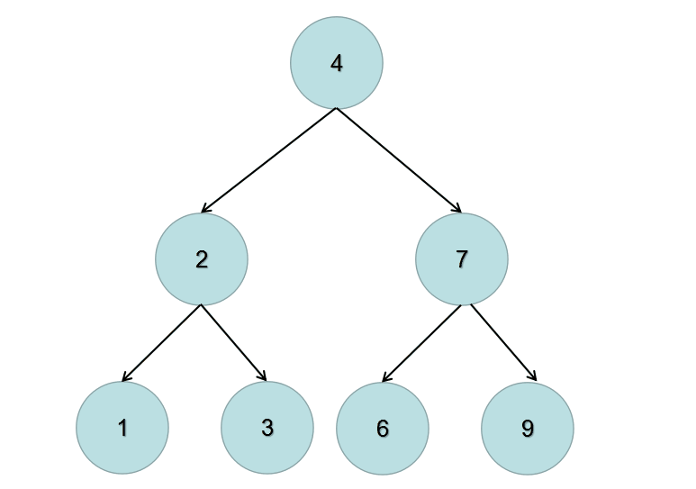

# \[Leetcode\]226. Invert Binary Tree

原题地址：[https://leetcode.com/problems/invert-binary-tree/](https://leetcode.com/problems/invert-binary-tree/) 关键词：BFS，DFS

题意：翻转一棵二叉树。把tree的每一层的node的顺序翻转。  
例子：


Input: `root = [4,2,7,1,3,6,9]`  
Output: `[4,7,2,9,6,3,1]`


### 方法1：BFS + Queue

**核心思想：**把每一个node的左右child都全部交换位置，最终就得到翻转过的一棵二叉树。

BFS做法：层层扫荡。先将根节点root放入到queue中，然后不断的pop出queue中的元素，然后switch当前元素左右child的位置。（要注意先判断当前pop出的node是不是null）



```text
class Solution {
    public TreeNode invertTree(TreeNode root) {
        if (root == null) return null;
        
        Queue<TreeNode> queue = new LinkedList<>();
        queue.offer(root);
        
        while (!queue.isEmpty()) {
            TreeNode cur = queue.poll();
            if (cur != null) {
                queue.offer(cur.left);
                queue.offer(cur.right);
            
                TreeNode Left = cur.left;
                TreeNode Right = cur.right;
            
                cur.left = Right;    // 交换每个node的左右child
                cur.right = Left;
            }
        }
        
        return root;
    }
}
```

Time：`O(n)`；每个元素都必须访问一次，所以是 O\(n\);  
Space：`O(n)`；最坏的情况下会包含所有的Leaf节点，对于Perfect Binary Tree完全二叉树，它的Leaf节点是 `n/2`个，所以时间复杂度是`O(n)`；


### 方法2：DFS

**核心思想：**把每一个node的左右child都全部交换位置，最终就得到翻转过的一棵二叉树。

DFS做法：从根节点root开始Recursion，并从Leaf节点先开始翻转。如果当前遍历到的节点root的左右两棵子树都已经翻转，那么我们只需要交换两棵子树的位置，即可完成以root为根节点的整棵子树的翻转。



```text
class Solution {
    public TreeNode invertTree(TreeNode root) {
        if (root == null) return null;
        
        TreeNode Left = root.left;
        TreeNode Right = root.right;
            
        root.left = Right;
        root.right = Left;
        
        invertTree(root.left);
        invertTree(root.right);
        
        return root;
    }
}
```

Time：`O(n)`；每个元素都必须访问一次，所以是 O\(n\);  
Space：`O(h)`；h是树的高度，最坏的情况下，需要h个stack，也就是recursion的层数；


