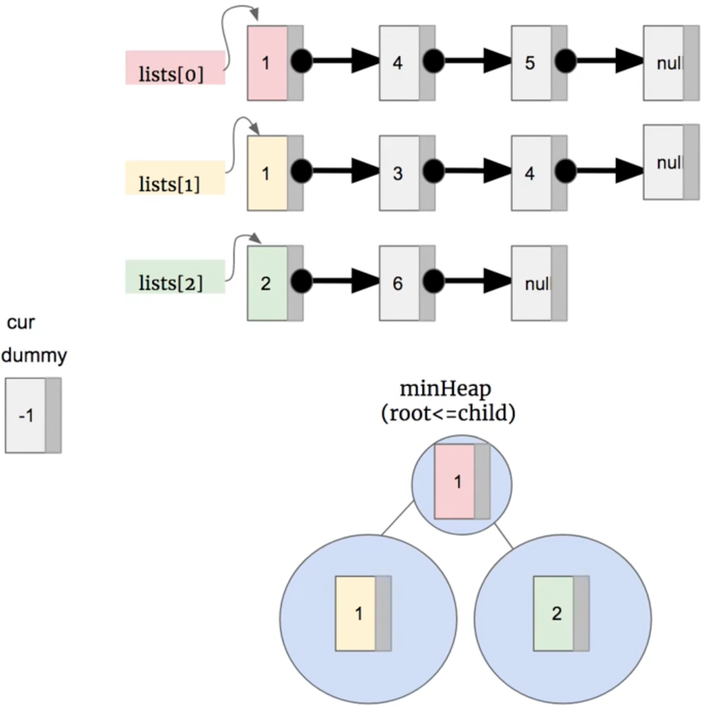

# \[Leetcode\]23. Merge k Sorted Lists

原题地址：[https://leetcode.com/problems/merge-k-sorted-lists/](https://leetcode.com/problems/merge-k-sorted-lists/) 关键词：Linked List, PriorityQueue

题意：合并K个升序链表。  
给一个数组，里面含有k个Linked List，每个Linked List都是升序排列。请将所有链表合并到一个升序链表中，返回合并后的链表。

例子：  
Input: `lists = [[1,4,5], [1,3,4], [2,6]]`  
Output: `[1,1,2,3,4,4,5,6]`


#### 方法1：Brute force

把所有Linked List全部加到ArrayList里，然后sort这个ArrayList，最后构建结果Linked List。


### 方法2：PriorityQueue（推荐）

**核心思想：**使用PriorityQueue，把数组里所有Linked List（也就是每个list的头节点的reference）放进PriorityQueue，每次poll出一个最小的，然后把最小的那个node的next放进Queue，直到Queue为空。



具体步骤：

1. 初始化一个dummy node来储存结果。初始化cur node指向dummy，用来进行遍历。

2. 初始化一个PriorityQueue，初始化方法：**`PriorityQueue pq = new PriorityQueue<>((node1, node2) -> node1.val - node2.val);`**

后面的意思是：根据ListNode的val值，构建最小堆**min Heap**，它的Heap堆顶会存放val值最小的node。

  
3. 遍历`lists[]`数组，把数组里所有Linked List，也就是每个list的头节点的reference，放进PriorityQueue。

4. 用while loop，每次poll出来一个节点，这个节点就是PriorityQueue里最小的。poll出来后使用cur把它连接到结果list中（代码15～17行）。如果poll出来的节点的next不为空，就把它的next放进PriorityQueue。

5. 最后返回`dummy.next`；


```text
class Solution {
    public ListNode mergeKLists(ListNode[] lists) {
        ListNode dummy = new ListNode(-1);
        ListNode cur = dummy;
            
        PriorityQueue<ListNode> pq = new PriorityQueue<>((node1, node2) -> node1.val - node2.val);
        
        for (int i = 0; i < lists.length; i++) {
            if (lists[i] != null) { // 注意lists里装的都是头节点
                pq.offer(lists[i]); // 所以queue里装的也都是单个的头节点
            }
        }
        
        while (!pq.isEmpty()) {
            ListNode temp = pq.poll(); // poll后，相当于整个LinkedList都被poll出来
            cur.next = temp;
            cur = cur.next;
            
            if (temp.next != null) { 
                pq.offer(temp.next); // 把poll出来的节点 的下一个节点放入queue
            }
        }
        
        
        return dummy.next;
    }
}
```

Time: `O(Nlogk)`;   
解释：PriorityQueue中的元素不会超过k个，所以插入offer\(\)和删除poll\(\)的时间代为`O(logk)`；N是所有node的总个数，因为每一个node都要poll一次，所以最后的时间是相乘:`O(N * logk)`; 

Space: `O(N)`;   
解释：PriorityQueue最大size是`O(K)`，最后的结果的list加入了所有的node，node的总个数是N，也就是`O(N)`；所以空间复杂度就是：`O(K + N) = O(N)`。


