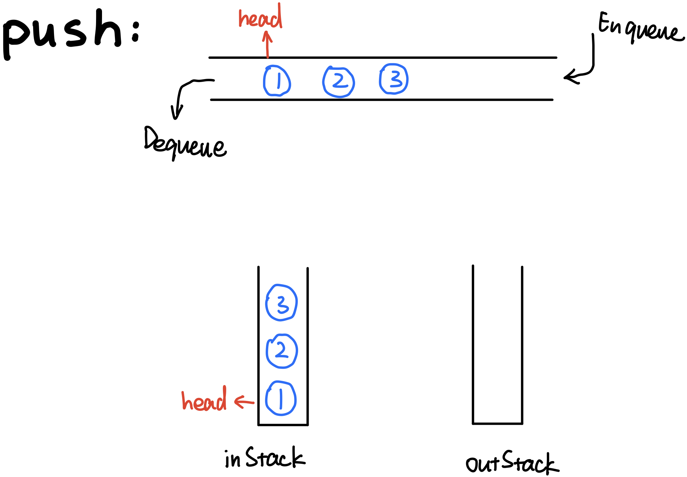
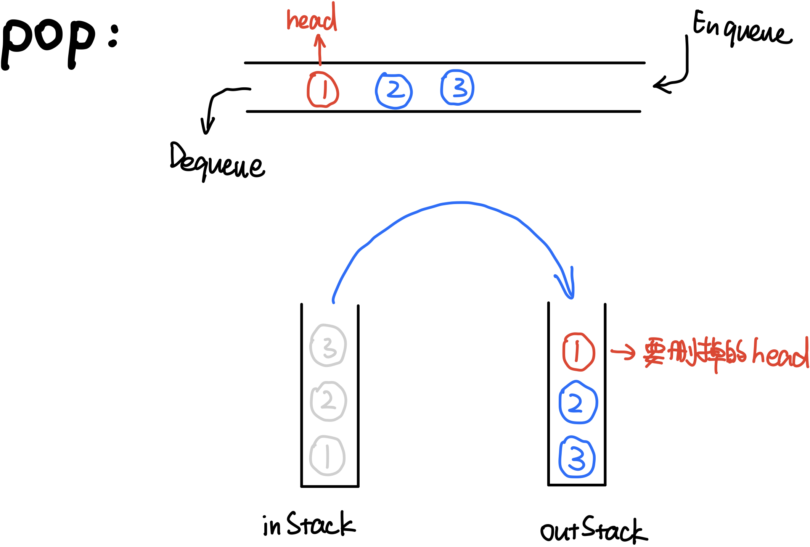
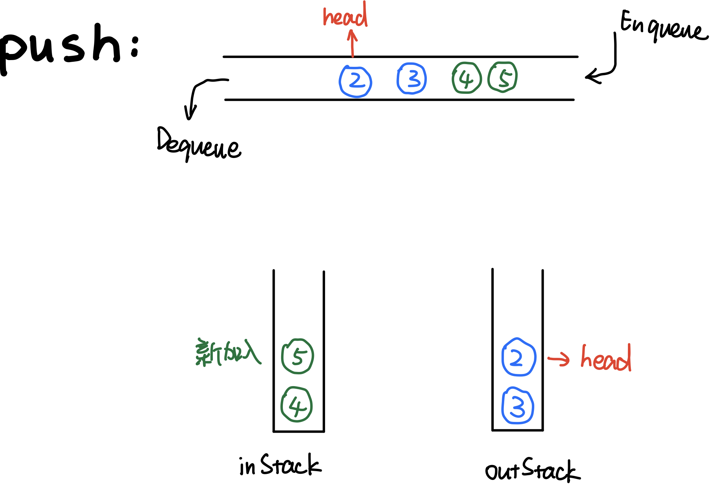
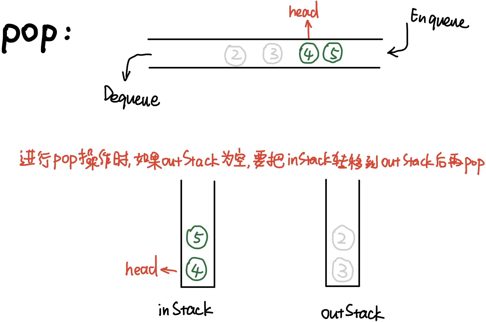

# \[Leetcode\]232. Implement Queue using Stacks

原题地址：[https://leetcode.com/problems/implement-queue-using-stacks/](https://leetcode.com/problems/implement-queue-using-stacks/) 关键词：Stack

题意：用Stack实现Queue。  
要求仅使用两个Stack实现先进先出Queue。Queue应当支持下列操作：`push()`、`pop()`、`peek()`、`isEmpty()`。


### 算法：两个Stack

Queue的特性是先进先出，而Stack的特性是先进后出。我们需要用两个Stack来模拟Queue的特性，一个栈为`inStack`，一个栈为`outStack`。

#### ●`push()`操作：`O(1)`

直接把新元素放入`inStack`，时间为`O(1)`；




#### ●`pop()`操作：平均`O(1)`, Worst-case `O(n)`.

有两种情况：  
如果`outStack`不为空，直接把`outStack`栈顶的元素pop出来即可：




在pop时，如果`outStack`为空，且，那么需要将`inStack`的元素转移到`outStack`，然后pop即可：







完整代码：

```text
class MyQueue {

    private Stack<Integer> inStack;
    private Stack<Integer> outStack;
    
    /** Initialize your data structure here. */
    public MyQueue() {
        inStack = new Stack();
        outStack = new Stack();
    }
    
    /** Push element x to the back of queue. */
    public void push(int x) {
        inStack.push(x);
    }
    
    /** Removes the element from in front of queue and returns that element. */
    public int pop() {
        if (outStack.isEmpty()) {
            while (!inStack.isEmpty()) {
                outStack.push(inStack.pop());
            }
        }
        return outStack.pop();
    }
    
    /** Get the front element. */
    public int peek() {           // 代码结构和pop基本一样
       if (outStack.isEmpty()) {
            while (!inStack.isEmpty()) {
                outStack.push(inStack.pop());
            }
        }
        return outStack.peek();
    }
    
    /** Returns whether the queue is empty. */
    public boolean empty() {
        return inStack.isEmpty() && outStack.isEmpty();
    }
}

/**
 * Your MyQueue object will be instantiated and called as such:
 * MyQueue obj = new MyQueue();
 * obj.push(x);
 * int param_2 = obj.pop();
 * int param_3 = obj.peek();
 * boolean param_4 = obj.empty();
 */
```


●`push()`：  
Time：`O(1)`；  
Space：`O(n)`；Stack的size

●`pop()`：  
Time：平均`O(1)`, Worst-case `O(n)`；  
Space：`O(1)`；


