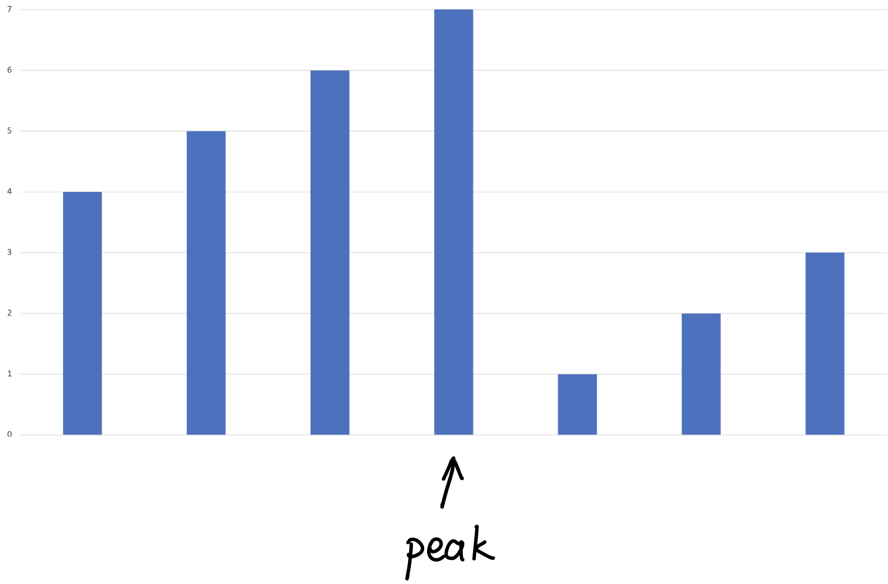

# \[Leetcode\]33. Search in Rotated Sorted Array

原题地址：[https://leetcode.com/problems/search-in-rotated-sorted-array/](https://leetcode.com/problems/search-in-rotated-sorted-array/) 关键词：Binary Search

题意：Rotated Sorted Array中寻找目标值。  
一个sorted数组`nums[]`，没有duplicates。数组前面某一段被截取放到了数组末尾，形成了新的数组。给一个整数`target`，求它在数组中的位置index，如果不存在则返回-1。

例1：  
Input: `nums = [4,5,6,7,0,1,2]`, `target = 1`   
Output: 5  
例2：  
Input: `nums = [1]`, `target = 0`  
Output: -1


### 算法：Binary Search

**核心思想：**先找到peak element，如果target在peak的左边就在左边进行Binary Search，如果target在peak的右边就在右左边进行Binary Search。



1. 找到数组中的peak element；注意两个corner case：
   1. 如果数组没有被Rotated，也就是sorted单调递增的话，那么第一个数，一定小于最后一个数，也就是说**peak element就是数组最后一个数**（如果数组Rotated，那么第一个数，一定大于最后一个数）
   2. 如果数组只有一个元素，那么peak element就是第一个数；
2. 如果target大于`nums[0]`，那么target一定在peak的左边部分，所以对左边的部分进行binary search；
3. 如果target小于`nums[0]`，那么target一定在peak的右边部分，所以对右边的部分进行binary search；

```text
class Solution {
    public int search(int[] nums, int target) {
        if (nums == null || nums.length == 0) return -1;
        
        int peakIndex = findPeakElement(nums);
        
        if (target >= nums[0]) {
            return binarySearch(0, peakIndex, nums, target);
        } else {
            return binarySearch(peakIndex + 1, nums.length - 1, nums, target);
        }
    }
    
    private int findPeakElement(int[] nums) {
        if (nums.length == 1) return 0;
        if (nums[0] < nums[nums.length - 1]) return nums.length - 1;
        
        int index = 0;
        
        for (int i = 1; i < nums.length; i++) {
            if (nums[i] < nums[i - 1]) { // 如果出现右边的数比左边小，那么左边的数一定是peak
                index = i - 1;
                break;
            }
        }
        
        return index;
    }
    
    private int binarySearch(int left, int right, int[] nums, int target) {
        while (left < right) {
            int mid = left + (right - left) / 2;
            
            if (target > nums[mid]) {
                left = mid + 1;
            } else {
                right = mid;
            }
        }
        
        return nums[right] == target ? right : -1;
    }
}
```

Time: `O(logn)`；  
Space: `O(1)`；


### 要记住的重点：

1. 上面`left < right` 无等号，下面if判断中，=等号只能交给`right`；  
2. mid注意防止溢出；  
**3. return的时候，只能返回`right`。**

简便记忆：if中等号判断交给right，下面返回right，**什么都是right，统统都是right！**


