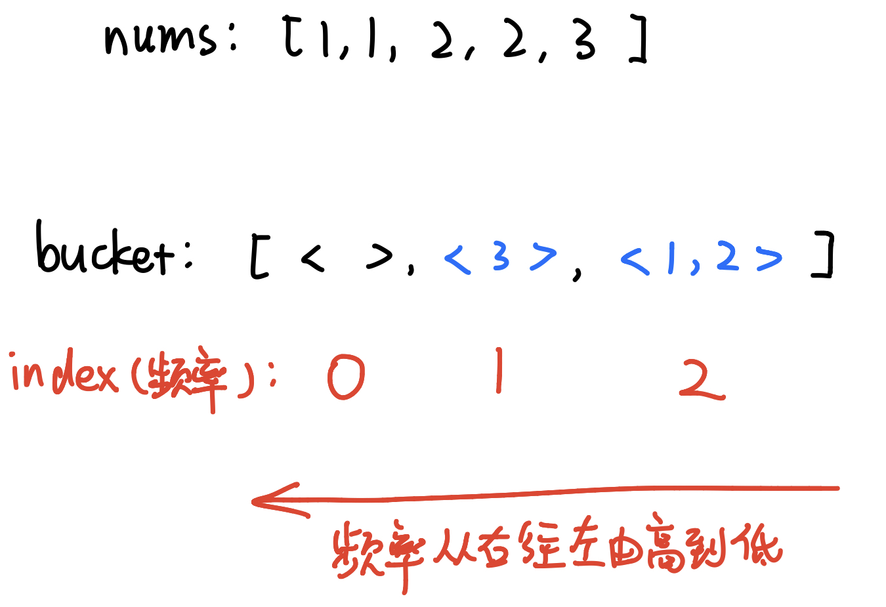

# \[Leetcode\]347. Top K Frequent Elements

原题地址：[https://leetcode.com/problems/top-k-frequent-elements/](https://leetcode.com/problems/top-k-frequent-elements/) 关键词：min-Heap, PriorityQueue

题意：返回前K个高频元素。  
给一个整数数组`nums[]`和一个整数`k`，请返回其中出现频率前`k`高的元素。可以按任意顺序返回答案。题目数据保证答案唯一。要求：时间复杂度小于`O(nlogn)`；

例：  
Input: `nums = [1,1,1,2,2,3], k = 2`   
Output: `[1,2]`


### 方法1：PriorityQueue `O(Nlogk)`（重要）

**核心思想：**对每个数按照频率，由高到低进行排序，然后再取前k个元素。

具体实现：

1. 使用HashMap统计频率；
2. 初始化min-Heap，使堆顶为频率最小的元素，**保持PriorityQueue里面不超过k个元素**；
3. 每次都将新的元素，与min-Heap顶端元素（PriorityQueue中频率最小的元素）进行比较，如果新的元素的频率比min-Heap顶端的元素大，则弹出min-Heap顶端的元素，将新的元素添加进去；
4. 最终，堆中留下的k个元素即为前k个高频元素。

注意min-Heap初始化方法：`PriorityQueue<Integer> pq = new PriorityQueue<>((num1, num2) -> map.get(num1) - map.get(num2));`


```text
class Solution {
    public int[] topKFrequent(int[] nums, int k) {
        if (nums.length == 1) return nums;
        
        Map<Integer, Integer> map = new HashMap<>();
        
        for (int num : nums) {
            map.put(num, map.getOrDefault(num, 0) + 1); // 计算频率
        }
        
        // 初始化min-Heap
        PriorityQueue<Integer> pq = new PriorityQueue<>((num1, num2) -> map.get(num1) - map.get(num2)); // min-Heap
        
        for (int key : map.keySet()) {
            pq.offer(key);
            
            if (pq.size() > k) { // 如果Heap的size超过k了，就把上面频率最小的poll出去
                pq.poll();       
            } 
        }
        
        int[] res = new int[k];
        
        for (int i = 0; i < k; i++) { // 把heap中留下的k个元素加入res
            res[i] = pq.poll();
        }
        
        return res;
    }
}
```

Time: `O(Nlogk)`;   
解释：首先，遍历一遍数组统计元素的频率，这一系列操作的时间复杂度是`O(n)`；PriorityQueue中的元素不会超过k个，所以插入offer\(\)和删除poll\(\)的时间代为`O(logk)`；N是数组所有元素的总个数，可能每一个数都要poll一次，所以最后的时间是相乘:`O(N * logk)`; 

Space: `O(N)`;   
解释：PriorityQueue最大size是`O(K)`，HashMap的size是`O(N)`；所以空间复杂度为`O(K + N) = O(N)`

在上面第14行加入PriorityQueue的方法中，我原来写的笨办法是：

```text
for (int key : map.keySet()) {
    if (pq.size() >= k) { //如果Heap的size满了，达到k了
        if (map.get(key) > map.get(pq.peek())) { // 那就看新元素的频率有没有比堆顶大
            pq.poll();       // 如果新元素频率更大，就poll出原来heap中最小的
            pq.offer(key);   // 然后加入新的
        }
    } else {
        pq.offer(key); // 如果Heap的size不到k，直接加进去
    }
}
```

其实完全没有必要，因为PriorityQueue已经为你按照频率排序，只需要在超过容量时把顶端的poll出去就行


### 方法2：Bucket Sort  `O(N)`

核心思想：使用HashMap统计频率，统计完成后，创建一个数组，**将频率作为数组index**，对于出现频率不同的数字集合，存入对应的数组下标index即可。



由图可知，最后只要倒序遍历`bucket[]`数组，记录前k个不为空的元素，即为最后结果。

注意：`bucket[]`是数组，但是它里面的每一个元素是ArrayList❗️ 初始化方法：**`List<Integer>[] bucket = new ArrayList[nums.length+1];`**

```text
class Solution {
    public int[] topKFrequent(int[] nums, int k) {
        
        Map<Integer, Integer> map = new HashMap<>();
        
        for (int num : nums) {
            map.put(num, map.getOrDefault(num, 0) + 1); // 计算频率
        }
        
        //将频率作为数组下标，对于出现频率不同的数字集合，存入对应的数组下标
        List<Integer>[] bucket = new ArrayList[nums.length+1];
        for(int key : map.keySet()){
            int i = map.get(key);
            if(bucket[i] == null){        // 如果key里出现且为空，那么就new一个ArrayList
               bucket[i] = new ArrayList();
            } 
            bucket[i].add(key);
        }
        
        // 倒序遍历数组获取出现顺序从大到小的排列
        int[] res = new int[k];
        int j = 0;
        
        for(int i = bucket.length - 1; i >= 0 && j < k; i--){
            if(bucket[i] != null) {
                for (int num : bucket[i]) {
                    res[j] = num;
                    j++;
                }
            }
        }
        
        return res;
    }
}
```

Time: `O(N)`; 

Space: `O(N)`;  HashMap的size


### 本题要记住的重点：

1. PriorityQueue构建的是最小堆min-Heap，并且size不超过k


