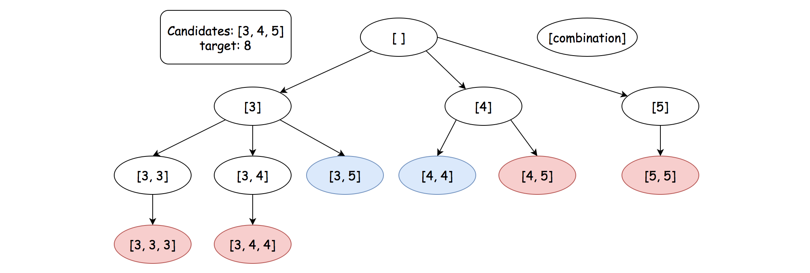

# \[Leetcode\]39. Combination Sum

原题地址：[https://leetcode.com/problems/combination-sum/](https://leetcode.com/problems/combination-sum/) 关键词：Backtrack

题意：求组合方案；  
给定一个无duplicate的正整数数组`candidates[]`和一个正整数 target ，找出`candidates[]`中所有可以使数字和为目标数 target 的唯一组合。`candidates[]`中的数字可以重复选取。

例：  
Input: `candidates = [2,3,5], target = 8`；   
Output: `[[2,2,2,2],[2,3,3],[3,5]]`


### 算法：Backtrack



注意要sort数组`candidates[]`为升序排列；

```text
class Solution {
    public List<List<Integer>> combinationSum(int[] candidates, int target) {
        List<List<Integer>> results = new ArrayList<>();
        
        if (candidates == null || candidates.length == 0) return results;
        
        Arrays.sort(candidates);
        
        List<Integer> combination = new ArrayList<>();
        
        helper(results, combination, candidates, target, 0);
        
        return results;
    }
    
    private void helper(List<List<Integer>> results, List<Integer> combination, int[] candidates, int target, int startIndex) {
        if (target == 0) {
            results.add(new ArrayList<>(combination));
            return;
        }
        
        for (int i = startIndex; i < candidates.length; i++) {
            if (candidates[i] > target) {
                break;
            }
            
            combination.add(candidates[i]);
            helper(results, combination, candidates, target - candidates[i], i); //注意这里不断用targe来减
            combination.remove(combination.size() - 1); //去掉最后一个元素
        }
    }
    
}
```

Time：？？

