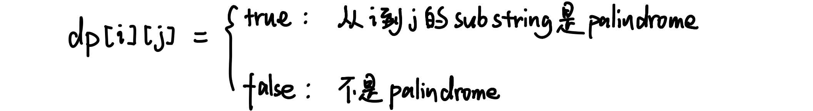
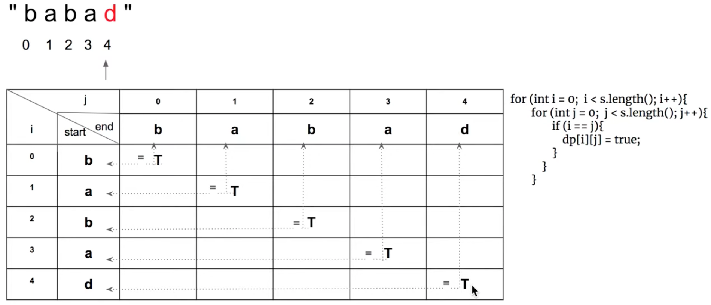
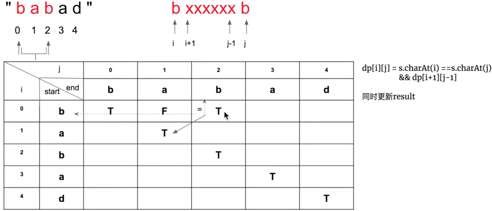
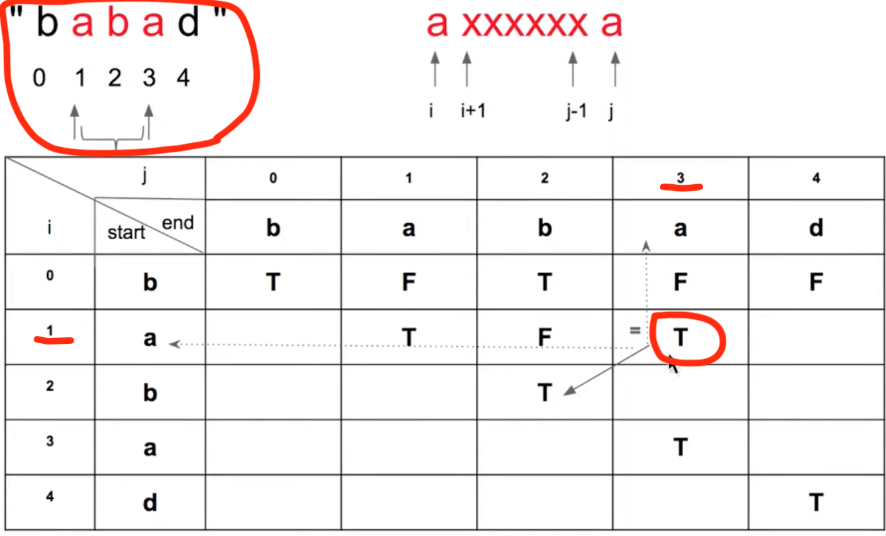

# \[Leetcode\]5. Longest Palindromic Substring

原题地址：[https://leetcode.com/problems/longest-palindromic-substring/](https://leetcode.com/problems/longest-palindromic-substring/) 关键词：[Palindrome](https://bhnigw.gitbook.io/leetcode/valid-palindrome), [Dynamic Programming](https://bhnigw.gitbook.io/leetcode/dynamic-programming)

题意：给一个String `s`，找到 `s` 中最长的Palindromic Substring。

例：  
Input: s = `"babad"`；Output: `"bab"` Note: "aba" is also a valid answer.   
Input: s = `"cbbd"`；Output: `"bb"`


### 算法：Dynamic Programming

**中心思想**：只要`i`和`j`对应的两个字母相同，并且它们中间那一坨string是Palindrome，那么整个string就是Palindrome。


所以我们初始化一个二维boolean数组`dp[i][j]`，它表示的意思是：如果从`i`到`j`的substring是Palindrome，那么`dp[i][j]`就等于true；否则就是false。



  
**找最小子问题**（base case）**：**  
1. 一个单独字母本身，是Palindrome。所以`dp[i][i] = true`；  
2. 两个字母相邻且相同，是Palindrome。所以`dp[i][j] = s.charAt(i) == s.charAt(i + 1)`;

  
可以先对`dp[][]`做预处理，使得对角线`dp[i][i]`均为true：




**`dp[i][j]`的值为true还是false，取决于：**  
    1.指数`i`和`j`对应的两个字母是否相同；  
    2. 中间那一坨string是否为Palindrome。也就是当前表格的左下角那一格是否为true


所以，得出**状态转移方程**（Governing equation）：  
**`dp[i][j] = s.charAt(i) == s.charAt(j) && dp[i + 1][j - 1];`**






根据状态转移方程，填完表格，构建完`dp[i][j]`的值：




```text
class Solution {
    public String longestPalindrome(String s) {
        if (s == null || s.length() < 2) return s;
        
        boolean[][] dp = new boolean[s.length()][s.length()];
        
        int maxlength = 0;
        int left = 0, right = 0; //记录最长substring的index
        
        for (int i = 0; i < s.length(); i++) {    // 预处理dp[][]
            for (int j = 0; j < s.length(); j++) {
                if (i == j) {
                    dp[i][j] = true; // 对角线都为true
                }
            }
        }
        
        for (int j = 0; j < s.length(); j++) { // 注意两个for的index
            for (int i = 0; i < j; i++) {
                if (s.charAt(i) == s.charAt(j)) { 
                    if (j - i <= 2) {          //处理两个字母相邻且相同的情况，如"cbbd"
                        dp[i][j] = true;
                        if (j - i > maxlength) { //更新最长substring的index
                            maxlength = j - i;
                            left = i; 
                            right = j;
                        }
                    } else if (j - i > 2 && dp[i + 1][j - 1]) { //处理一般情况，即两个字母不相邻
                        dp[i][j] = true;
                        if (j - i > maxlength) { //更新最长substring的index
                            maxlength = j - i;
                            left = i; 
                            right = j;
                        }
                    }
                }
            }
        }
        
        
        return s.substring(left, right + 1);
    }
}
```

Time: `O(n^2)`；两层for loop  
Space: `O(n^2)`；即`dp[][]`用的空间

