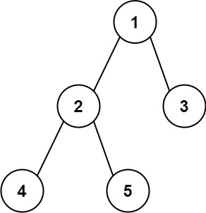

# \[Leetcode\]543. Diameter of Binary Tree \(对应124题\)

原题地址：[https://leetcode.com/problems/diameter-of-binary-tree/](https://leetcode.com/problems/diameter-of-binary-tree/) 关键词：Tree，DFS

题意：求Maximum Path Length。  
给一个二叉树，每两个node之间都有一条唯一的路径。求这个二叉树任意两个node路径长度中的最大值。路径不一定经过根节点。

例子：



Input: `root = [1,2,3,4,5]`   
Output: 3   
Explanation: 最长的path可以是`[4,2,1,3]`或者`[5,2,1,3]`，最长的路径长度是3。


### 算法：DFS

★**核心思想：**对于每一个node，**`穿过它的最长路径` = `穿过左child的最长路径` + `穿过右child的最长路径`**；

初始化一个长度为1的`res[]`数组来记录结果；Recursion的过程：从最底层leaf向上，对当前的node，拿到它左child的最长路径，和它右child的最长路径，然后加上当前node的路径长度\(也就是加1\)，即为穿过该node的最长路径。与此同时，把这个路径长度和global变量`res[]`里的值做一个对比，更新最大长度。

接下来，向上recursion，向它的parent node返回一个最大长度。如果parent node一旦选择走这个node，那就要加上这个最大长度。事实上，parent node会**在自己的左右两个child中选择一个对路径贡献更大的（路径更长的child）来走。**

**❗️**这就是本题的难点，要弄清楚Recursion时我们要返回的是什么！！  
我们的目标：判断parent node到底要走左右child哪一条路！  
怎样判断：选最长的那条路走！  
所以我们返回的是：该node能给parent贡献的最长路径！  
**`该node能给parent贡献的最长路径` = `Max(该node左child的最长路径, 该node右child的最长路径) + 1`**；


**核心DFS：**  
`private int dfs(TreeNode root, int[] res) {   
    if (root == null) return 0;  
    int leftLength = dfs(root.left, res);   
    int rightLength = dfs(root.right, res);  
    res[0] = Math.max(leftLength + rightLength, res[0]);   
    return Math.max(leftLength, rightLength) + 1; // 注意返回的是什么  
                                                //每向上recursion一次，路径就加长一个，所以加1  
}`


观察下面为什么有错：

```text
// 错误代码
class Solution {
    public int diameterOfBinaryTree(TreeNode root) {
        int res = 0;  // 不能用int类型来记录结果
        if (root == null) return res;
        
        res = dfs(root, res); // 这样写的话，res值是第20行的结果，而我们需要的是18行的结果
        
        return res;
    }
    
    private int dfs(TreeNode root, int res) {
        if (root == null) return 0;
        
        int leftLength = dfs(root.left, res);
        int rightLength = dfs(root.right, res);
        
        res = Math.max(leftLength + rightLength, res); // 这是我们要的结果
        
        return Math.max(leftLength, rightLength) + 1;  // 这是最后返回的结果
    }
}
```

有错，是因为在DFS结束时，我们需要的res是第18行的值，但是dfs\(root, res\)返回的是第20行的值，这个值只是左右child其中一个的最大路径值。所以第7行里是拿不到res的正确值的。  
我们可以把`res[]`变成长度为1的数组，当成全局变量来用，就可以保证在DFS结束时依然能够拿到所要的值，也就是`res[0]`。


#### 正确代码：

```text
class Solution {
    public int diameterOfBinaryTree(TreeNode root) {
        int[] res = new int[1]; // 可以理解为DFS时的一个全局变量
        if (root == null) return res[0];
        
        dfs(root, res);
        
        return res[0];
    }
    
    private int dfs(TreeNode root, int[] res) {
        if (root == null) return 0;
        
        int leftLength = dfs(root.left, res);
        int rightLength = dfs(root.right, res);
        
        res[0] = Math.max(leftLength + rightLength, res[0]);
        
        return Math.max(leftLength, rightLength) + 1;
    }
}
```

Time: `O(N)`；每个node走了一遍，所以时间是node的个数。

Space: `O(N)`；空间是DFS的stack个数，**也就是DFS的深度，也就是树的高度。**如果树的形状规则，那平均时间是`O(logN)`；在worst case的情况下，树是一条向下的直线，深度为N，那么时间就是`O(N)`；


### 要记住的重点：

1. DFS时返回的是什么？是返回该node能给parent贡献的最长路径
2. 用`res[0]`来记录结果


同类题：




