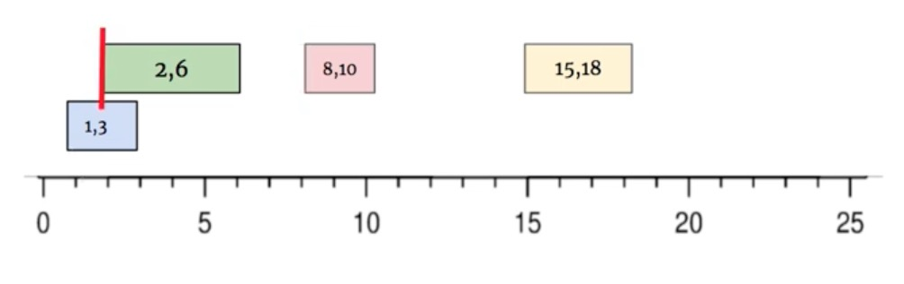

# \[Leetcode\]56. Merge Intervals

原题地址：[https://leetcode.com/problems/merge-intervals/](https://leetcode.com/problems/merge-intervals/)关键词：ArrayList，Lambda Expression

题意：融合线段；  
数组`intervals[]`表示若干个区间的集合，其中单个区间为`intervals[i] = [startIndex, endIndex]`，合并所有重叠的区间。

例：  
Input: `intervals = [[1,3],[2,6],[8,10],[15,18]]`  
Output: `[[1,6],[8,10],[15,18]]`  
Explanation: 区间 \[1,3\] 和 \[2,6\] 重叠, 将它们合并为 \[1,6\]



### 算法：

使用ArrayList来记录结果，因为结果的长度未知；`List<int[]> res = new ArrayList<>();`

要先以第一位数，来sort所有的intervals，注意方法：`Arrays.sort(intervals, (int[] a, int[] b) -> a[0] - b[0])`;

先把第一个线段加进去；for循环从1开始，每次取res最末尾的线段lastInterval，来与当前的线段i比较：  
● 如果lastInterval的尾巴比线段i的开头还大（大于或等于），说明重叠了，那么我们就更新res最末尾线段的尾巴：`Math.max(lastInterval[1], intervals[i][1])`；  
● 如果lastInterval的尾巴并没有比线段i的开头还大，说明没有重叠，那就直接把线段i加入res；

最后一步，把res这个List转化为数组array：`res.toArray(new int[res.size()][2])`;

```text
class Solution {
    public int[][] merge(int[][] intervals) {
        if (intervals == null || intervals.length == 0) return intervals;
        List<int[]> res = new ArrayList<>(); //注意初始化
        
        Arrays.sort(intervals, (int[] a, int[] b) -> a[0] - b[0]);
        
        res.add(intervals[0]);
        for (int i = 1; i < intervals.length; i++) {
            int[] lastInterval = res.get(res.size() - 1);
            if (lastInterval[1] >= intervals[i][0]) {
                res.get(res.size() - 1)[1] = Math.max(lastInterval[1], intervals[i][1]);
            } else {
                res.add(intervals[i]);
            }
        }
        
        return res.toArray(new int[res.size()][2]);
    }
}
```

Time: `O(nlogn)`；这是sort所需要的时间  
Space: `O(n)`；ArrayList可能需要的空间


