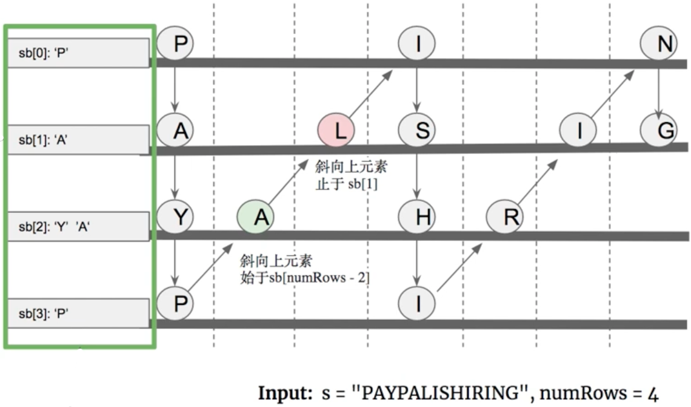

# \[Leetcode\]6. ZigZag Conversion

原题地址：[https://leetcode.com/problems/zigzag-conversion/](https://leetcode.com/problems/zigzag-conversion/) 关键词：StringBuilder

题意：将一个字符串`s`根据给定的行数`numRows`，进行ZigZag排列后，按照行数，重建string并返回。

例如：  
Input: s = `"PAYPALISHIRING"`, `numRows = 4`   
Output: `"PINALSIGYAHRPI"`   
解释:   
`P      I      N   
A    L S    I G   
Y  A   H  R   
P      I`


### 算法：

对每一行，都用一个StringBuilder来存应该放入的character，下图中的例子就可以这样初始化：`StringBuilder[] sb = new StringBuilder[numRows];`然后记得在该数组每一个位置new一下StringBuilder否则会报错nullPointerException。



初始化一个`index = 0`，用while loop来扫整个input string：


在index扫的过程中，用两个for循环\(不是两层\)来完成zigzag：

#### ● 第一个for loop，从上往下：

从上往下，`i`始于0，止于`numRows - 1`；

`for (int i = 0; i < numRows && index < s.length(); i++) {   
    sb[i].append(s.charAt(index)); // 扫的时候把字母加到对应的StringBuilder层数里去  
    index++;   
}`


#### ● 第二个for loop，从下往上：

从下往上，`j`始于`numRows - 2`，止于1；  
看图理解，因为每次从上往下的时候，都已经扫了0和`numRows - 1`，也就是头和尾地方，所以相当于是只扫了往上部分的中间一坨，

`for (int j = numRows - 2; j > 0 && index < s.length(); j--) {   
    sb[j].append(s.charAt(index)); // 扫的时候把字母加到对应的StringBuilder层数里去  
    index++;   
}`


最后把数组`sb[]`全部append到res里，然后`toString()`就可以了。

```text
class Solution {
    public String convert(String s, int numRows) {
        // 题目规定了s的长度大于1，所以不用null check
        
        StringBuilder[] sb = new StringBuilder[numRows];
        StringBuilder res = new StringBuilder();
        int index = 0;
        
        for (int i = 0; i < numRows; i++) { //要初始化，否则nullPointerException
            sb[i] = new StringBuilder();
        }
        
        
        while (index < s.length()) {
            for (int i = 0; i < numRows && index < s.length(); i++) {
                sb[i].append(s.charAt(index));
                index++;
            }
            for (int j = numRows - 2; j > 0 && index < s.length(); j--) { //注意j初始值
                sb[j].append(s.charAt(index));
                index++;
            }
        }
        
        
        for (int i = 0; i < numRows; i++) {
            res.append(sb[i]);
        }
        
        return res.toString();
    }
}
```

Time: O\(n\);  
Space: O\(n\);


