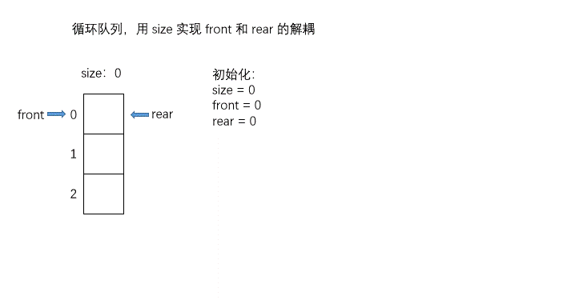

# \[Leetcode\]622. Design Circular Queue

原题地址：[https://leetcode.com/problems/design-circular-queue/](https://leetcode.com/problems/design-circular-queue/)

题意：设计循环队列Circular Queue。   
Circular Queue是一种线性数据结构，其操作基于 FIFO（先进先出）原则，并且队尾被连接在队首，以形成一个循环。它也被称为“环形缓冲器“（Ring Buffer）。

Circular Queue的一个好处是我们可以利用这个队列之前用过的空间。在一个普通队列里，一旦一个队列满了，我们就不能插入下一个元素，即使在队列前面仍有空间。但是使用循环队列，我们能使用这些空间去存储新的值。

你的实现应该支持如下操作：

MyCircularQueue\(k\): 构造器，设置队列长度为 k 。 Front: 从队首获取元素。如果队列为空，返回 -1 。 Rear: 获取队尾元素。如果队列为空，返回 -1 。 enQueue\(value\): 向循环队列插入一个元素。如果成功插入则返回真。 deQueue\(\): 从循环队列中删除一个元素。如果成功删除则返回真。 isEmpty\(\): 检查循环队列是否为空。 isFull\(\): 检查循环队列是否已满。

例子：


### 算法：



```text
class MyCircularQueue {
    int[] arr;
    int size;
    int front;
    int rear;

    public MyCircularQueue(int k) {
        this.arr = new int[k];
        this.size = 0;
        this.front = 0;
        this.rear = 0;
    }
    
    public boolean enQueue(int value) {
        if (size == arr.length) return false;
        
        arr[rear] = value;
        rear++;
        size++;
        
        if (rear == arr.length) rear = 0; // 注意这里不能是arr.length - 1
        
        return true;
    }
    
    public boolean deQueue() {
        if (size == 0) return false;
        
        front++;
        size--;
        
        if (front == arr.length) front = 0; // 注意这里不能是arr.length - 1
        
        return true;
    }
    
    public int Front() {
        if (size == 0) return -1;
        
        return arr[front];
    }
    
    public int Rear() {
        if (size == 0) return -1;
        
        if (rear == 0) {
            return arr[arr.length - 1];
        } else {
            return arr[rear - 1];
        }
    }
    
    public boolean isEmpty() {
        return size == 0;
    }
    
    public boolean isFull() {
        return size == arr.length;
    }
}

/**
 * Your MyCircularQueue object will be instantiated and called as such:
 * MyCircularQueue obj = new MyCircularQueue(k);
 * boolean param_1 = obj.enQueue(value);
 * boolean param_2 = obj.deQueue();
 * int param_3 = obj.Front();
 * int param_4 = obj.Rear();
 * boolean param_5 = obj.isEmpty();
 * boolean param_6 = obj.isFull();
 */
```


