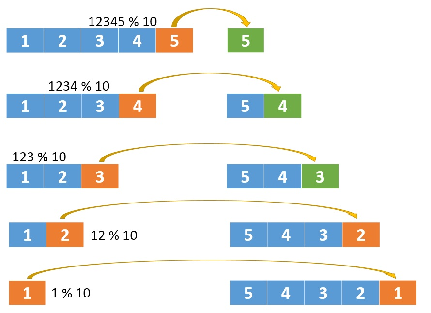

# \[Leetcode\]7. Reverse Integer

 原题地址：[https://leetcode.com/problems/reverse-integer/](https://leetcode.com/problems/reverse-integer/) 关键词：数学技巧

题意：反转整数；  
如果反转后整数超过 32 位的有符号整数的范围 `[-2^31,  2^31 − 1]`（出现overflow），就返回 0；  
只允许存储32-bit integer，也就是说不能用long类型只能用int。

例：  
Input: `x = -123` Output: `-321`；  
Input: `x = 120`   Output: `21`；


### 算法：

主要由两个步骤构成，取数字 & 放数字。

#### 取数字：

`int digit = x % 10;   
x /= 10;`

#### 放数字：

`int temp = res * 10 + digit;   
res = temp;`





**此题唯一需要注意的地方就是overflow**


假如输入数字是x = 1534236469，在反转进行到res = 964632435时：  
`res * 10 = 9646324350;`  
`2 ^ 31   = 2147483648;`  
此时发生了overflow，应该返回0；

**在Java中，如果overflow，结果只会保留低32位，高位会抛弃掉。**所以如果`res * 10`溢出后赋值给temp，那么temp就会变成一个奇怪的数字。所以，在把temp赋值给res之前，要判断`temp / 10`和`res`是否相等：不相等，说明发生overflow。

```text
class Solution {
    public int reverse(int x) {
        int res = 0; 
        
        while (x != 0) {
            int digit = x % 10;
            x /= 10;
            
            int temp = res * 10 + digit;
            
            if (temp / 10 != res) return 0; //判断溢出
            
            res = temp;
        }
        
        return res;
    }
}
```

Time: O\(log\(x\)\). There are roughly`log10(x)`digits in xx.   
Space: O\(1\).


