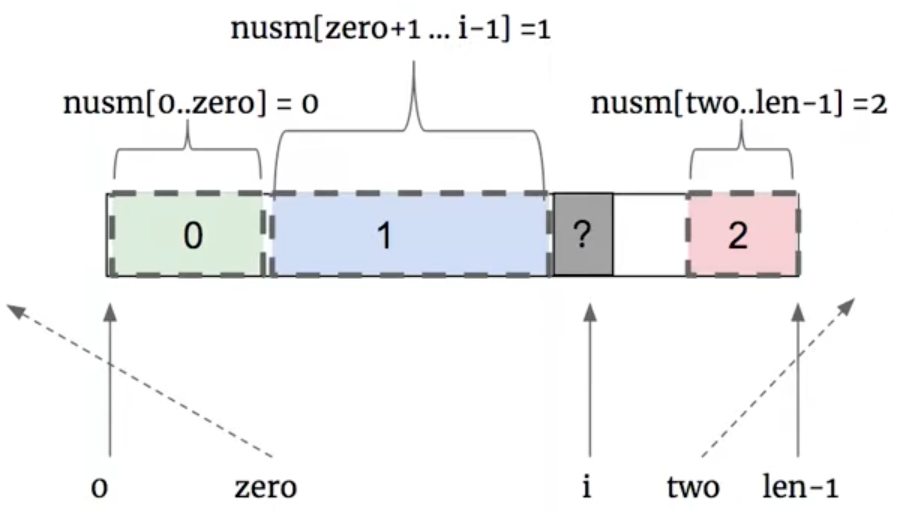
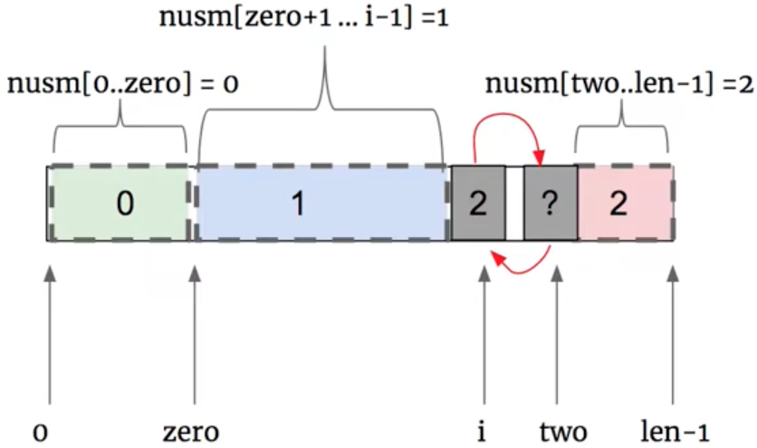
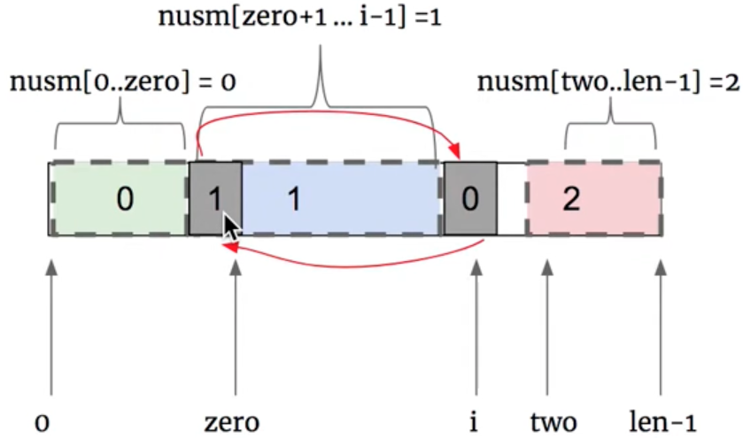

# \[Leetcode\]75. Sort Colors

原题地址：[https://leetcode.com/problems/sort-colors/](https://leetcode.com/problems/sort-colors/) 关键词：多指针

题意：颜色分类；  
给一个乱序的数组，包含整数0、1、2代表三种颜色，对它们进行排序，使得相同颜色的元素相邻，并按照0、1、2顺序排列。

要求：不能使用sort\(\)方法；只能扫描一趟；不能用额外的空间，**space只能是O\(1\)；**

例：  
Input: `nums = [2,0,2,1,1,0]`  
Output: `[0,0,1,1,2,2]`


### 方法1：统计0、1、2个数（时间较高，不推荐）

要做到space是O\(1\)，那就只能在原数组上操作。  
扫第一遍数组，统计0、1、2每个元素出现的频率。  
扫第二遍数组，按照频率，把0、1、2按顺序放入原数组覆盖原来的数据。


### 方法2：one pass（最优）

只用扫一遍数组，思路类似[283. Move Zeroes](https://bhnigw.gitbook.io/leetcode/leetcode/leetcode27.-remove-element-tong-lei-ti-zong-jie/leetcode-283.-move-zeroes)；

**核心思想：**从左往右遍历，遇到0就放到左边，遇到2就放到右边，中间剩下的就全部是1。



使用三个指针：  
指针1：`zero`；用于维护nums里`0 ～ zero`区间的数字0  
指针2：`two`；  用于维护nums里`two ～ (length-1)`区间的数字2  
指针3：`index`；该指针用于遍历。

⚠️  **注意易错的重点来了！**指针`zero`和`two`的初始化都要在数组的boundary之外；为什么，因为如果起点是index0，开始遍历之后，使用`zero++`来reserve下一个位置，index就会变成1，会丢失掉第一个数字。


从左往右遍历，如果`index`遇到2，那么指针`two--`，向左移动一位预留出位置。要注意`two`左移后，这个新位置本身也是有一个元素的，不能直接粗暴的把它变成2否则会丢失数据。我们需要进行swap操作，把`index`和`two`对应的数据交换，这样`index`对应的数字2就划入到了nums里`two ～ (length-1)`的阵营里；然后那个被交换的未知数据则要继续被遍历检查。  
⚠️  **注意易错的重点来了！**swap交换后到指针index位置的元素依然是未知的，所以此时不能index++！index继续留在原地判断这个未知元素。




继续遍历，如果`index`遇到0，那么指针`zero++`，向右移动一位预留出位置。进行swap操作，把`index`和`zero`对应的数据交换，这样`index`对应的数字0就划入到了nums里`0 ～ zero`的阵营里；然后`index++`往右移继续遍历下一个数字。




继续遍历，如果`index`遇到1，那么直接`index++`往右移继续遍历下一个数字。

```text
class Solution {
    public void sortColors(int[] nums) {
        if (nums == null || nums.length == 0) return;
        
        int zero = -1;
        int two = nums.length;
        
        int index = 0;
        while (index < two) {  // 注意while的终止条件
            if (nums[index] == 0) {
                zero++;             // 用于reserve一个space
                swap(nums, zero, index);     
                index++;
            } else if (nums[index] == 1) {
                index++;
            } else {
                two--;            // 用于reserve一个space
                swap(nums, two, index);
                                       // 注意这里index没有++
            }
            
        }
    }
    
    private void swap(int[] nums, int i, int j) {
        int temp = nums[i];
        nums[i] = nums[j];
        nums[j] = temp;
    }
}
```

Time: `O(n)`; 只扫了一遍数组  
Space: `O(1)`; 没有新建额外空间


### 要注意的重点：

1. 遇到数字2的时候，index不能++；
2. 两个初始化的时候，zero和two都要在数组的boundary之外；


