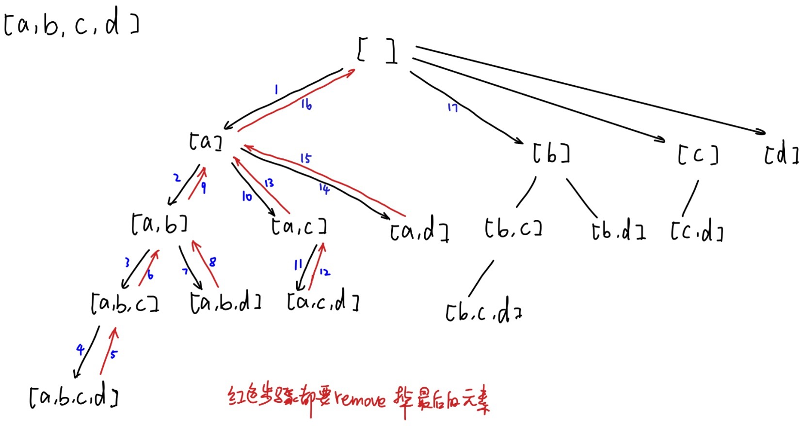

# \[Leetcode]78. Subsets

原题地址：[https://leetcode.com/problems/subsets/](https://leetcode.com/problems/subsets/) 关键词：Backtracking, ArrayList, DFS, Recursive

题意：给一个没有duplicate的数组，输出所有的子集（包括空集和它本身）


#### 详细图解：




#### 算法/代码结构：使用[backtrack](https://bhnigw.gitbook.io/1/backtrack-mo-ban)

1. 无需null check；初始化二维List作为res，初始化一维List作为backtrack时候的current Subset；
2. 无需for循环遍历数组，直接用0作为初始index进入helper方法；
3. 在helper方法内：
   1. 首先把当前此刻最新的currentSubset加入结果集（第一轮加入的是空集）
   2. 从当前输入的index开始for循环，每一轮的for 循环都有3个操作：
      1. 把当前数字`nums[i]`加入curren subset；（对应下面第1步）
      2. 开始递归找此刻i + 1的subset；（对应下面第2步）
      3. ★每一轮for循环结束前，都要去掉curren subset里最后一个元素（因为要backtrack到上一轮给末尾加入新的元素，详细看上图和[backtrack讲解](https://bhnigw.gitbook.io/1/backtrack-mo-ban)）（对应下面第3步）

```
class Solution {
    public List<List<Integer>> subsets(int[] nums) {
        List<List<Integer>> res = new ArrayList<>();
        List<Integer> currentSubset = new ArrayList<>();
        
        int startIndex = 0;
        
        helper(nums, startIndex, currentSubset, res); //这里不用for循环
        
        return res;
    }
    
    private void helper(int[] nums, int startIndex, List<Integer> currentSubset, List<List<Integer>> res) {
        res.add(new ArrayList<>(currentSubset)); //注意一定要new ArrayList
        
        for (int i = startIndex; i < nums.length; i++) {
            currentSubset.add(nums[i]);                    // 第1步
            helper(nums, i + 1, currentSubset, res);       // 第2步
            currentSubset.remove(currentSubset.size() - 1); //第3步
        }
    }
}
```

Time：O(n × 2 ^ n)； 解释见下图\
Space：O(n)；

#### 时间复杂度的计算：


****

**空间复杂度计算：**


****

**注意事先确认**：\
1\. 给的input数组是否有duplicates，如果有，那么需要**先sort**，然后在for循环里skip掉相同元素 `if(i > startIndex && input[i] == input[i-1]) continue`;\
2\. 给的input数组里装的是char还是String还是integer


### 要记住的重点：

1. 主函数起始的时候不用for循环，直接开始backtrack；
2. helper方法里所有的3步操作都在for循环里；
3. 不用任何return；
4. 注意第18行，是i + 1，而不是startIndex + 1，因为后面需要遍历的是从此刻i开始的后面；
5. backtrack最后一步一定要去除current subset里最后一个元素：`currentSubset.remove(currentSubset.size() - 1);`
6. 复杂度的计算


\


