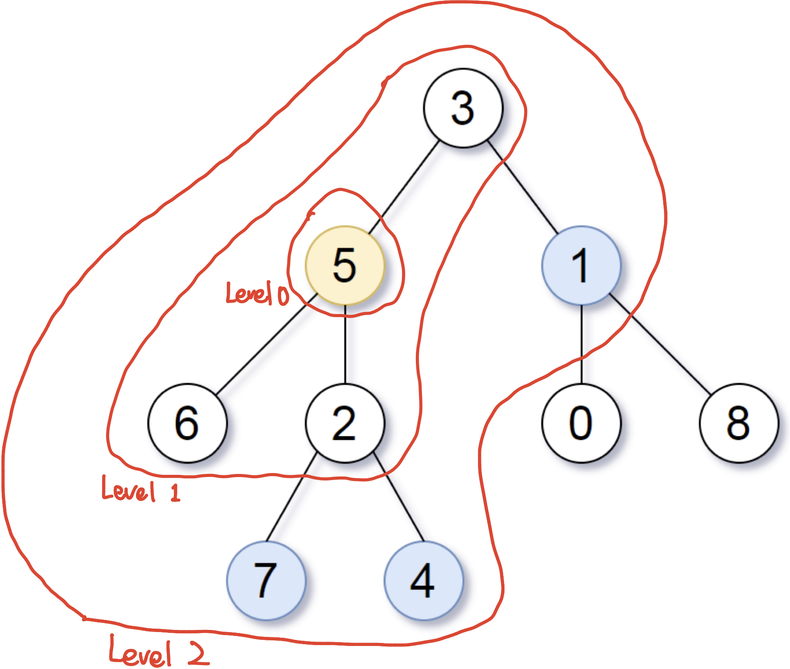

# \[Leetcode\]★863. All Nodes Distance K in Binary Tree

原题地址：[https://leetcode.com/problems/all-nodes-distance-k-in-binary-tree/](https://leetcode.com/problems/all-nodes-distance-k-in-binary-tree/) 关键词：BFS，DFS，Tree，Queue，HashSet，HashMap

题意：给一个二叉树`root`， 和一个目标结点`target`，和一个整数值`K`。返回到`target`距离为`K`的所有结点。 答案可以任何顺序。

例如：  
求到`node 5`距离为2的所有节点。


Input: `root = [3,5,1,6,2,0,8,null,null,7,4]`, `target = 5`, `k = 2`  
Output: `[7,4,1]`  
Explanation: The nodes that are a distance 2 from the target node have values 7, 4, and 1.


### 算法：BFS

BFS和DFS都有用到，但核心是BFS。

★**核心思想：**以`target node`为原点，作为第0层，使用BFS \(同时记录层数`level`\)，把属于同一层的node全部放进queue里，当层数`level`等于距离`k`时，此时queue里所有node即为答案。

更直接的理解方式：把整个tree当做一个无向图**undirected graph**，然后构建一个类似adjacency list的东西来记录与每个点所有相连接的点，然后把该层的相邻点全部放入queue。（但我们并没有必要真的把它转化为无向图，因为树的node之间已经有自己独特的连接方式）


**我们的目标：**把属于同一层的node全部放进queue里。

**本题的难点：**把当前node的左右child加入queue很简单，但是怎样把node上面的parent加入到queue里呢❓



**答案是使用HashMap❗️**

我们先用DFS遍历整棵树，把每一个node作为key，它的parent作为value。（具体实现见代码46行）

 此番操作后，我们就可以通过`map.get(curNode)`来得到当前node的parent node。（[一个小知识点](https://bhnigw.gitbook.io/-1/shu-ju-jie-gou-map#ru-guo-ba-treenode-jia-ru-hashmap)）

因此，对于每一个node，我们就可以得到与这个node所有相邻的node。因此我们就相当于得到了这个无向图的adjacency list！

  
对于Binary tree来说，每一个node，至多有三个与之相邻的node：  
    **1. 左child；**得到它的方法：`root.left;`  
    **2. 右child；**得到它的方法：`root.right;`  
    **3. parent；** 得到它的方法：`map.get(root);`

###  有了这些铺垫，接下来就可以对这个“无向图“来进行BFS：

初始化level为0记录层数，把target加入queue作为BFS起点。然后把所有与该层相邻的node加入queue。

那问题就来了！怎样区分每一个level的node，然后分层放进queue呢❓  
答案：我们需要在每一层while循环开始时，**记录当前queue的长度n，也就是每一层的size**，然后在while里用for循环`(int i = 0; i < size; i++)`把这一层的node都poll光。

⚠️  这里有一个易错的点：如果写成`for (int i = 0; i < queue.size(); i++)`就是错的。因为在for循环里会poll出元素，此时queue的size就变化了，就不对。所以在for循环开始之前要提前对size赋值：`int size = queue.size();`


在加入相邻node的过程中，又会出现一个问题，看上图，比如在处理node2时，与2的相邻元素有5, 7, 4，但是5已经访问过了，属于上一层，我们只需要把7, 4加入queue就行了。  
问题就又来了！怎样只把未访问过的元素加入queue呢❓  
答案：使用HashSet，每poll一个元素就加入set，加入新元素之前检查是否已经在set里。


**BFS核心步骤：**  
`while (!queue.isEmpty()) {  
    int size = queue.size(); // 提前赋值确定size  
    for (int i = 0; i < size; i++) { // 一次把这一层poll光   
        TreeNode cur = queue.poll();    
        visited.add(cur);   
        if (cur.left != null && visited.add(cur.left)) {//add()方法里已经包含了contains()方法  
            queue.offer(cur.left);   
        }   
        if (cur.right != null && visited.add(cur.right)) {   
            queue.offer(cur.right);   
        }  
        if (map.get(cur) != null && visited.add(map.get(cur))) {   
            queue.offer(map.get(cur));   
        }   
    }  
    level++;   // 处理完一层后level加一  
}`


完整代码：

```text
class Solution {
    public List<Integer> distanceK(TreeNode root, TreeNode target, int k) {
        List<Integer> res = new ArrayList<>();
        HashMap<TreeNode, TreeNode> map = new HashMap<>();
        Set<TreeNode> visited = new HashSet<>(); // 记录已经访问过的元素
        int level = 0;  // 记录层数
               
        dfsToFindParent(root, map);    // DFS来记录每个node的parent
        
        // BFS
        Queue<TreeNode> queue = new LinkedList<>();
        queue.offer(target);            // 以target node为原点
        
        while (!queue.isEmpty()) {
            if (level == k) {              // 如果达到了目标层数k
                for (TreeNode node : queue) { 
                    res.add(node.val);    // 则记录queue中所有node并返回
                }
                
                return res;
            }
            
            int size = queue.size();    // 提前赋值确定size
            
            for (int i = 0; i < size; i++) { // 一次把这一层poll光（使用当前queue的size）
                TreeNode cur = queue.poll(); 
                visited.add(cur);
                if (cur.left != null && visited.add(cur.left)) {
                    queue.offer(cur.left); 
                }
                if (cur.right != null && visited.add(cur.right)) {
                    queue.offer(cur.right);
                }  
                if (map.get(cur) != null && visited.add(map.get(cur))) {
                    queue.offer(map.get(cur));
                }
            }
            
            level++;
        }
        
        return res;
    }
    
    
    private void dfsToFindParent(TreeNode root, HashMap<TreeNode, TreeNode> map) {
        if (root.left != null) {
            map.put(root.left, root); // 每个node作为key，它的parent作为value
            dfsToFindParent(root.left, map);
        }
        if (root.right != null) {
            map.put(root.right, root);
            dfsToFindParent(root.right, map);
        }
    }
}
```

Time: `O(N)`；即BFS所耗时间；  
解释：无向图BFS所耗时间为：顶点vertex总数N，加上edge总数E的总和，即`O(N + E)`；  
根据树的特性：**如果一个tree有n个节点，那么它必然有n - 1条edges**；  
所以，时间就是`O(N + N - 1)`；最终结果就是`O(N)`；

Space: `O(N)`；map存了n个node


### 要记住的重点：

1. 怎样把node上面的parent加入到queue里；
2. 怎样区分每一个level的node，然后分层放进queue
3. 时间复杂度是怎么算的；


